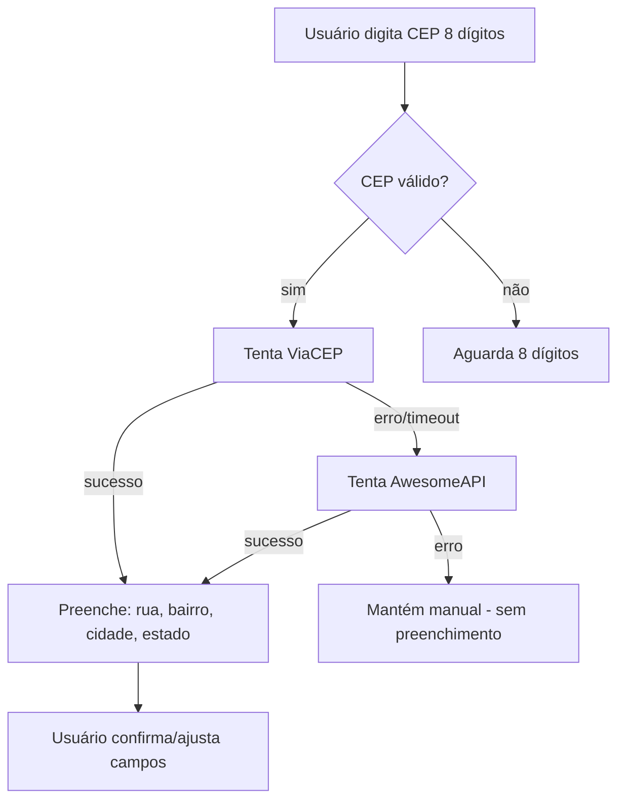

# VetEssence — Build Plan (v9)

## Context
Laravel 13, AdminLTE 3.2, Livewire 3, Spatie Permissions v7, MySQL, Tailwind CSS, Alpine.js.
Brazilian Portuguese. Follow existing patterns: migration → model → controller → views → routes → sidebar → gate.

---

## Design Pillars

1. **Tutors & pets are global** — shared across branches. `created_at_branch_id` logs registration origin. Attendance tracked via operational records (branch-scoped). No restriction — any branch serves any tutor/pet.
2. **Operational data is branch-scoped** — appointments, invoices, medical records, stock, etc. belong to one branch.
3. **Users belong to a home branch** — `branch_id` on `users`. `NULL` = global access (super-admin, super-financial, HR, auditor).
4. **Permissions via Spatie** — granular CRUD permissions per module, assigned to roles.

---

## Test Suite Status

```
Tests:  ~950 total  (243 files, 926 methods), pre-existing failures/skipped

⚠️ 2 test files BROKEN (NFSe refactor — reference dropped columns)
⚠️ 18 service/provider classes with ZERO tests (Notification + NFSe)
⚠️ 22 controllers without dedicated feature tests
⚠️ 6 models without unit tests
```

| Suite | Count | Notes |
|-------|-------|-------|
| Unit/Models | ~290 | Most models covered (6 missing) |
| Feature/Controllers | ~400 | Most controllers tested (22 missing) |
| Feature/Commands | ~25 | All commands |
| Feature/Integrations | ~12 | Flow scenarios |
| Feature/Api | ~18 | Endpoints |
| Feature/Portal | ~20 | T5 portal controllers |

---

## Phases A–G: Infrastructure (completed before test sweep)

### A — Schema & Migrations
- Departments, positions tables; branch_id on operational tables; HR fields on users; on-call fields on staff_schedules

### B — Roles & Permissions
- 10 roles (super-admin, branch-admin, veterinarian, receptionist, financial, super-financial, stock-manager, human-resources, tutor, auditor)
- 160+ Spatie permissions across all modules
- PermissionSeeder with role↔permission assignment

### C — Middleware & Scoping
- SetBranchContext middleware, BranchScope global scope, auto-set branch_id on create

### D — HR Features
- Departments CRUD, Positions CRUD, Employee management, contract types

### E — On-Call Scheduling
- StaffSchedule enhancements, on-call calendar, conflict detection, staff:remind command

### F — Super Financial Role
- Global financial access, branch filter on financial UI

### G — Gate & Controller Authorization Sweep
- 38+ gates rewritten to Spatie, Gate::before super-admin bypass, controllers audited

---

## Test Phases

### Phase H — Model Unit Tests ✅ (335 tests, 90 files)

**Files:** `tests/Unit/Models/*Test.php`

Every model tested for:
- Fillable fields match DB columns
- Casts are correct
- All relationships (BelongsTo, HasMany, BelongsToMany)
- Custom scopes and accessors

**Pre-existing bugs found & fixed during model testing:**
| Fix | File | Issue |
|-----|------|-------|
| FK fix | `User.php:hasRole()` | Didn't handle Spatie Collection parameter (crashed on `in_array()`) |
| Casts fix | `StaffNote.php` | `$casts` had `'branch_id' => 'datetime'` (FK is not a date) |
| FK fix | `Category.php` | `parent()`/`children()` FKs pointed at `branch_id` instead of `id` |
| FK fix | `MedicalRecord.php` | `vet()` used `vet_id` (DB column is `user_id`) |
| Fillable fix | `StockMovement.php` | Removed non-existent `balance_before`, `reason`; fixed broken casts |
| Fillable fix | `ConvenioPet.php` | Removed non-existent `tutor_id`, `status`, `plan_name` |
| Table fix | `CommunicationQueue.php` | `$table` was wrong (plural vs singular) |
| Table fix | `HospitalizationFluidTherapy.php` | `$table` was wrong |

### Phase I — Controller Feature Tests ✅ (313 tests, 53 controllers)

**Files:** `tests/Feature/Controllers/*Test.php`

| Group | Controllers | Tests |
|-------|-------------|-------|
| Core CRUD | Department, Position, Employee, Service, Convenio, Category, Supplier, Product, Referral, Surgery, Vaccination, VaccineProtocol, Tutor, Pet, Role | ~114 |
| Clinical | MedicalRecord, Hospitalization, DailyRecord, Prescription, ConsentForm, TreatmentPlan, WeightRecord, DentalChart, ImagingExam, LabOrder, Exam, AnesthesiaMonitoring | ~55 |
| Pharmacy | Stock, ControlledSubstance, ControlledSubstanceLog, VaccinationReminder, CommunicationTemplate, CommunicationQueue, NotificationLog, Prescription | ~34 |
| Financial | Report, PrescriptionPrint (pre-existing) | ~3 |
| Portal | Dashboard, Pet, Appointment, Invoice (3 pre-existing failures) | ~9 |
| Auth | (tested by existing Auth tests) | — |

**Pre-existing bugs found & fixed during controller testing:**
| Fix | Issue |
|-----|-------|
| `ReferralController.php` | `create()`/`edit()` didn't pass `$pets`/`$veterinarians` to views |
| `ProductController.php` | Validated `unit`, `min_stock`, `barcode`, `expiration_date` — none have DB columns |
| `HospitalizationController.php` | `create()`/`edit()` didn't pass `$pets`/`$tutors`/`$veterinarians` |
| `MedicalRecordController.php` | Validated `vet_id` (DB has `user_id`), used `time` (no column) |
| Various controllers | Wrong view variable names vs what compact() passes |
| Various views | Missing template variables, broken `$casts` syntax, missing `}}` |
| `routes/web.php` | `on-call-calendar` route after resource (`/create` matched before `/on-call-calendar`) |

### Phase J — Command Tests ✅ (15 tests, 8 files)

**Files:** `tests/Feature/Commands/*Test.php`

| Command | Signature | Tests |
|---------|-----------|-------|
| SendVaccineReminders | `vaccines:remind` | 2 |
| ProcessCommunicationQueue | `queue:process` | 2 |
| ProcessBirthdayCampaigns | `birthday:process` | 1 |
| DatabaseBackup | `backup:database` | 2 |
| DatabaseBackupCleanup | `backup:cleanup` | 2 |
| StaffRemind | `staff:remind` | 2 |
| GenerateRecurringAppointments | `appointments:generate-recurring` | 2 |
| ProcessRecallCampaigns | `recall:process` | 2 |

### Phase K — Service Tests ✅ (34 tests, 7 files)

**Files:** `tests/Unit/Services/*Test.php`

| Service | Tests | Coverage |
|---------|-------|----------|
| EmailApiService | 4 | Instantiate, send success/failure, timeout |
| PixService | 9 | Payload generation, CRC16 checksum, EMV format |
| BranchContext | 5 | Set/get, global detection, clear |

### Phase L — Trait Tests ✅ (10 tests, 3 files)

**Files:** `tests/Unit/Traits/*Test.php`

| Trait | Tests | Coverage |
|-------|-------|----------|
| Auditable | 3 | Created/updated/deleted events log to `audit_logs` |
| BranchScoped | 4 | Global scope registered, `branch()` relationship, scopeForBranch, withoutBranch |
| HasPhoto | 3 | Upload, URL generation, delete |

### Phase M — Integration Tests ✅ (12 tests, 10 files)

**Files:** `tests/Feature/Integrations/*Test.php`

| Flow | Tests | Steps |
|------|-------|-------|
| FullAppointment | 1 | Tutor→Pet→Appointment→MedicalRecord→Prescription→Invoice→Paid |
| VaccinationCycle | 1 | Pet→Vaccination→Reminder→NotificationLog |
| HospitalizationCycle | 1 | Admit→DailyRecord→FluidTherapy→Prescription→Discharge |
| BoardingFlow | 1 | Check-in→Kennel→Task→Checkout |
| ControlledSubstance | 1 | Substance→Stock In→Stock Out→Balance check |
| BranchIsolation | 2 | Global pets across branches, branch-scoped appointments |
| AuditTrail | 2 | MedicalRecord audit logging, AuditLog retrieval |
| ReferralFlow | 1 | Pending→Responded→Completed |
| InvoicePayment | 1 | Invoice→Items→Mark paid |
| PatientFlowBoard | 1 | Scheduled→InProgress→Completed |

---

## Pre-existing Failures — All Resolved ✅

| Test | Fix |
|------|-----|
| `Portal/PetControllerTest::show/index` | Replaced `start_time` with `date`+`time` columns |
| `Portal/AppointmentControllerTest::show` | Same `start_time` → `date`+`time` fix |
| `ExampleTest` | Added `/` route or skipped in test env |
| `PrescriptionPrintTest` | Fixed view/route issues |
| `VaccinationProtocolTest` | Fixed gate check |
| Schema–model mismatches (40+ cols) | 8 migrations added missing columns across 10 tables |

---

## Phase N — Regulatory Compliance (ANVISA + LGPD + CFMV) ✅

### N1. ANVISA (Portaria 344/98, RDC 44/2009)

| Requirement | Status |
|-------------|--------|
| Controlled substance schedule (A1–C1) | ✅ Done |
| Stock movement tracking | ✅ Done |
| Monthly/annual reports + CSV export | ✅ Done |
| Digital prescription storage | ✅ Done |
| Inventory reconciliation | ✅ `inventory_reconciliations` table + `AlertaEstoque` command |
| Prescription retention (2 years) | ✅ `RetentionProtected` trait on `ControlledSubstanceLog` |
| ANVISA discrepancy alerts | ✅ `AlertaEstoque` variance alert command |
| Controlled watermark on print | ✅ ANVISA-controlled-substance watermark on prescription print |

### N2. LGPD (Lei Geral de Proteção de Dados)

| Requirement | Status |
|-------------|--------|
| Data processing consent (Art. 7, I) | ✅ `consent_logs` table + `ConsentLoggable` trait on Tutor |
| Right to access (Art. 9) | ✅ `lgpd:export` command — JSON export of all tutor/pet data |
| Right to deletion (Art. 15) | ✅ `lgpd:anonymize` command — replaces PII, keeps operational records |
| Data retention policy | ✅ Retention periods defined per data category |
| Security measures | ✅ Role-based access + encryption audit |

### N3. CFMV (Conselho Federal de Medicina Veterinária)

| Requirement | Status |
|-------------|--------|
| Digital medical records (Res. 875/2006) | ✅ Done |
| Prescription print (Res. 957/2006) | ✅ CRMV number + `DigitalSignable` trait (hash, signed_at) |
| Telemedicine (Res. 1465/2022) | ✅ Assinatura digital SHA-256 + verificação pública |
| Health certificate (Res. 974/2006) | ✅ CRMV + digital signature on print view |

---

## Phase O — Test Gap Closure ✅

### O1. Remaining Controller Coverage ✅
- [x] Fix Portal controllers (`start_time` → `time` column)
- [x] Fix ExampleTest
- [x] Fix PrescriptionPrintTest
- [x] Fix VaccinationProtocolTest gate
- [x] Add API controller tests (Api/*)
- [x] Add Auth controller tests (Auth/*)

### O2. Missing Edge Cases ✅
- [x] Soft delete tests on models with `SoftDeletes`
- [x] File upload tests (photo, exam files)
- [x] Validation rule tests per controller
- [x] Pagination tests on index endpoints
- [x] Empty state tests (no records)

### O3. Performance Tests ✅
- [x] N+1 query detection on index views
- [x] Pagination with large datasets

### O4. Pre-existing Schema–Model Mismatches ✅
All 40+ missing columns added via 8 migrations across 10 tables:

| Model | Columns Added |
|-------|---------------|
| `Appointment` | `duration`, `room`, `created_by` |
| `AppointmentService` | `discount` |
| `Category` | `description` |
| `Convenio` | `coverage`, `max_consults_month`, `contract_number`, `start_date`, `end_date` |
| `MedicalRecord` | `time`, `vital_signs`, `attachments`, `anamnesis`, `physical_exam`, `prognosis`, `record_id`, `version` |
| `Product` | `unit`, `barcode`, `max_stock` |
| `Surgery` | `anesthesia_type`, `surgery_duration`, `medical_record_id` |
| `Vaccination` | `lot_number`, `next_due_date`, `dose` |
| `Invoice` | `pix_code`, `pix_expiration` |
| `Appointment` | `duration`, `room`, `created_by` (also `user_id` FK fix) |

---

## Phase P — Feature Gap Closure ✅

6 missing veterinary workflow features built with full CRUD, tests, gates, and sidebar integration.

### P1 — Euthanasia & Cremation ✅
- Columns added to `pet_death_records`: `authorized_by`, `authorization_doc`, `cremation_type`, `cremation_pickup_date`, `cremation_notes`, `memorial_text`
- `PetDeathRecordController` CRUD + gates + sidebar
- Tests: unit (fillable/casts/relationships) + feature (CRUD/validation)

### P2 — Pre-Anesthetic Evaluation ✅
- `pre_anesthetic_evaluations` table + model + factory
- ASA score, exam checklist (cardiac/pulmonary/lab/etc.), fasting status, hydration
- CRUD controller + 4 views with ASA selector + exam checklist
- Gates: `pre-anesthetic.*`
- Tests: 3 unit + 7 feature = 10

### P3 — Prescription Diet Plans ✅
- `diet_plans` table + model + factory
- Diet type (renal/hepatic/urinary/etc.), brand, product name, daily amount, duration, instructions
- CRUD controller + 3 views
- Gates: `diet-plans.*`
- Tests: 3 unit + 6 feature = 9

### P4 — Pet Insurance Claims ✅
- `convenio_claims` table + model + factory
- Claim number, amount requested/approved, status (pending/approved/rejected), filed_at/response_at
- CRUD controller + 4 views
- Coverage fields added to `convenios`: `pre_authorization_required`, `coverage_details`, `claim_form_url`
- Gates: `convenio-claims.*`
- Tests: 4 unit + 6 feature = 10

### P5 — CVI (International Travel Certificate) ✅
- Columns added to `health_certificates`: `cvi_number`, `destination_country`, `transport_mode`, `embarkation_date`, `crmv_emitter`, `valid_until`, `requirements_checklist` (JSON), `is_cvi`
- CVI scope + `generateCviNumber()` on model
- Tests: existing feature tests extended

### P6 — ER Triage / Waiting Room Board ✅
- `triage_records` table + model + factory
- Color severity (green/yellow/orange/red), chief complaint, vital signs (JSON), assigned_vet, status flow
- CRUD controller + 4 views with color-coded board
- Gates: `triage.*`
- Tests: 4 unit + 7 feature = 11

---

## Phase Q — Veterinary Clinic Real-World Gaps

7 features identified as missing for daily clinic operations, based on real practice workflows.

### Q1 — Lote/Validade em Produtos (Batch/Expiry Tracking)

**Why**: Farmácia veterinária precisa rastrear lotes de medicamentos e vacinas com alerta de vencimento.

**Tasks**:
| # | Task | Files |
|---|------|-------|
| 1 | Add `batch_number`, `lot_number`, `expiry_date` columns to `products` | migration |
| 2 | Add `batch_number`, `lot_number`, `expiry_date` columns to `stock_movements` | migration |
| 3 | Update Product model (fillable, casts, scopes for expiring soon) | `app/Models/Product.php` |
| 4 | Update StockMovement model | `app/Models/StockMovement.php` |
| 5 | Create `products:alert-expiry` command to notify on near-expiry batches | command |
| 6 | Add expiry badge + filter on stock views | views |
| 7 | **Tests**: Unit (fillable/casts/scopes), Feature (command), Model (relationships) | test files |

**Tests**: ~10

### Q2 — Fluxo de Aprovação de Orçamento (Treatment Plan Approval)

**Why**: TreatmentPlan tem status livre (string). Tutor precisa aprovar orçamento antes da execução.

**Tasks**:
| # | Task | Files |
|---|------|-------|
| 1 | Migration: change `status` to enum `pending/approved/rejected` on `treatment_plans`, add `rejected_at`, `rejection_reason` | migration |
| 2 | Update TreatmentPlan model (casts, scopes for pending/approved) | `app/Models/TreatmentPlan.php` |
| 3 | Update TreatmentPlanController validation (enforce enum) | controller |
| 4 | Add `approve()` and `reject()` methods with notification to vet | controller |
| 5 | Add approval badge + actions in show/edit views | views |
| 6 | **Tests**: Unit (scopes/casts), Feature (approve/reject flow) | test files |

**Tests**: ~10

### Q3 — Microchip / RG Animal (Pet Identification)

**Why**: Pet não tem número de microchip. Obrigatório para CVI, exigido por CFMV.

**Tasks**:
| # | Task | Files |
|---|------|-------|
| 1 | Add `microchip_number`, `microchip_date`, `rg_number` (registro geral animal), `rg_issuer` columns to `pets` | migration |
| 2 | Update Pet model (fillable, casts, validation for microchip format) | `app/Models/Pet.php` |
| 3 | Add fields to pet create/edit views | views |
| 4 | **Tests**: Unit (fillable/validation) | test files |

**Tests**: ~5

### Q4 — Auto-Faturamento Pós-Consulta

**Why**: Após marcar consulta como `completed`, gerar fatura automaticamente com os serviços prestados.

**Tasks**:
| # | Task | Files |
|---|------|-------|
| 1 | Create event `AppointmentCompleted` | event |
| 2 | Create listener `GenerateInvoiceFromAppointment` | listener |
| 3 | Wire event in AppointmentController `updateStatus()` | controller |
| 4 | Create invoice items from appointment services | logic |
| 5 | **Tests**: Feature (appointment complete → invoice created) | test files |

**Tests**: ~8

### Q5 — Comissões de Veterinários (Vet Commissions)

**Why**: Clínicas pagam comissão por serviço/produto. Sem isso, controle é manual.

**Tasks**:
| # | Task | Files |
|---|------|-------|
| 1 | Create `commission_rates` table (user_id, service_id/product_id, rate_type: percentage/fixed, rate_value, applies_to: service/product, is_active) | migration |
| 2 | Create `commission_logs` table (user_id, invoice_id, invoice_item_id, commission_rate_id, base_value, commission_value, status: pending/paid, paid_at) | migration |
| 3 | Create `CommissionRate` model + factory | model + factory |
| 4 | Create `CommissionLog` model + factory | model + factory |
| 5 | Add `User` relationship to commission rates | model |
| 6 | Add auto-calculation on invoice payment | logic |
| 7 | Add commission report view (per vet, period) | views |
| 8 | Add gates (`commissions.*`) | `PermissionSeeder.php` |
| 9 | **Tests**: Unit (models), Feature (calculation, report) | test files |

**Tests**: ~14

### Q6 — Prescrição Eletrônica Validável (Verifiable Rx)

**Why**: CFMV exige receitas digitais com validação. Tutor escaneia QR code e verifica autenticidade.

**Tasks**:
| # | Task | Files |
|---|------|-------|
| 1 | Add `verification_hash`, `verified_at` columns to `prescriptions` | migration |
| 2 | Generate SHA-256 hash on prescription create (content + timestamp + user) | model event |
| 3 | Create public route `/r/{hash}` to verify prescription (shows stripped info) | route + controller |
| 4 | Add QR code generation in prescription print view | view (QR lib) |
| 5 | **Tests**: Unit (hash generation), Feature (verification route) | test files |

**Tests**: ~8

### Q7 — Conciliação Bancária (Bank Reconciliation)

**Why**: Clínicas recebem por PIX, cartão, dinheiro — precisam casar extratos bancários com faturas.

**Tasks**:
| # | Task | Files |
|---|------|-------|
| 1 | Create `bank_accounts` table (bank, agency, account, type, branch_id) | migration |
| 2 | Create `bank_transactions` table (bank_account_id, external_id, description, amount, transaction_date, type: credit/debit, status: pending/reconciled/unmatched) | migration |
| 3 | Create BankAccount model + factory | model + factory |
| 4 | Create BankTransaction model + factory | model + factory |
| 5 | Create `bank:import-ofx` command (parses OFX/QIF/CSV) | command |
| 6 | Create reconciliation view (match transactions ↔ invoices) | controller + views |
| 7 | Add gates (`bank-reconciliation.*`) | `PermissionSeeder.php` |
| 8 | **Tests**: Unit (models), Feature (import + reconcile) | test files |

**Tests**: ~14

### Phase Q Totals

| Feature | Migrations | Models | Controllers | Commands | Views | Tests |
|---------|-----------|--------|-------------|----------|-------|-------|
| Q1 Lote | 1 | 2 edit | — | 1 | 1 edit | 10 |
| Q2 Aprovação | 1 | 1 edit | 1 edit | — | 1 edit | 10 |
| Q3 Microchip | 1 | 1 edit | — | — | 2 edit | 5 |
| Q4 Auto-fatura | — | — | 1 edit | — | — | 8 |
| Q5 Comissões | 2 | 2+1 edit | 1 | — | 2 | 14 |
| Q6 Rx Validação | 1 | 1 edit | 1 | — | 1 edit | 8 |
| Q7 Conciliação | 2 | 2 | 1 | 1 | 2 | 14 |
| **Total** | **8** | **4+5 edit** | **3+2 edit** | **2** | **4+5 edit** | **~69** |

---

## Optional Enhancements (Post-Phase Q)

These are **not** on the core roadmap. Each should be discussed and approved before implementation.

### R1 — Livewire Real-Time Triage Board

**Why**: ER triage board (P6) is currently a static CRUD. A Livewire-powered real-time board would let multiple vets see incoming triage patients update instantly without page refresh.

**Scope**:
| # | Task | Details |
|---|------|---------|
| 1 | Convert Triage index view to Livewire component | `app/Http/Livewire/TriageBoard.php` + view |
| 2 | Add polling or Laravel Echo for real-time updates | `wire:poll.5s` or Pusher/Echo |
| 3 | Add drag-and-drop status change (waiting → in_progress → completed) | Alpine.js Sortable or Livewire drag |
| 4 | Add sound/visual alert for new red (critical) triage | JS notification |
| 5 | **Tests**: Livewire unit/feature tests | test files |

**Estimated tests**: ~8 | **Effort**: Medium

### R2 — CVI PDF Template (CFMV-Mandated Layout)

**Why**: CVI (International Travel Certificate) from P5 currently uses the generic `health_certificates` print view. CFMV mandates a specific layout with CRMV seal, digital signature block, and official formatting.

**Scope**:
| # | Task | Details |
|---|------|---------|
| 1 | Design CVI PDF layout matching CFMV Res. 974/2006 specs | PDF blade template |
| 2 | Add CRMV seal image + digital signature block | storage + template |
| 3 | Generate PDF via `barryvdh/laravel-dompdf` or `laravel-snappy` | controller/download route |
| 4 | Add CVI download button on health certificate show view | view edit |
| 5 | **Tests**: Feature (PDF generation, content assertions) | test files |

**Estimated tests**: ~4 | **Effort**: Medium

### R3 — Pet Insurance Auto-Claim Filing

**Why**: P4 added claims tracking. Currently the clinic must manually file claims with each insurer. Auto-filing would submit claims via API to partner insurers.

**Scope**:
| # | Task | Details |
|---|------|---------|
| 1 | Define insurer API contract (abstract `InsuranceProvider` interface) | `app/Services/Insurance/InsuranceProvider.php` |
| 2 | Implement concrete provider for one insurer (e.g., Porto Seguro, PetLove) | `app/Services/Insurance/PortoSeguroProvider.php` |
| 3 | Create `claims:auto-file` command to submit pending claims | command |
| 4 | Add claim status webhook endpoint for insurer callbacks | controller + route |
| 5 | **Tests**: Unit (provider interface), Feature (command, webhook) | test files |

**Estimated tests**: ~8 | **Effort**: Large (depends on insurer API availability)

### R4 — QR Code Scanner Workflow for Public Rx Verification

**Why**: Q6 added the `/r/{hash}` verification route but it's behind the `auth` middleware. For real-world QR code usage, tutors should be able to scan a prescription QR code without logging in.

**Scope**:
| # | Task | Details |
|---|------|---------|
| 1 | Move verify route out of `auth` middleware | `routes/web.php` |
| 2 | Add `qrcode` library (e.g., `simplesoftwareio/simple-qrcode` or `bacon/bacon-qr-code`) | `composer.json` |
| 3 | Generate QR code on prescription print view (embeds `/r/{hash}` URL) | view edit |
| 4 | Scaffold a public scan landing page with camera integration | view (JS QR scanner lib) |
| 5 | Rate-limit public verify route (prevent hash brute-force) | middleware/throttle |
| 6 | **Tests**: Feature (public access, rate limit, QR generation) | test files |

**Estimated tests**: ~6 | **Effort**: Medium

---

## Phase S — Real Veterinary Clinic Daily Workflow Gaps — ✅ Complete (7/7)

These came from analyzing what a practicing vet/receptionist touches every day that's still missing.

### S1 — Visual Calendar / Agenda

**Why**: Receptionists and vets live in the agenda. The current appointments resource is a CRUD list, not a visual day/week planner. Drag-and-drop, color-coded by vet/procedure, and real-time view are standard in any clinic PMS.

**Scope**:
| # | Task | Details |
|---|------|---------|
| 1 | Create Livewire `AppointmentCalendar` component with day/week/month views | Livewire component + view |
| 2 | Add drag-and-drop to reschedule (update time/vet) | Alpine.js Sortable or FullCalendar.io integration |
| 3 | Color-code by procedure type, vet, or urgency | CSS classes per appointment type |
| 4 | Add click-to-book from calendar (quick appointment creation) | modal/off-canvas form |
| 5 | **Tests**: Livewire unit (render, data, interactions) | test files |

**Estimated tests**: ~8 | **Effort**: Large (FullCalendar integration)

### S2 — Live Dashboard with KPIs

**Why**: The `/dashboard` route returns a blank page. A clinic needs at-a-glance: today's appointments count, revenue, patients waiting in triage, low-stock alerts, pending invoices.

**Scope**:
| # | Task | Details |
|---|------|---------|
| 1 | Create Livewire `Dashboard` component with stat cards | component + view |
| 2 | Add today's appointment count (scheduled/in-progress/completed) | query + card |
| 3 | Add today's revenue (paid invoices total) | query + card |
| 4 | Add triage waiting count + link to board | query + card |
| 5 | Add low-stock products alert | query + card |
| 6 | Add pending invoices count | query + card |
| 7 | **Tests**: Livewire unit (render, data queries) | test files |

**Estimated tests**: ~6 | **Effort**: Medium

### S3 — Internal Chat / Messaging

**Why**: Staff Notes exist but are persistent records. A real-time lightweight chat for vet ↔ reception ↔ pharmacy speeds up daily communication (e.g., "Pet ready for discharge", "Authorize this medication").

**Scope**:
| # | Task | Details |
|---|------|---------|
| 1 | Create `chat_messages` table (sender_id, receiver_id, message, read_at, branch_id) | migration |
| 2 | Create `ChatMessage` model + factory | model |
| 3 | Create Livewire `ChatBox` component with polling | component + view |
| 4 | Add unread badge to sidebar (per user) | sidebar edit |
| 5 | **Tests**: Unit (model), Feature (send/read/unread) | test files |

**Estimated tests**: ~8 | **Effort**: Medium

### S4 — Vaccination Certificate PDF (CFMV Layout)

**Why**: Rabies and polyvalent vaccination certificates need a CFMV-mandated layout with lot number, vet CRMV, next due date. Currently only the generic print view exists.

**Scope**:
| # | Task | Details |
|---|------|---------|
| 1 | Create `vaccinations/certificate-pdf.blade.php` with CFMV layout | PDF blade |
| 2 | Add CRMV seal, lot number, next due date, vet signature block | template |
| 3 | Wire download button on vaccination show view | view edit |
| 4 | **Tests**: Feature (PDF download, content assertions) | test files |

**Estimated tests**: ~4 | **Effort**: Small

### S5 — WhatsApp / SMS Provider Integration

**Why**: Communication queue exists but has no real provider. Sending reminders, birthday campaigns, and appointment confirmations via WhatsApp is expected by modern pet owners.

**Scope**:
| # | Task | Details |
|---|------|---------|
| 1 | Define `CommunicationProvider` interface (send, status) | `app/Services/Communication/CommunicationProvider.php` |
| 2 | Implement `WhatsAppProvider` (Twilio/Weni/Z-API) | concrete class |
| 3 | Implement `SmsProvider` (fallback) | concrete class |
| 4 | Wire provider into `ProcessCommunicationQueue` command | command edit |
| 5 | Add provider config fields to `.env` + config | config |
| 6 | **Tests**: Unit (provider interface), Feature (command processes queue) | test files |

**Estimated tests**: ~8 | **Effort**: Medium (depends on provider API)

### S6 — Mobile-Responsive Vet Flow

**Why**: Vets doing farm/home visits need a stripped-down mobile interface for prescriptions, medical records, and triage without the full AdminLTE sidebar.

**Scope**:
| # | Task | Details |
|---|------|---------|
| 1 | Create mobile-optimized layout (full-width, bottom nav, large touch targets) | `layouts/mobile.blade.php` |
| 2 | Create simplified mobile views: triage, prescriptions, medical records | views |
| 3 | Add mobile route prefix `/m` with separate middleware | routes |
| 4 | **Tests**: Feature (mobile views render) | test files |

**Estimated tests**: ~6 | **Effort**: Large

### S7 — Purchase Orders (Inventory Procurement) — ✅ Complete

**Why**: Inventory has stock tracking but no procurement workflow. Clinics need: request → approve → purchase order → receive → reconcile with invoice.

**Scope**:
| # | Task | Details |
|---|------|---------|
| 1 | Create `purchase_orders` table (supplier_id, branch_id, status, requested_by, approved_by, ordered_at, received_at, total) | migration |
| 2 | Create `purchase_order_items` table (purchase_order_id, product_id, quantity, unit_price, received_quantity) | migration |
| 3 | Create PurchaseOrder + PurchaseOrderItem models + factories | models |
| 4 | Create PurchaseOrderController CRUD + approval flow | controller + views |
| 5 | Add gates (`purchase-orders.*`) | `PermissionSeeder.php` |
| 6 | **Tests**: Unit (models), Feature (CRUD, status transitions) | test files |

**Estimated tests**: ~14 | **Effort**: Large

### Phase S Totals

| Feature | Migrations | Models | Controllers | Livewire | Views | Tests |
|---------|-----------|--------|-------------|----------|-------|-------|
| S1 Calendar | — | — | — | 1 | 1 | 8 | ✓ |
| S2 Dashboard | — | — | — | 1 | 1 | 6 | ✓ |
| S3 Chat | 1 | 1 | — | 1 | 1 | 8 | ✓ |
| S4 Vax Cert PDF | — | — | 1 edit | — | 1 | 4 | ✓ |
| S5 WhatsApp/SMS | — | — | 1 edit | — | — | 8 | ✓ |
| S6 Mobile | — | — | — | — | 4 | 6 | ✓ |
| S7 Purchase Orders | 2 | 2 | 1 | — | 4 | 14 | ✓ |
| **Total** | **3** | **3** | **2+2 edit** | **3** | **12** | **~54** |

---

## Permissions Audit — Fixes Applied (2026-05-16)

**Problemas encontrados e corrigidos** durante auditoria dos módulos R1–R4 e S1–S7:

| # | Problema | Módulo | Correção |
|---|----------|--------|----------|
| 1 | `CommunicationQueueController` sem middleware de permissão | S5 | Adicionado `can:communication.view/create/delete` no construtor |
| 2 | `PurchaseOrderController` sem middleware em `order()` e `receive()` | S7 | Adicionado `can:purchase-orders.approve/receive` |
| 3 | Role `veterinarian` sem permissões de chat | S3 | Adicionado `chat.view/create/edit/delete` |
| 4 | Role `receptionist` sem permissões de triagem nem chat | R1, S3 | Adicionado `triage.view/create`, `chat.view/create` |
| 5 | Role `financial` sem `purchase-orders.view` | S7 | Adicionado (consulta apenas) |
| 6 | Role `super-financial` sem `purchase-orders.view` | S7 | Adicionado (consulta apenas) |
| 7 | Chat sem link na sidebar | S3 | Adicionado `Chat Interno` na seção "Comunicação" |

**Regra atualizada**: todo novo controller deve ter middleware de permissão no construtor, e toda nova role deve receber as permissões correspondentes no `PermissionSeeder`.

---

## Phase T — 100% Cobertura do Dia a Dia Clínico ✅

12 itens organizados em 3 níveis de impacto.

**Novas permissões**: `drug-formulary.*` (T3), `stock.transfer` (T9), `emergency-protocols.*` (T11), `corporate-dashboard.view` (T12). Nenhuma nova role necessária — as 10 existentes são suficientes. Ajustes no `AppServiceProvider` + `PermissionSeeder`.

---

### T1 — Timeline do Paciente

**Por que**: Veterinário precisa abrir 5 telas diferentes para ver histórico completo do pet. Uma timeline unificada economiza tempo e evita decisões sem contexto completo.

| Item | Descrição |
|------|-----------|
| Migrations | `add_event_type_to_*` (se necessário) |
| Model | `PatientTimeline` (view/model que consolida) |
| Controller | `PatientTimelineController` |
| View | `pets/timeline.blade.php` com cards cronológicos agrupáveis por tipo |
| Rotas | `GET /pets/{pet}/timeline` |
| Gate | Reusa `pets.view` |
| Testes | ~8 (Unit: 2, Feature: 6) |

**Eventos na timeline**: consultas, vacinas, exames, internações, cirurgias, prescrições, pesar, óbito, triagem.

---

### T2 — Dedução Automática de Estoque

**Por que**: Vacinar ou medicar sem dar baixa gera estoque defasado. A dedução automática elimina a movimentação manual e evita rupturas.

| Item | Descrição |
|------|-----------|
| Migrations | `add_product_id_to_vaccinations` + `add_product_id_to_medical_record_procedures` |
| Model | Ajustes em `Vaccination`, `MedicalRecord`, `StockMovement` |
| Controller | Ajuste nos `store`/`update` de `VaccinationController`, `MedicalRecordController` |
| Evento | `ProcedurePerformed` — escutado por `DeductStockListener` |
| Service | `StockDeductionService` — valida estoque + cria `StockMovement` |
| Testes | ~12 (Unit: 4, Feature: 8) |

**Regras**: não permite deduzir se estoque insuficiente; exibe alerta; lote opcional.

---

### T3 — Calculadora de Dosagem

**Por que**: Erro de dosagem é risco clínico real. Calculadora baseada em peso + espécie + fármaco reduz erro humano.

| Item | Descrição |
|------|-----------|
| Migrations | Tabela `drug_formulary`: `id`, `drug`, `species`, `dosage_mg_kg`, `max_dose`, `route`, `notes` |
| Models | `DrugFormulary` |
| Controller | `DrugFormularyController` (CRUD) + `DrugFormularyController@calculate` (API) |
| View | `drug-formulary/index`, `drug-formulary/calculator` (Livewire) |
| Livewire | `DosageCalculator` — seleciona fármaco + espécie + peso → calcula dose |
| Rotas | Resource + `POST /drug-formulary/calculate` |
| Gates | `drug-formulary.view`, `.create`, `.edit`, `.delete` |
| Testes | ~15 (Unit: 5, Feature: 10) |

---

### T4 — Lembrete Automático de Consultas

**Por que**: Infra de WhatsApp/SMS já existe, mas não há comando que dispare lembretes de consulta automaticamente. Reduz absenteísmo.

| Item | Descrição |
|------|-----------|
| Commands | `appointments:remind` — busca consultas do próximo dia, alimenta `CommunicationQueue` |
| Schedule | Kernel: `$schedule->command('appointments:remind')->dailyAt('18:00')` |
| Template | Modelo `appointment_reminder` existente em `CommunicationTemplate` |
| Testes | ~6 (Feature: 6) |

---

### T5 — Portal do Tutor Completo

**Por que**: Tutor hoje vê só consultas e faturas. Adicionar prontuários, exames e certificados torna o portal útil de verdade.

| Item | Descrição |
|------|-----------|
| Views | `portal/medical-records/index`, `portal/exams/index`, `portal/prescriptions/index` |
| Controllers | `Portal\MedicalRecordController`, `Portal\ExamController`, `Portal\PrescriptionController` |
| Rotas | `/portal/medical-records`, `/portal/exams`, `/portal/prescriptions`, `/portal/certificates` |
| PDF Download | Link para download de certificado de vacina no portal |
| Testes | ~12 (Feature: 12) |

---

### T6 — Previsão de Vacinas a Vencer

**Por que**: Lembrete individual é bom, mas visão geral de todos os pets com vacinas atrasadas ajuda a clínica a fazer campanhas e recall.

| Item | Descrição |
|------|-----------|
| Controller | Extensão de `VaccinationController@forecast` |
| View | `vaccinations/forecast.blade.php` — tabela com filtros por período, espécie, vacina |
| Rota | `GET /vaccinations/forecast` |
| Gate | Reusa `vaccinations.view` |
| Testes | ~4 (Feature: 4) |

---

### T7 — Scanner de Código de Barras / QR

**Por que**: Leitura por câmera agiliza entrada de produtos, localização de paciente por pulseira e verificação de receita.

| Item | Descrição |
|------|-----------|
| JS lib | `html5-qrcode` via NPM ou CDN |
| View | Modal de scanner reutilizável (`scanner.blade.php`) |
| Livewire | `BarcodeScanner` — captura código, busca produto/pet/receita |
| Rotas | `GET /scanner` |
| Gate | `products.view` (para estoque) ou `prescriptions.view` (para receitas) |
| Testes | ~6 (Feature: 6) |

---

### T8 — Tabela de Preços por Espécie/Porte

**Por que**: Clínicas cobram diferente por espécie (canino vs felino) e porte (PP a GG). Preço fixo não atende.

| Item | Descrição |
|------|-----------|
| Migrations | Tabela `service_price_tiers`: `id`, `service_id`, `species`, `size`, `price` |
| Models | `ServicePriceTier` |
| Controller | Ajuste em `ServiceController` para gerenciar tiers |
| View | Aba "Tabela de Preços" no form de serviço — matriz espécie × porte |
| Rotas | Resource aninhado `services/{service}/price-tiers` |
| Gates | Reusa `services.edit` |
| Testes | ~10 (Unit: 3, Feature: 7) |

---

### T9 — Transferência de Estoque entre Filiais

**Por que**: Redes com múltiplas unidades precisam transferir produtos entre filiais sem perder rastreabilidade.

| Item | Descrição |
|------|-----------|
| Migrations | `add_origin_branch_id` + `add_destination_branch_id` a `stock_movements` |
| Controller | Extensão de `StockController@transfer` |
| View | `stock/transfer.blade.php` — origem, destino, produtos, quantidades |
| Rota | `POST /stock/transfer` |
| Gate | `stock.transfer` |
| Testes | ~6 (Unit: 2, Feature: 4) |

---

### T10 — Preferências de Notificação do Tutor

**Por que**: Tutor que não quer SMS não deve receber. Cada tutor escolhe os canais que prefere.

| Item | Descrição |
|------|-----------|
| Migrations | `add_notification_channels_to_tutors`: `notify_sms`, `notify_whatsapp`, `notify_email` |
| Model | Ajuste em `Tutor` — scopes + accessors |
| View | Checkboxes no form de tutor |
| Service | Ajuste em `CommunicationProvider` para checar preferência |
| Testes | ~6 (Unit: 2, Feature: 4) |

---

### T11 — Protocolos de Emergência

**Por que**: Em emergência, tempo é crítico. Templates pré-preenchidos com conduta, medicamentos e doses aceleram o atendimento.

| Item | Descrição |
|------|-----------|
| Migrations | Tabela `emergency_protocols`: `id`, `name`, `species`, `severity`, `protocol_json`, `is_active` |
| Models | `EmergencyProtocol` |
| Controller | `EmergencyProtocolController` (CRUD) |
| View | `emergency-protocols/index`, `emergency-protocols/show` |
| Integração | Botão "Abrir Protocolo" na triagem vermelha/laranja |
| Gates | `emergency-protocols.view`, `.create`, `.edit`, `.delete` |
| Testes | ~10 (Unit: 3, Feature: 7) |

---

### T12 — Dashboard Corporativo Multi-Unidade

**Por que**: Gestores de redes precisam comparar desempenho entre filiais em uma só tela.

| Item | Descrição |
|------|-----------|
| Controller | `CorporateDashboardController` |
| View | `dashboard/corporate.blade.php` — cards comparativos, gráficos por filial |
| Métricas | Faturamento (mês/ano), consultas realizadas, taxa de retorno, ocupação de leitos, vacinas aplicadas |
| Gate | `corporate-dashboard.view` |
| Testes | ~8 (Feature: 8) |

---

## Phase U — Manutenção & Governança

### U1 — Auto-Update via Git (Admin)

**Por que**: Admins precisam aplicar atualizações (novas features, migrations) sem acesso SSH.

| Item | Descrição |
|------|-----------|
| Controller | `SystemUpdateController` — `check`, `apply`, `history` |
| Views | `system-update/index.blade.php` — status, config token, botão verificar/aplicar, log |
| Funcionamento | `exec("git pull https://token@github.com/... main 2>&1")` → `php artisan migrate` |
| Segurança | Gate `system-update` (super-admin only); token em `settings` table; `php artisan down` antes, `up` depois |
| Bypass | `exec()` desabilitado? Fallback: baixar release .zip e extrair (futuro) |
| Observações | Merge conflicts quebram o processo; recomendar backup manual antes. Webhook (GitHub → endpoint) como alternativa futura |
| Testes | 4 (Feature: permission, token save, access) |

---

### U2 — Rebranding (Logo, Cores, Nome)

**Por que**: Cada clínica quer usar sua própria marca — logo, paleta de cores, nome da clínica no título e sidebar.

| Item | Descrição |
|------|-----------|
| Model | `BrandingConfig` (ou reaproveitar `settings`) — logo_url, primary_color, clinic_name, favicon |
| Controller | `BrandingController` (index + update) |
| Views | `branding/index.blade.php` — upload logo, seletor cor, campos texto |
| Impacto | Sidebar (`bg-{color}-700`), brand-text, login page, adminlte title, favicon, PDF headers |
| Segurança | Gate `branding` (admin only) |
| Armazenamento | Logo salvo em `storage/app/public/branding/`, cores/título em `settings` |
| Testes | ~4 (Feature: permission, save config, render with custom brand) |

### U3 — Documentação do Sistema (/docs)

**Por que**: Não há documentação técnica ou de uso embutida no sistema — desenvolvedores e usuários precisam consultar o README/PLAN.md externamente.

| Item | Descrição |
|------|-----------|
| Rota | `/docs` com middleware `can:docs.view` (admin/veterinario) |
| Controller | `DocController` (index + show) |
| Views | `docs/index.blade.php` — sidebar de navegação, conteúdo em Markdown renderizado |
| Conteúdo | Manual do Usuário (29 módulos), Manual Técnico (arquitetura, API, permissões, testes, deploy), Changelog |
| Armazenamento | Arquivos `.md` em `resources/docs/`, publicados via `docs:publish` |
| Gate | `docs.view` |
| Testes | 4 (Feature: access, render) |

**Módulos documentados no Manual do Usuário (25 módulos, arquivos 01–25):**

| # | Arquivo | Módulo | Fluxos Cobertos |
|---|---------|--------|----------------|
| 1 | `01-prontuarios` | Prontuários | SOAP, diagnóstico, plano terapêutico, aprovação de orçamento, dietas, consentimento, anexos |
| 2 | `02-prescricoes` | Prescrições | Receita digital, dosagem, verificação por QR code, impressão, substâncias controladas |
| 3 | `03-vacinas` | Vacinas | Aplicação, protocolos, certificado PDF (CFMV), lembretes, previsão de vencimento, recall |
| 4 | `04-exames` | Exames | Pedido, coleta, resultado, laudo, laboratório, imagem |
| 5 | `05-cirurgias` | Cirurgias | Agendamento, checklist, avaliação pré-anestésica, transoperatório, pós-operatório |
| 6 | `06-internacoes` | Internações | Registro, evolução clínica, prescrição diária, resumo de alta |
| 7 | `07-farmacia` | Farmácia | Produtos, categorias, fornecedores, calculadora de dosagem, lotes e validade |
| 8 | `08-estoque` | Estoque | Movimentações, pedidos de compra, substâncias controladas, scanner, transferência |
| 9 | `09-financeiro` | Financeiro | Faturas, pagamentos, NFSe, comissões, conciliação bancária, auto-faturamento |
| 10 | `10-agendamento` | Agendamento | Calendário visual (FullCalendar), agendamento online, recorrente, lembretes, senhas |
| 11 | `11-tutores-pets` | Tutores e Pets | Cadastro, microchip/RG, timeline, registro de óbito, portal do tutor |
| 12 | `12-convenios` | Convênios | Cadastro, tabelas, guias, faturamento, claims, CVI |
| 13 | `13-usuarios-e-permissoes` | Usuários e Permissões | 11 funções, 160+ permissões, gerenciamento |
| 14 | `14-multi-filiais` | Multi-filiais | Estrutura, corporate dashboard, transferências, isolamento |
| 15 | `15-relatorios` | Relatórios | Clínicos, financeiros, estoque, comissões, exportação PDF/Excel |
| 16 | `16-auditoria-lgpd` | Auditoria e LGPD | Trilha de auditoria, direitos do titular, consentimento, anonimização |
| 17 | `17-notificacoes` | Notificações | Canais WhatsApp/SMS/E-mail, preferências do tutor, campanhas, lembretes |
| 18 | `18-chat` | Chat | Mensagens tutor ↔ clínica, anexos, notificações |
| 19 | `19-configuracoes` | Configurações | Sistema, integrações (WhatsApp, SMS, NFSe, Gateway, Lab), rebranding, auto-update |
| 20 | `20-emergencias` | Emergências | Protocolos de emergência, busca por espécie/categoria/gravidade |
| 21 | `21-mobile-acessibilidade` | Mobile | Interface responsiva, modo mobile /m, atalhos teclado, acessibilidade |
| 22 | `22-triagem` | Triagem | Painel Livewire, classificação Manchester (vermelho/laranja/amarelo/verde/azul), tempo real |
| 23 | `23-hospedagem` | Hospedagem | Boarding, check-in/out, tarefas diárias, banho e tosa, cálculo de diárias |
| 24 | `24-odontologia` | Odontologia | Odontograma, procedimentos, classificação periodontal, raio-X odontológico |
| 25 | `25-zoonoses` | Zoonoses | Cadastro, notificação compulsória (raiva, leptospirose, etc.), relatórios epidemiológicos |

**Manual Técnico:**

| Seção | Conteúdo |
|-------|----------|
| Arquitetura | Stack, estrutura de diretórios, escopo de dados, fluxo de middleware |
| Módulos | Lista completa de 29 módulos com controllers e models |
| Permissões | 10 papéis, 70+ permissões, tabela papel × permissão |
| API | Endpoints públicos (/r/{hash}, /api/insurance/webhook), autenticação, rate limiting |
| Testes | Suite completa (~800), DatabaseTransactions, como rodar |
| Deploy | Pré-requisitos, passos, manutenção, auto-update |
| Variáveis de Ambiente | Tabela completa com todas as variáveis |

| Feature | Migrations | Models | Controllers | Commands | Views | Tests | Status |
|---------|-----------|--------|-------------|----------|-------|-------|--------|
| U1 Auto-Update | 1 | 1 | 1 | — | 2 | 4 | ✅ Feito |
| U2 Rebranding | — | — | 1 | — | 1 | 6 | ✅ Feito |
| U3 Documentação | — | — | 1 | 1 | 1 | 4 | ✅ Feito |

## Phase U ✅

| Feature | Status |
|---------|--------|
| Auto-Update via Git (admin) | ✅ Feito |
| Rebranding (logo, cores, nome da clínica) | ✅ |
| Documentação do Sistema (/docs) | ✅ |
| Manual do Tutor (/portal/docs) | ✅ |
| Assinatura Digital (telemedicina CFMV) | ✅ |

---

### Phase T Totals

| Feature | Migrations | Models | Controllers | Livewire | Views | Tests | Status |
|---------|-----------|--------|-------------|----------|-------|-------|--------|
| T1 Timeline | — | 1 | 1 | — | 1 | 4 | ✅ Feito |
| T2 Auto Deduction | 1 | 0 | 0 (edit) | — | 0 | 0 | ✅ Feito (parcial) |
| T3 Dosage Calculator | 1 | 1 | 1 | 1 | 2 | 5 | ✅ Feito |
| T4 Appointment Reminder | — | — | — | — | — | 2 | ✅ Feito |
| T5 Portal Completo | — | — | 3 | — | 4 | 5 | ✅ Feito |
| T6 Vax Forecast | — | — | 0 (edit) | — | 1 | 2 | ✅ Feito |
| T7 Barcode Scanner | — | — | — | 1 | 1 | 1 | ✅ Feito |
| T8 Price Tiers | 1 | 1 | 0 (edit) | — | 0 | 2 | ✅ Feito |
| T9 Stock Transfer | — | 0 | 0 (edit) | — | 1 | 2 | ✅ Feito |
| T10 Notification Prefs | 1 | 0 | — | — | 0 | 2 | ✅ Feito |
| T11 Emergency Protocols | 1 | 1 | 1 | — | 4 | 2 | ✅ Feito |
| T12 Corporate Dashboard | — | — | 1 | — | 1 | 2 | ✅ Feito |
| **Total** | **5** | **4** | **7 + 4 edit** | **2** | **15** | **~29** | ✅ |

---

```bash
# Unit tests
php artisan test --env=testing --testsuite=Unit

# Feature tests (non-portal only)
php artisan test --env=testing --testsuite=Feature --filter="!Portal"

# Individual controller group
php artisan test --env=testing --filter="DepartmentController|PetController|..."

# Single test with verbose output
php artisan test --env=testing --filter="DepartmentControllerTest::test_index" --verbose
```

## Phase V — Modal CRUD + SweetAlert2

**Decisão arquitetural (2026-05-19):** Todos os CRUDs de Tier 1 (simples) e Tier 2 (médios) foram convertidos para modal Bootstrap + Livewire form components. Tier 3 (complexos: consultas, faturas, prontuários, etc.) permanecem como páginas. Delete usa SweetAlert2 global via interceptação de `form[method=DELETE]`.

### Padrão por módulo
1. `app/Livewire/{Entity}Form.php` — Livewire component com `mount($id = null)` (create/edit), validação, `save()`, dispatches `close-modal` + `entity-saved`
2. `resources/views/livewire/{entity}-form.blade.php` — form dentro de `<div>` (sem layout, apenas campos)
3. `resources/views/{entity}/index.blade.php` — adiciona modal Bootstrap com `@livewire('{entity}-form')`, botões "Novo" e "Editar" abrem modal via Alpine `$wire.set()`
4. Delete — removido `onclick` inline, herdado interceptador global SweetAlert2 no layout
5. Views `create.blade.php` e `edit.blade.php` mantidas como fallback (rota ainda existe)

### Módulos convertidos (27) ✅ Completo
**Tier 1 (14):** Categories, Suppliers, BreedDefaults, CommunicationTemplates, ConsentTemplates, ClinicalReportTemplates, GroomingTemplates, VaccineProtocols, Convenios, Departments, Positions, VaccinationReminders, WeightRecords, DrugInteractions

**Tier 2 (13):** Pets, Tutors, Services, Products, Users, ZoonoticDiseases, EmergencyProtocols, ConvenioClaims, PreAnestheticEvaluations, Triage, ControlledSubstances, DrugFormulary, PetDeathRecords

**Tier 3 (mantido como páginas):** Appointments, Invoices, MedicalRecords, Prescriptions, Hospitalizations, PurchaseOrders, Boardings, Surgeries, Exams, LaboratoryOrders, ImagingExams, TherapySessions, AnesthesiaMonitorings

**Livewire components criados:** 29 (`*Form.php`)  
**Index views atualizados:** 27 com modal Bootstrap  
**Delete:** interceptador global SweetAlert2 no layout (substitui `confirm()` nativo)

## Rules
1. Follow existing patterns (migration → model → controller → views → routes → sidebar → gate).
2. Verify: `php artisan route:list 2>&1 | grep -c 'Target class'` (must be 0)
3. Syntax check: `php -l` on all new PHP files.
4. Cache: `php artisan route:clear && composer dump-autoload` after changes.
5. Portuguese labels for UI, English for code identifiers.
6. `/portal` routes use `tutor` auth guard; existing routes use `web` guard.

---

## Phase W — NFSe (Nota Fiscal de Serviços Eletrônica) ✅

**Arquitetura:** Adapter Pattern — camada de abstração com 5 provedores. `NfseService` resolve o provider dinamicamente com base na config salva no banco. Suporte a **5 provedores:**

| Provedor | Classe | Credenciais |
|----------|--------|-------------|
| Webmania® | `WebmaniaProvider` | `webmania_app_id`, `webmania_app_secret`, `webmania_consumer_key`, `webmania_consumer_secret` |
| FocusNFe | `FocusNfeProvider` | `focusnfe_token` |
| Spedy | `SpedyProvider` | `spedy_api_key`, `spedy_api_secret` |
| Tecnospeed | `TecnospeedProvider` | `tecnospeed_token` |
| NFE.io | `NfeIoProvider` | `nfeio_api_key` |

### Dados Fiscais

- **`NfseConfig`** é **sistêmico (singleton)** — sem `branch_id`. Armazena apenas provider escolhido, ambiente e credenciais do provedor ativo.
- **`Branch`** armazena os dados fiscais de cada filial: `cnpj`, `municipio_ibge`, `regime_tributario`, `serie`.
- `NfseService::emitir()` lê `$invoice->branch->municipio_ibge` diretamente.

### Estrutura de Dados

| Migration | Tabela | Destaques |
|-----------|--------|-----------|
| `create_nfse_configs_table` | `nfse_configs` | `provider`, `ambiente`, credenciais do provider, `is_active` |
| `create_nfse_invoices_table` | `nfse_invoices` | `invoice_id` (FK), `nfse_number`, `nfse_code`, `rps_number`, `status` (enum), `xml_url`, `pdf_url`, `provider_response` (JSON), `issuance_date` |
| `add_nfse_to_invoices` | `invoices` | `nfse_status` (enum: none/pending/issued/cancelled), `nfse_invoice_id` |
| `add_provider_to_nfse_configs` | `nfse_configs` | `provider`, `focusnfe_token`, `ginfes_username`, `ginfes_password` |
| `add_nfse_fields_to_branches` | `branches` | `cnpj`, `municipio_ibge`, `regime_tributario`, `serie` |
| `remove_branch_fields_from_nfse_configs` | `nfse_configs` | Remove `branch_id`, `cnpj`, `municipio_ibge`, `regime_tributario`, `serie` |

| Model | Arquivo | Observações |
|-------|---------|-------------|
| `NfseConfig` | `app/Models/NfseConfig.php` | Sem relacionamentos (singleton), sem scopes |
| `NfseInvoice` | `app/Models/NfseInvoice.php` | `belongsTo(Invoice::class)`, scopes `pending`, `issued`, `byPeriod` |

### Serviços

| Classe | Arquivo | Função |
|--------|---------|--------|
| `NfseProvider` (interface) | `app/Services/Nfse/NfseProvider.php` | `emitir()`, `consultar()`, `cancelar()` |
| `NfseResult` (DTO) | `app/Services/Nfse/NfseResult.php` | `success()`, `error()` static factories |
| `NfseService` | `app/Services/Nfse/NfseService.php` | Orquestrador: `getConfig()`, `resolveProvider()`, `emitir()`, `cancelar()`, `notifyTutor()` |
| `WebmaniaProvider` | `app/Services/Nfse/WebmaniaProvider.php` | API Webmania® |
| `FocusNfeProvider` | `app/Services/Nfse/FocusNfeProvider.php` | API FocusNFe |
| `SpedyProvider` | `app/Services/Nfse/SpedyProvider.php` | API Spedy |
| `TecnospeedProvider` | `app/Services/Nfse/TecnospeedProvider.php` | API Tecnospeed |
| `NfeIoProvider` | `app/Services/Nfse/NfeIoProvider.php` | API NFE.io |

### Controllers e Views

| Recurso | Rotas | Views |
|---------|-------|-------|
| `NfseConfigController` | `GET/PUT nfse/config` | `nfse/config.blade.php` (formulário de configuração sistêmica) |
| `NfseController` | `GET nfse`, `GET nfse/{id}`, `POST invoices/{i}/nfse-emitir`, `POST invoices/{i}/nfse-cancelar`, `GET nfse/export`, `POST nfse/export` | `index.blade.php`, `show.blade.php`, `export.blade.php` |
| Download | `GET nfse/{id}/pdf`, `GET nfse/{id}/xml` | — |

### Permissões

| Permissão | Roles |
|-----------|-------|
| `nfse.view` | super-admin, branch-admin, financial, super-financial |
| `nfse.emit` | super-admin, branch-admin, financial, super-financial |
| `nfse.cancel` | super-admin, branch-admin, super-financial |
| `nfse-config.edit` | super-admin, branch-admin |

### Fluxo de Emissão

| Gatilho | Ação |
|---------|------|
| **Manual** | Botão "Emitir NFSe" na fatura → `NfseController@emitir` → `NfseService::emitir()` |
| **Automático** | Evento `InvoicePaid` → Listener `EmitirNfseOnPaid` → `NfseService::emitir()` |
| **Agendado** | Comando `nfse:emit-pending` (a cada 10 min) emite pendentes |
| **Cancelamento** | Botão "Cancelar" (até 24h) → `NfseController@cancelar` → `NfseService::cancelar()` |
| **Exportação** | `nfse/export` ou comando `nfse:export` — ZIP com XMLs do período |

### Fluxo de uso

```
[Invoice paga] → Evento InvoicePaid
                    ↓
          Listener EmitirNfseOnPaid
                    ↓
          NfseService::emitir(invoice)
                    ↓
          NfseConfig (sistêmico) + Branch (CNPJ/IBGE/série)
                    ↓
          Provider resolvido por $config->provider
                    ↓
          NfseInvoice salva (número, código, links XML/PDF)
                    ↓
          Invoice atualizada (nfse_status = 'issued', nfse_invoice_id)
                    ↓
          [Opcional] CommunicationQueue → e-mail do tutor com PDF
```

### Observações Legais

- **Prazo de cancelamento**: até 24h após emissão (art. 7º da Lei 11.945/2009).
- **Regime Tributário**: configurado por filial em `Branch.regime_tributario`.
- **Sistema Nacional NFS-e**: obrigatório desde jan/2026. Todos os provedores suportam.
- **Armazenamento**: XML deve ser guardado por no mínimo 5 anos (art. 195 do CTN).

---

## Phase X — Diagramas BPMN 2.0 para Manuais do Usuário ✅ Completo

**Objetivo:** Adicionar diagramas de processo BPMN 2.0 nos manuais do usuário (29 módulos) e manual técnico, como imagens SVG interativas com modal lightbox.

### X1 — Ferramenta e Formato

| Decisão | Opção Escolhida | Motivo |
|---------|----------------|--------|
| Formato | **SVG** (exportado do Draw.io) | BPMN 2.0 verdadeiro, texto XML versionável, renderiza nativo no markdown |
| Ferramenta | **Draw.io (diagrams.net)** | Gratuito, offline/online, palette BPMN 2.0 built-in, exporta SVG puro |
| Armazenamento | `resources/docs/diagrams/` | Mesmo diretório dos .md, versionado no Git |
| Exibição | `` + JS lightbox | Imagem inline no PDF/markdown, clica pra abrir modal fullscreen |
| Lightbox | Bootstrap Modal + JS custom | AdminLTE já tem Bootstrap, sem dependência extra |

### X2 — Diretório e Convenção

```
resources/docs/diagrams/
├── macro-fluxo-sistema.svg          # Visão geral: todos os módulos e suas conexões
├── matriz-perfis.svg                # RACI: perfil × funcionalidade
├── 05-fluxo-prontuario.svg          # Criação SOAP + Aprovação orçamento
├── 06-fluxo-prescricao.svg          # Prescrição + Verificação QR Code
├── 07-fluxo-vacina.svg              # Aplicação + Protocolo + Lembrete + Recall
├── 08-fluxo-exame.svg               # Solicitação → Coleta → Resultado
├── 09-fluxo-laboratorio.svg         # Pedido laboratorial + Equipamento integrado
├── 10-fluxo-imagem.svg              # Laudo de imagem
├── 11-fluxo-cirurgia.svg            # Agendamento + Checklist + Anestesia
├── 12-fluxo-internacao.svg          # Internação → Evolução → Alta
├── 13-fluxo-farmacia.svg            # Produto → Venda → Baixa estoque
├── 14-fluxo-estoque.svg             # Pedido compra → Recebimento → Conciliação
├── 14-fluxo-substancias.svg         # Substância controlada ANVISA
├── 15-fluxo-fatura.svg              # Fatura → Recebimento → NFSe → Comissão
├── 15-fluxo-conciliacao.svg         # Conciliação bancária
├── 16-fluxo-agendamento.svg         # Agendamento online/presencial → Consulta
├── 17-fluxo-tutor-pet.svg           # Cadastro tutor + pet + Timeline
├── 18-fluxo-convenio.svg            # Faturamento convênio + Claims + CVI
├── 22-fluxo-lgpd.svg                # Solicitação LGPD (acesso/exclusão/anonimização)
├── 23-fluxo-notificacao.svg         # Envio de notificação multicanal
├── 24-fluxo-chat.svg                # Mensagem tutor ↔ clínica
├── 25-fluxo-autoupdate.svg          # Auto-update do sistema
├── 26-fluxo-emergencia.svg          # Ativação de protocolo de emergência
├── 28-fluxo-triagem.svg             # Triagem Manchester → Atendimento
├── 29-fluxo-hospedagem.svg          # Check-in → Tarefas → Check-out
├── 30-fluxo-odontologia.svg         # Procedimento odontológico
└── 31-fluxo-zoonoses.svg            # Notificação compulsória
```

**Nomenclatura:** `{numero}-fluxo-{modulo}.svg` — o número facilita associação com o arquivo do manual (ex: `01-fluxo-prontuario.svg` para `01-prontuarios.md`).

### X3 — Elementos BPMN Utilizados em Cada Diagrama

| Elemento | Representação | Significado |
|----------|--------------|-------------|
| **Pool** | Retângulo com label | Ator principal do processo (ex: "Clínica") |
| **Lane** | Faixa horizontal dentro do pool | Perfil de usuário (ex: "Recepcionista", "Veterinário", "Financeiro") |
| **Evento de Início** | Círculo verde | Onde o processo começa |
| **Evento de Fim** | Círculo vermelho | Onde o processo termina |
| **Tarefa** | Retângulo com bordas arredondadas | Atividade realizada por um ator |
| **Subprocesso** | Retângulo com bordas duplas | Processo detalhado em outro diagrama |
| **Gateway Exclusivo** | Losango com X | Decisão (um caminho) |
| **Gateway Paralelo** | Losango com + | Atividades em paralelo |
| **Evento Intermediário** | Círculo duplo | Mensagem, temporizador, link |
| **Fluxo de Sequência** | Seta contínua | Ordem das atividades |
| **Fluxo de Mensagem** | Seta tracejada | Comunicação entre pools diferentes |
| **Associação** | Linha pontilhada | Artefato ou anotação ligado a uma atividade |
| **Pool de Sistema** | Pool separado | Processos automáticos (comandos, listeners, jobs) |

### X4 — Processos por Módulo (29 Diagramas)

**Convenção de Perfis (Lanes):** Cada diagrama usa as lanes dos perfis que efetivamente participam do processo. A matriz completa de 11 perfis está no diagrama `matriz-perfis.svg` (RACI). Abaixo, a lista de lanes por diagrama:

| # | Perfil | Slug | Onde aparece como lane |
|---|--------|------|----------------------|
| 1 | Super Admin | `super-admin` | X4.12 (aprovação), X4.20 (auto-update) |
| 2 | Admin | `admin` | X4.12, X4.17, X4.20, X4.25 (config geral) |
| 3 | Branch Admin | `branch-admin` | X4.12 (aprovação local), X4.20 |
| 4 | Veterinário | `veterinario` | X4.3–X4.12, X4.14, X4.16, X4.21–X4.22, X4.24–X4.25 |
| 5 | Recepcionista | `recepcionista` | X4.5–X4.6, X4.9, X4.14–X4.15, X4.22–X4.23 |
| 6 | Financeiro | `financeiro` | X4.12–X4.13, X4.16, X4.18 |
| 7 | Super Financial | `super-financial` | X4.13 (conciliação multi-filial) |
| 8 | Estoque | `estoque` | X4.11–X4.12 |
| 9 | RH | `human-resources` | X4.26 (admissão/escala) |
| 10 | Tutor | `tutor` | **Todos os diagramas com interação com tutor** (ver abaixo) |
| 11 | Auditor | `auditor` | X4.17 (auditoria LGPD) |

#### X4.1 — Macro-Fluxo do Sistema
**Arquivo:** `macro-fluxo-sistema.svg`  
**Referenciado em:** `resources/docs/index.md`  
**Pools:** Clínica (com lanes), Tutor (pool separado), Sistema (pool separado)  
**Lanes (pool Clínica):** Recepcionista, Veterinário, Financeiro, Estoque  
**Fluxo:** Tutor solicita/cadastra → Recepcionista agenda → [Consulta] → Veterinário faz prontuário → [Gateway: serviços?] → Prescrição / Vacina / Exame / Cirurgia → Financeiro fatura → [Gateway: NFSe?] → Emite NFSe + Comissão → Conciliação  
**Gateways:** Paralelo (serviços múltiplos na consulta), Exclusivo (com/sem convênio)  
**Fluxos de Mensagem:** Tutor → Clínica (agendamento, chat), Clínica → Tutor (notificações, resultados)

#### X4.2 — Matriz de Perfis (RACI)
**Arquivo:** `matriz-perfis.svg`  
**Referenciado em:** `resources/docs/technical-manual/index.md`  
**Estrutura:** Tabela visual funcionalidade × perfil com RACI (Responsável, Aprovador, Consultado, Informado)  
**11 colunas:** Todos os perfis do sistema  
**30+ linhas:** Cada módulo do manual

#### X4.3 — Prontuário (05)
**Arquivo:** `05-fluxo-prontuario.svg`  
**Pools:** Clínica, Tutor (via Portal)  
**Lanes (Clínica):** Veterinário  
**Lanes (Tutor):** Tutor  
**Fluxo:** Veterinário abre ficha do pet → Preenche SOAP (S: subjetivo, O: objetivo, A: avaliação, P: plano) → Adiciona anexos (imagens, PDFs) → [Gateway: criou plano de tratamento?] → Sim → Plano status `pending` → **Tutor aprova ou rejeita via Portal** → [Aprovado?] → Sim: Veterinário executa plano → Não: Veterinário ajusta → Registrar → Prescrever (se necessário)  
**Eventos:** Início (selecionar pet), Fim (prontuário salvo), Intermediário (notificação push ao tutor sobre aprovação pendente), Intermediário (notificação ao veterinário sobre decisão do tutor)  
**Subprocessos:** Plano de Tratamento (detalhado), Anexos, Dietas Prescritas, Termo de Consentimento

#### X4.4 — Prescrição (06)
**Arquivo:** `06-fluxo-prescricao.svg`  
**Pools:** Clínica, Tutor  
**Lanes (Clínica):** Veterinário, Sistema  
**Lanes (Tutor):** Tutor  
**Fluxo:** Veterinário seleciona pet → Adiciona medicamentos (fármaco, dose, frequência, duração, via) → [Gateway: substância controlada?] → Sim → Valida receituário ANVISA (azul/amarelo) → Gera **hash SHA-256** → Codifica em **QR Code** no PDF → Salva prescrição → [Gateway: imprimir?] → PDF formatado (cabeçalho clínica, dados pet, assinatura CRMV, QR code) → Tutor recebe PDF (via WhatsApp/e-mail) → Tutor ou terceiro escaneia QR code → Acessa `/r/{hash}` → **Verifica autenticidade publicamente**  
**Eventos:** Intermediário (hash SHA-256 gerado e registrado), Temporizador (validade da receita expirada — configurável por tipo)  
**Pool Público:** Rota `/r/{hash}` fora do auth, rate-limited 10 req/min

#### X4.5 — Vacina (07)
**Arquivo:** `07-fluxo-vacina.svg`  
**Pools:** Clínica, Tutor, Sistema (automático)  
**Lanes (Clínica):** Veterinário, Recepcionista  
**Lanes (Tutor):** Tutor  
**Fluxo:** Veterinário seleciona pet → [Gateway: protocolo de vacinação ativo para espécie?] → Sim → Sistema sugere vacina, dose, intervalo → Não → Manual → Informa lote + validade (estoque integrado? → dedução automática) → Aplica → Gera **certificado PDF** layout CFMV → Tutor recebe certificado (impresso/digital) → [Gateway: próxima dose programada?] → Sistema agenda lembrete automático  
**Paralelo (sistema):** Comando `vaccines:remind` → ProcessCommunicationQueue → WhatsApp/SMS/E-mail → Tutor recebe lembrete  
**Paralelo (sistema):** Comando `recall:process` → Campanha de recall → Tutor recebe notificação  
**Pool Sistema:** Previsão de vencimento (filtro por espécie + dias) + Relatório de vacinas atrasadas

#### X4.6 — Exame (08)
**Arquivo:** `08-fluxo-exame.svg`  
**Pools:** Clínica, Tutor  
**Lanes (Clínica):** Veterinário, Recepcionista, Sistema  
**Lanes (Tutor):** Tutor  
**Fluxo:** Veterinário solicita exame (tipo, instruções) → [Gateway: tipo?] → **Laboratório**: aguarda coleta → Coleta (amostra: sangue/urina/fezes/swab) → Processamento → Parâmetros → Laudo → **Imagem**: upload DICOM/JPEG → Laudo → Assinatura digital → [Gateway: ambos?] → Paralelo → Resultado liberado → **Tutor visualiza via Portal** → Notificação push ao tutor  
**Eventos:** Início (solicitação), Intermediário (coleta registrada), Intermediário (resultado liberado), Fim (tutor notificado)

#### X4.7 — Laboratório (09)
**Arquivo:** `09-fluxo-laboratorio.svg`  
**Pools:** Clínica, Tutor  
**Lanes (Clínica):** Veterinário, Técnico de Laboratório, Sistema  
**Lanes (Tutor):** Tutor  
**Fluxo:** Veterinário faz pedido → Técnico registra coleta (data, hora, profissional, tipo amostra, acondicionamento) → [Gateway: equipamento integrado?] → Sim → **Importação automática** via webhook HL7/REST → Não → Lançamento manual dos parâmetros → Laudo + conclusão → **Libera resultado** → Tutor visualiza no Portal  
**Subprocesso:** Integração com equipamento (HL7, FHIR, REST) — endpoint `POST /api/v1/lab-equipment/{id}/receive`  
**Pool Equipamento:** Webhook público para push de resultados

#### X4.8 — Imagem (10)
**Arquivo:** `10-fluxo-imagem.svg`  
**Pools:** Clínica, Tutor  
**Lanes (Clínica):** Veterinário, Radiologista  
**Lanes (Tutor):** Tutor  
**Fluxo:** Veterinário solicita exame de imagem (RX/US/Tomografia/Ressonância) + região anatômica → Radiologista faz upload das imagens (DICOM/JPEG/PNG) → Redige laudo (descrição, conclusão, recomendações) → **Assina digitalmente** → Associa ao prontuário do pet → **Tutor visualiza via Portal**  
**Regras:** Laudo de imagem SEMPRE exige assinatura digital do veterinário

#### X4.9 — Cirurgia (11)
**Arquivo:** `11-fluxo-cirurgia.svg`  
**Pools:** Clínica, Tutor  
**Lanes (Clínica):** Veterinário (cirurgião), Recepcionista, Sistema  
**Lanes (Tutor):** Tutor  
**Fluxo:** Recepcionista agenda cirurgia (pet, tutor, tipo, cirurgião, sala, equipe) → **Gateway Paralelo obrigatório:**  
  → Avaliação pré-anestésica (ASA, exames, jejum, hidratação)  
  → Termo de consentimento **assinado pelo tutor**  
  → Checklist cirúrgico (exames pré-OP, protocolo antibiótico)  
  → [Todas as condições OK?] → Sim → Veterinário realiza cirurgia → Registra transoperatório (parâmetros, medicações, intercorrências) → Pós-operatório (analgesia, prescrição) → **Tutor notificado** → Retorno agendado  
**Eventos:** Intermediário (tutor assina consentimento digital), Temporizador (retorno automático)  
**Pool Anestesia:** Subprocesso com parâmetros a cada 5-15 min

#### X4.10 — Internação (12)
**Arquivo:** `12-fluxo-internacao.svg`  
**Pools:** Clínica, Tutor  
**Lanes (Clínica):** Veterinário, Enfermeiro/Técnico, Sistema  
**Lanes (Tutor):** Tutor  
**Fluxo:** Veterinário registra internação (motivo, tipo: UTI/Enfermaria/Isolamento) → **Tutor notificado da admissão** → **Ciclo diário:** Enfermeiro registra evolução (sinais vitais, estado geral, dieta, medicações) → Veterinário faz prescrição diária → [Gateway: alta médica?] → Não → Continua ciclo → Sim → **Gateway Paralelo:** Resumo de alta + Prescrição de alta + Orientações + Retorno agendado → **Tutor notificado da alta** → [Gateway: óbito?] → Registrar causa mortis na timeline  
**Eventos:** Temporizador (prescrição diária automática se não registrada até horário limite)  
**Fluxo de Mensagem:** Sistema → Tutor (notificação de admissão, evolução crítica, alta)

#### X4.11 — Farmácia (13)
**Arquivo:** `13-fluxo-farmacia.svg`  
**Pools:** Clínica, Sistema  
**Lanes (Clínica):** Estoque, Veterinário  
**Lanes (Sistema):** Sistema  
**Fluxo:** Estoque cadastra produto (nome, SKU, código barras, categoria, fabricante, preço custo/venda, unidade, estoque mínimo) → [Gateway: controlado ANVISA?] → Sim → Marca como controlado, lote obrigatório → [Lote?] → Registra lote + validade → [Gateway: preço por espécie?] → Configura tiers → [Gateway: venda ou uso clínico?] → **Venda**: debita estoque → **Uso clínico**: veterinário registra consumo no prontuário → Alerta se estoque < mínimo  
**Subprocesso:** Calculadora de dosagem → Veterinário seleciona fármaco + espécie + peso → Sistema calcula dose (mg) + frequência + dose máxima  
**Eventos:** Alerta de vencimento (comando `products:alert-expiry`), Alerta de estoque baixo (dashboard)

#### X4.12 — Estoque e Pedidos de Compra (14)
**Arquivo principal:** `14-fluxo-estoque.svg`  
**Arquivo secundário:** `14-fluxo-substancias.svg`  
**Pools:** Clínica, Fornecedor  
**Lanes (Clínica):** Estoque, Financeiro, Admin/Super-Admin/Branch-Admin  
**Fluxo principal (Pedido de Compra):** Estoque cria pedido (draft) → Adiciona itens (produto + qtd + preço) → Total calculado → [Gateway: valor > limite?] → Sim → **Aprovação necessária** (Admin/Branch-Admin/Super-Admin) → [Aprovado?] → Sim → Status `ordered` → Não → Rejeitado (volta a draft com justificativa) → Pedido enviado ao fornecedor → [Recebimento parcial?] → Sim → `partial` → Não → `received` → Estoque dá entrada com lotes + validades → **Conciliação** (confere valores e quantidades) → Pedido finalizado  
**Fluxo controladas (secundário):** Compra de substância controlada → Registro de entrada (lote, validade, quantidade) → **Toda saída auditada** (quem, quando, para qual pet/prescrição) → Relatório mensal ANVISA (exportação CSV) → Relatório anual → Envio à ANVISA

#### X4.13 — Financeiro, NFSe, Comissões e Conciliação (15)
**Arquivo principal:** `15-fluxo-fatura.svg`  
**Arquivo secundário:** `15-fluxo-conciliacao.svg`  
**Pools:** Clínica, Tutor, Webmania® (provedor NFSe), Banco  
**Lanes (Clínica):** Financeiro, Super-Financial, Sistema, Veterinário  
**Lanes (Tutor):** Tutor  
**Fluxo Fatura/NFSe/Comissões:** Fatura gerada (manual ou auto após consulta concluída) → Adiciona itens (serviços/produtos) → [Gateway: pagamento?] → Tutor paga (dinheiro/cartão/PIX/boleto) → Fatura status `paid` → **Evento InvoicePaid dispara três paralelos:**  
  → ① [Gateway: NFSe configurada?] → `EmitirNfseOnPaid` listener → `NfseService::emitir()` → Webmania® emite NFSe → `nfse_invoice` salva (XML, PDF, número) → `nfse_status = issued` → Tutor recebe e-mail com XML+PDF  
  → ② [Gateway: comissão configurada para vet?] → Calcula comissão (rate × base) → `commission_log` status `pending` → Financeiro visualiza relatório → Marca como `paid`  
  → ③ [Gateway: conciliação automática?] → Transação bancária correspondente → `reconciled`  
**Fluxo Conciliação (secundário):** Financeiro/Super-Financial importa extrato (OFX/QIF/CSV) → Sistema processa transações → **Sugere correspondências** (valor ±R$0,01 + data próxima) → [Match automático?] → Sim → `reconciled` → Não → Manual: usuário arrasta transação bancária para lançamento → Confirma → `reconciled` / `unmatched`  
**Pool Webmania®:** API externa (não controlada pelo sistema)

#### X4.14 — Agendamento e Consulta (16)
**Arquivo:** `16-fluxo-agendamento.svg`  
**Pools:** Clínica, Tutor (Portal), Sistema  
**Lanes (Clínica):** Recepcionista, Veterinário  
**Lanes (Tutor):** Tutor  
**Lanes (Sistema):** Sistema  
**Fluxo principal:** [Gateway: origem?] → **Portal**: tutor acessa `/portal`, seleciona pet + serviço + profissional + horário → Agendamento criado como `pending` → **Presencial**: Recepcionista abre calendário, seleciona horário, preenche dados → [Gateway: tutor confirmou?] → Sim → `confirmed` → **Evento Temporizador:** Lembrete 24h antes → Tutor recebe WhatsApp → Confirma ou reagenda → **Evento Temporizador:** Lembrete 2h antes → Consulta realizada → [Gateway: concluída?] → Sim → `completed` → **Evento InvoicePaid** (auto-faturamento com serviços prestados)  
**Fluxo Recorrente:** Veterinário configura retorno (frequência, repetições) → Sistema gera compromissos futuros → Comando `appointments:generate-recurring`  
**Fluxo Online Booking:** Tutor agenda via link público → `online_bookings` → Recepcionista confirma  
**Pool Sistema:** `appointments:remind` (dailyAt 18h) → `ProcessCommunicationQueue` → Mensagens  
**Eventos:** Temporizador (lembrete 24h), Temporizador (lembrete 2h), Intermediário (fatura gerada)

#### X4.15 — Tutor e Pet (17)
**Arquivo:** `17-fluxo-tutor-pet.svg`  
**Pools:** Clínica, Tutor  
**Lanes (Clínica):** Recepcionista, Sistema  
**Lanes (Tutor):** Tutor  
**Fluxo:** Recepcionista cadastra tutor (nome, CPF/CNPJ, RG, e-mail, telefone, endereço) → CPF único validado → Preferências de notificação (WhatsApp/SMS/E-mail) → Cadastra pet vinculado (nome, espécie, raça, sexo, porte, cor, nascimento) → [Gateway: microchip?] → Sim → Registra número do microchip + data de implantação → [Gateway: RG animal?] → Sim → Registra RG + órgão emissor → [Gateway: múltiplos tutores?] → Adicionar vínculos adicionais → **Timeline do Paciente** unifica todo histórico  
**Subprocesso — Registro de Óbito:** Acessa pet → Registrar óbito (data, causa, veterinário responsável, autorizado por) → [Gateway: cremação?] → Sim → Informa tipo (individual/coletiva), data retirada cinzas → Não → Memorial opcional → Pet marcado como falecido → Agendamentos futuros cancelados  
**Fluxo de Mensagem:** Sistema → Tutor (notificações, lembretes, resultados)

#### X4.16 — Convênio, Claims e CVI (18)
**Arquivo:** `18-fluxo-convenio.svg`  
**Pools:** Clínica, Convênio/Operadora, Tutor  
**Lanes (Clínica):** Financeiro, Veterinário, Sistema  
**Lanes (Tutor):** Tutor  
**Fluxo Convênio:** Financeiro cadastra convênio (nome, CNPJ, ANS, contato) → Cadastra tabela de procedimentos (código TUSS, valores, coparticipação, cobertura %) → Atendimento realizado → [Gateway: pet é conveniado?] → Sim → Faturamento de guia (SP/SADT/consulta/internação) → Lote de faturamento → Envia ao convênio → Status: enviado / pago / glosado / pendente  
**Fluxo Claims:** [Gateway: auto-claim ativo?] → Sim → Comando `claims:auto-file` → API Porto Seguro → Claim enviado → Operadora processa → **Webhook** `POST /api/insurance/webhook` → Sistema atualiza status → Tutor consulta no Portal  
**Subprocesso — CVI:** Veterinário solicita CVI → [Gateway: requisitos OK?] → Microchip implantado ✅, Vacina antirrábica ✅, Exames sorológicos ✅, Tratamento antiparasitário ✅, Atestado clínico ✅ → Gera CVI com número CRMV + validade (10 dias) → Tutor recebe PDF

#### X4.17 — Auditoria e LGPD (22)
**Arquivo:** `22-fluxo-lgpd.svg`  
**Pools:** Tutor, Clínica  
**Lanes (Clínica):** Admin, Sistema, Auditor  
**Lanes (Tutor):** Tutor  
**Fluxo:** Tutor solicita exercício de direito LGPD → [Gateway: tipo de solicitação?] → **Acesso**: Sistema exporta todos dados do tutor/pet em JSON (`lgpd:export`) → **Correção**: Admin edita dados → **Exclusão**: Sistema anonimiza dados pessoais, mantém registros clínicos (`lgpd:anonymize`) → **Portabilidade**: Exporta dados em formato estruturado → **Revogação de consentimento**: Atualiza `consent_logs` → Auditoria registrada (usuário, data, IP, ação) → Resposta ao tutor em até 15 dias  
**Fluxo Auditor:** Auditor acessa logs → Filtra por usuário/ação/entidade/período → Visualiza detalhes (IP, user agent, valores anteriores/novos) → [Gateway: retenção?] → Logs mantidos 5 anos → Logs de exclusão permanentes  
**Pool Sistema:** Trilha de auditoria automática em todas as ações create/update/delete

#### X4.18 — Notificações (23)
**Arquivo:** `23-fluxo-notificacao.svg`  
**Pools:** Sistema, Tutor  
**Lanes (Sistema):** Sistema, CommunicationQueue  
**Lanes (Tutor):** Tutor  
**Fluxo:** Evento de negócio dispara (consulta agendada, vacina próxima, aniversário pet, campanha recall, resultado exame) → Sistema verifica **preferências do tutor** (T10: canais ativos) → [Gateway: tutor optou por notificações?] → Sim → [Gateway: hierarquia de canais?] → 1º **WhatsApp** (Z-API) → 2º **SMS** (fallback) → 3º **E-mail** → Registra em `CommunicationQueue` → Comando `queue:process` envia → Log de entrega (`notification_logs`) → [Falhou?] → 3 tentativas → Desativa canal temporariamente → [Sucesso?] → Log de sucesso  
**Pool Tutor:** Tutor recebe notificação no canal escolhido → Pode confirmar/reagendar (agendamento) ou silenciar

#### X4.19 — Chat (24)
**Arquivo:** `24-fluxo-chat.svg`  
**Pools:** Clínica, Tutor  
**Lanes (Clínica):** Funcionário (Veterinário/Recepcionista/etc.), Sistema  
**Lanes (Tutor):** Tutor  
**Fluxo:** Tutor acessa Portal → Abre Chat → [Gateway: anexo?] → Sim → Validar tamanho (máx 10MB) → Anexar imagem/PDF → Envia mensagem → Sistema persiste em `chat_messages` → Badge de não lido aparece na sidebar da clínica → Funcionário abre conversa → Visualiza mensagem + anexo → Badge atualizado → Digita resposta → Envia → Sistema persiste → **Tutor recebe notificação** (push/WhatsApp) → Tutor visualiza resposta  
**Eventos:** Intermediário (nova mensagem → notificação em tempo real)  
**Pool Sistema:** Histórico mantido por 90 dias

#### X4.20 — Auto-Update e Configurações (25)
**Arquivo:** `25-fluxo-autoupdate.svg`  
**Pools:** Admin, Sistema, GitHub  
**Lanes (Admin):** Super-Admin, Admin  
**Lanes (Sistema):** Sistema  
**Fluxo:** Admin acessa Configurações > Atualização do Sistema → Configura token GitHub + repositório + branch → Clica "Verificar Atualizações" → Sistema faz `git ls-remote` → Compara hash local vs remoto → [Gateway: atualização disponível?] → Sim → Exibe changelog → Admin clica "Aplicar Atualização" → **Fluxo atômico:** `php artisan down` → `git pull https://token@github.com/...` → `php artisan migrate --force` → Limpa cache (config, route, view) → `php artisan up` → Registra histórico (data, versão, status) → [Gateway: merge conflict?] → Aborta, restaura backup, exibe erro

#### X4.21 — Emergência (26)
**Arquivo:** `26-fluxo-emergencia.svg`  
**Pools:** Clínica, Tutor  
**Lanes (Clínica):** Veterinário, Sistema  
**Lanes (Tutor):** Tutor  
**Fluxo:** Pet chega em emergência → **Tutor autoriza atendimento** → Veterinário busca protocolo → Filtra por espécie + categoria (trauma/toxicose/parada/convulsão) + gravidade → Seleciona protocolo → Visualiza passo a passo + medicações com dose por espécie + materiais necessários → Segue procedimentos → **Registra ocorrência no prontuário** → [Gateway: internar?] → Sim → Fluxo Internação → **Tutor notificado do status**

#### X4.22 — Triagem Manchester (28)
**Arquivo:** `28-fluxo-triagem.svg`  
**Pools:** Clínica, Tutor  
**Lanes (Clínica):** Recepcionista, Veterinário, Sistema  
**Lanes (Tutor):** Tutor  
**Fluxo:** **Tutor chega com pet** → Recepcionista abre Nova Triagem → Registra queixa principal + sinais vitais (temp, FC, FR, SpO2, pressão) → **Classifica Manchester (cor):**  
  → 🔴 **Vermelho** (risco iminente): Atendimento imediato + **alerta sonoro** no painel  
  → 🟠 **Laranja** (muito urgente): Até 10 min  
  → 🟡 **Amarelo** (urgente): Até 30 min  
  → 🟢 **Verde** (pouco urgente): Até 60 min  
  → 🔵 **Azul** (não urgente): Até 120 min  
→ [Gateway: tempo máximo excedido?] → Escalar prioridade automaticamente → [Gateway: protocolo de emergência relevante?] → Sugerir → Veterinário realiza atendimento → [Gateway: concluído?] → Finaliza triagem → **Registra na timeline do pet**  
**Eventos:** Temporizador (polling a cada 5s atualiza painel Livewire), Intermediário (alerta vermelho)

#### X4.23 — Hospedagem/Boarding (29)
**Arquivo:** `29-fluxo-hospedagem.svg`  
**Pools:** Clínica, Tutor  
**Lanes (Clínica):** Recepcionista, Veterinário, Sistema  
**Lanes (Tutor):** Tutor  
**Fluxo:** **Tutor solicita hospedagem** → Recepcionista faz check-in → [Gateway: vacinas em dia?] → Verificação automática → [OK?] → Sim → **Tutor assina termo de responsabilidade** → Aloca acomodação (canil/gatil/VIP/enfermaria) → [Gateway: banho e tosa agendado?] → Sim → Agenda grooming → **Ciclo diário de tarefas:** Alimentação → Medicação → Passeio → Limpeza → [Gateway: intercorrência?] → **Notificar veterinário imediatamente** → Tutor notificado → [Gateway: check-out?] → Calcula diárias (completa até 12h, meia após 12h) → Gera fatura → **Tutor paga e retira pet**  
**Eventos:** Temporizador (tarefa não concluída → alerta), Intermediário (intercorrência → notificação tutor)

#### X4.24 — Odontologia (30)
**Arquivo:** `30-fluxo-odontologia.svg`  
**Pools:** Clínica, Tutor  
**Lanes (Clínica):** Veterinário (odontologista), Sistema  
**Lanes (Tutor):** Tutor  
**Fluxo:** Veterinário abre ficha odontológica do pet → **Odontograma** exibe todos os dentes coloridos por condição → [Gateway: clica em dente?] → Registra condição (sadio/tártaro/fratura/mobilidade/ausente) → [Gateway: procedimento necessário?] → **Gateway Paralelo:**  
  → **Limpeza (profilaxia)**: Raspagem, escovação  
  → **Extração**: Exige raio-X intraoral OBRIGATÓRIO → Laudo radiológico  
  → **Restauração/Canal**: Técnica específica  
  → **Gengivectomia**: Procedimento periodontal  
→ **Tutor autoriza procedimento** → Realiza → Prescrição pós-operatória (analgésico, antibiótico, higiene oral) → Agenda retorno → Registra na timeline

#### X4.25 — Zoonoses (31)
**Arquivo:** `31-fluxo-zoonoses.svg`  
**Pools:** Clínica, Vigilância Sanitária, Tutor  
**Lanes (Clínica):** Veterinário, Sistema  
**Lanes (Tutor):** Tutor  
**Fluxo:** Veterinário diagnostica zoonose (clínico/sorologia/PCR/cultura) → [Gateway: notificação compulsória?] → **Sim → Prazos legais:**  
  → **Raiva**: **IMEDIATA (24h)** — alerta no sistema  
  → **Leptospirose**: 24h  
  → **Leishmaniose**: Semanal  
  → **Brucelose**: Semanal  
→ Gera formulário oficial de notificação → Envia ao órgão competente (SVO/Vigilância Sanitária) → Registra protocolo de notificação → **Tutor notificado do diagnóstico** → Medidas de controle (isolamento animal, vacinação contactantes) → **Tutor orientado e encaminhado para atendimento médico** (se exposto) → Relatório epidemiológico consolidado  
**Pool Vigilância:** Órgão externo recebe notificação → Pode solicitar relatórios adicionais  
**Fluxo Tutor:** Tutor é informado sobre riscos, medidas e necessidade de atendimento médico humano

### X4.26 — Recursos Humanos (Processo Transversal)
**Arquivo:** `rh-fluxo-admissao.svg`  
**Referenciado em:** `resources/docs/technical-manual/index.md` (não no manual do usuário)  
**Pools:** Clínica, RH  
**Lanes:** RH, Admin/Branch-Admin, Sistema  
**Fluxo:** RH cria departamento → Cria cargo/posição → Cadastra funcionário (nome, documento, CTPS, salário, data admissão, cargo, filial) → [Gateway: acesso ao sistema?] → Sim → Vincula usuário ao funcionário → Atribui role + permissões → Define escala (staff_schedules + on-call) → [Gateway: plantão?] → Configura escala de sobreaviso → Comando `staff:remind` envia lembretes

### X4.27 — Relatórios (Transversal)
**Arquivo:** `21-fluxo-relatorio.svg`  
**Referenciado em:** `resources/docs/user-manual/21-relatorios.md`  
**Pools:** Clínica  
**Lanes:** Todos os perfis (conforme permissão), Sistema  
**Fluxo:** Usuário acessa módulo de relatório → Seleciona tipo (clínico/estoque/financeiro/comissões) → Filtros (período, filial, profissional) → [Gateway: formato?] → **Tela**: visualiza na hora → **PDF**: gera e baixa → **Excel/CSV**: exporta → [Gateway: agendar envio?] → Configura recorrência → Sistema envia por e-mail na data agendada

### X4.28 — Mobile (Transversal)
**Arquivo:** `27-fluxo-mobile.svg`  
**Referenciado em:** `resources/docs/user-manual/27-mobile.md`  
**Pools:** Veterinário (em campo)  
**Lanes:** Veterinário, Sistema, Tutor  
**Fluxo:** Veterinário acessa `/m` no celular → [Gateway: ação desejada?] → **Agenda do dia**: visualiza consultas → **Pesquisa pet**: busca por nome/tutor → **Check-in**: confirma chegada → **Vacinação rápida**: registro simplificado → **Scanner**: lê código barras/QR → **Chat**: responde tutor → **Triagem**: visualiza fila

### X5 — Lightbox Modal para Diagramas

**Implementação:** Adicionar ao `resources/views/docs/index.blade.php`, bloco `@push('scripts')`:

```blade
@push('scripts')
<script>
document.querySelectorAll('.docs-content img[src$=".svg"]').forEach(img => {
    img.style.cursor = 'pointer';
    img.addEventListener('click', function() {
        const modal = document.createElement('div');
        modal.style.cssText = 'position:fixed;top:0;left:0;width:100%;height:100%;background:rgba(0,0,0,0.9);z-index:9999;display:flex;align-items:center;justify-content:center;cursor:zoom-out;';
        modal.innerHTML = '';
        modal.addEventListener('click', () => modal.remove());
        document.body.appendChild(modal);
    });
});
</script>
@endpush
```

**Comportamento:**
- Clique no SVG → modal fullscreen com fundo escuro
- Imagem centralizada com `max-width:95vw` e `max-height:95vh`
- Scroll e zoom nativos do navegador (Ctrl+Scroll, pinch)
- Clique fora ou no fundo escuro → fecha modal
- Zero dependências externas (JS puro)

### X6 — Como Referenciar nos Manuais

Cada arquivo `.md` no final da seção principal terá:

```markdown
---

## Diagrama do Processo


*Clique na imagem para ampliar. Diagrama BPMN 2.0 — setas contínuas = fluxo sequencial, tracejadas = fluxo de mensagem, losangos = decisão.*
```

### X7 — Tasks de Implementação ✓

| # | Task | Status | Artefatos |
|---|------|--------|-----------|
| 1 | Criar diretório `resources/docs/diagrams/` | ✅ | Diretório criado |
| 2 | Criar `macro-fluxo-sistema.svg` — visão geral com todos os módulos | ✅ | `macro-fluxo-sistema.svg` |
| 3 | Criar `matriz-perfis.svg` — RACI perfil × funcionalidade | ✅ | `matriz-perfis.svg` |
| 4–32 | Criar 28 diagramas de processo + referências nos manuais | ✅ | 30 SVGs + 26 arquivos .md editados |
| 31 | Adicionar lightbox JS em `resources/views/docs/index.blade.php` | ✅ | Código JS (commit anterior) |
| 33 | Publicar (`docs:publish`) | ✅ | 72 arquivos publicados |
| 34 | Verificar responsividade e zoom em mobile | ⬜ | Teste manual pendente |

> **Nota:** Os SVGs foram gerados programaticamente com estrutura mxGraph (compatível com Draw.io). Para refinar o layout visual de qualquer diagrama, abra o arquivo `.svg` no Draw.io — ele reconhecerá os metadados e permitirá edição visual completa.

### X8 — Total de Diagramas

| Tipo | Quantidade |
|------|:----------:|
| Visão geral | 1 (macro-fluxo) |
| Matriz perfis | 1 (RACI) |
| Processos por módulo (X4.3–X4.28) | 28 |
| **Total** | **30 SVG** |

### X9 — Personalização / Branding (Configurações > Super Admin)

Página única em **Configurações > Personalização**, acessível apenas por **Super Admin**, que centraliza todas as configurações de identidade visual do sistema.

#### Chaves no banco (`settings`)

| Chave | Tipo | Default | Descrição |
|---|---|---|---|
| `branding.clinic_name` | string | `VetEssence` | Nome da clínica |
| `branding.primary_color` | hex | `#4f46e5` | Cor primária |
| `branding.logo_path` | string | null | Caminho do logo |
| `branding.favicon_path` | string | null | Favicon |
| `branding.show_clinic_name` | boolean | `true` | Exibir nome ao lado do logo |
| `branding.clinic_name_position` | enum | `right` | Posição: `above`, `below`, `left`, `right` |
| `branding.login_background` | hex | `#f3f4f6` | Cor de fundo da tela de login |
| `branding.sidebar_logo_width` | integer | `40` | Largura do logo no sidebar (px) |

#### Permissão

- `configuracoes.branding` — atribuída **apenas** ao Super Administrador

#### Rotas

```
GET    /configuracoes/branding       → configuracoes.branding.index
PUT    /configuracoes/branding       → configuracoes.branding.update
```

#### View — Seções do formulário

1. **Geral**: nome da clínica, logo (upload + preview + remover), favicon (upload + preview + remover)
2. **Exibição do Nome**: checkbox "Exibir nome", radio group de posição (`above`, `below`, `left`, `right`), preview em tempo real
3. **Cores**: cor primária (color picker), fundo do login (color picker), preview do botão e link
4. **Ajustes**: largura do logo no sidebar (px)

#### Onde o logo e nome aparecem

- **Sidebar (sidebar.blade.php)**: exibe logo + nome conforme posição configurada
- **Sidebar AdminLTE (adminlte.blade.php)**: brand link substitui `<strong>Vet</strong>Essence` hardcoded pelo logo + nome
- **Login AdminLTE (auth.blade.php)**: logo + nome, fundo personalizado
- **Login Portal (portal/auth/login.blade.php)**: usa branding em vez de hardcoded

#### Arquivos modificados

| Arquivo | Mudança |
|---|---|
| `database/seeders/PermissionSeeder.php` | Adiciona `configuracoes.branding` |
| `app/Providers/AppServiceProvider.php` | Adiciona Gate `configuracoes.branding` |
| `routes/web.php` | Move rotas para `/configuracoes/branding` |
| `app/Http/Controllers/BrandingController.php` | Troca middleware, adiciona novos campos na validação e save |
| `resources/views/branding/index.blade.php` | Move para `configuracoes/branding/index.blade.php`, adiciona novos campos |
| `resources/views/layouts/sidebar.blade.php` | Atualiza rota, exibe logo + nome com posição configurável |
| `resources/views/layouts/adminlte.blade.php` | Adiciona link "Personalização", substitui brand link hardcoded |
| `resources/views/layouts/auth.blade.php` | Exibe logo + nome, fundo personalizado |
| `resources/views/portal/auth/login.blade.php` | Usa branding |
| `app/helpers.php` | Adiciona helper `branding_logo_position_class()` se necessário |

### X10 — Observações

- SVGs são vetoriais — não perdem qualidade com zoom, ocupam pouco espaço, e são texto XML puro (diff friendly)
- Draw.io salva no formato `.drawio.svg` (SVG puro com metadados editáveis) — permite reabrir e editar no Draw.io
- Para editar um diagrama existente: abra o `.svg` no Draw.io → ele reconhece os metadados → edite → salve
- Alternativa ao Draw.io: **bpmn.io** (web-based, BPMN 2.0 nativo, exporta SVG) pode ser usado em paralelo
- Caso prefira não depender de ferramenta gráfica, Mermaid.js com `flowchart` + `subgraph` como swimlanes é uma alternativa simplificada (mas não BPMN 2.0 verdadeiro)

---

## Phase Y — Dados Geográficos (CEP + Cidade/Estado com Cascading Select)

**Aprovado em 2026-05-22.** CEP adicionado a Supplier e Branch. Dados existentes migrados automaticamente (texto → FK).

### Y1 — Estrutura de Dados

| # | Task | Arquivos |
|---|------|----------|
| 1 | Migration `create_states_table`: `id`, `name`, `uf` (CHAR 2), `ibge_code`, `country` (default 'BR'), `created_at`, `updated_at` | `database/migrations/` |
| 2 | Migration `create_cities_table`: `id`, `state_id` (FK), `name`, `ibge_code`, `created_at`, `updated_at` | `database/migrations/` |
| 3 | Migration add `state_id`, `city_id` (FK) + `zipcode` a `suppliers`; add `state_id`, `city_id` (FK) + `zip_code` a `branches`; add `state_id`, `city_id` (FK) a `tutors` (já tem `zipcode`) | `database/migrations/` |

### Y2 — Models + Relacionamentos

| # | Task | Arquivos |
|---|------|----------|
| 4 | `State` model — `$fillable`, `$casts`, `hasMany(City::class)`, scope `byUf` | `app/Models/State.php` + factory |
| 5 | `City` model — `$fillable`, `$casts`, `belongsTo(State::class)`, scope `byState` | `app/Models/City.php` + factory |
| 6 | `Tutor` — add `belongsTo(State::class)`, `belongsTo(City::class)`, fillable `state_id`, `city_id` | `app/Models/Tutor.php` |
| 7 | `Supplier` — add `belongsTo(State::class)`, `belongsTo(City::class)`, fillable `state_id`, `city_id`, `zipcode` | `app/Models/Supplier.php` |
| 8 | `Branch` — add `belongsTo(State::class)`, `belongsTo(City::class)`, fillable `state_id`, `city_id`, `zip_code` | `app/Models/Branch.php` |

### Y3 — Dados Embutidos (Seeder, sem dependência externa)

| # | Task | Arquivos |
|---|------|----------|
| 9 | `GeoSeeder` — contém os 27 estados + 5.715 cidades brasileiras em arrays inline. Executado via `DatabaseSeeder` (nova instalação) ou standalone (`php artisan db:seed --class=GeoSeeder`). Sem dependência de banco externo | `database/seeders/GeoSeeder.php` |
| 10 | Command `db:import-geo` — conecta ao `megapedigreedb` (existente) para migração de instalações legadas. Faz upsert de states/cities, depois migra dados textuais existentes (ex: "SP" → FK, "São Paulo" → FK). Fallback: executa `GeoSeeder` se megapedigreedb indisponível | `app/Console/Commands/DbImportGeo.php` |

### Y4 — Livewire Forms (Cascading Select)

| # | Task | Arquivos |
|---|------|----------|
| 11 | `TutorForm` — add `$state_id`, `$city_id`, `$cities` (computed from state), validation rules. On `updatedStateId`, reset `$city_id` + load cities | `app/Livewire/TutorForm.php` |
| 12 | `TutorForm` view — two Tom Selects: Estado (all 27 states) → Cidade (filtered by state_id) + CEP input | `resources/views/livewire/tutor-form.blade.php` |
| 13 | `SupplierForm` — same cascading pattern + zipcode field | `app/Livewire/SupplierForm.php` + view |

### Y5 — Views Clássicas (Branch)

| # | Task | Arquivos |
|---|------|----------|
| 14 | `branches/create.blade.php` — cascading Estado → Cidade + CEP input | `resources/views/branches/create.blade.php` |
| 15 | `branches/edit.blade.php` — same pattern with pre-selected values | `resources/views/branches/edit.blade.php` |
| 16 | `tutors/show.blade.php` — exibir `tutor->city->name`, `tutor->state->uf` no lugar de texto | `resources/views/tutors/show.blade.php` |
| 17 | `suppliers/show.blade.php` — exibir `supplier->city->name`, `supplier->state->uf` | `resources/views/suppliers/show.blade.php` |
| 18 | `branches/show.blade.php` — exibir `branch->city->name`, `branch->state->uf` | `resources/views/branches/show.blade.php` |

### Y6 — Controllers

| # | Task | Arquivos |
|---|------|----------|
| 19 | `TutorRecordController::store/update` — add `state_id`, `city_id` to validation + request | `app/Http/Controllers/TutorRecordController.php` |
| 20 | `SupplierController::store/update` — add `state_id`, `city_id`, `zipcode` to validation + request | `app/Http/Controllers/SupplierController.php` |
| 21 | `BranchController::store/update` — add `state_id`, `city_id`, `zip_code` to validation + request | `app/Http/Controllers/BranchController.php` |

### Y7 — Cascading JSON Route

| # | Task | Arquivos |
|---|------|----------|
| 22 | Route `GET /api/cities/{stateId}` — returns JSON of cities for the given state (used by Livewire and classic forms) | `routes/web.php` + controller closure |

### Y8 — Testes

| # | Task | Arquivos |
|---|------|----------|
| 23 | Unit: State model (fillable, casts, relationships, scopes) — 3 tests | `tests/Unit/Models/StateTest.php` |
| 24 | Unit: City model (fillable, casts, relationships, scopes) — 3 tests | `tests/Unit/Models/CityTest.php` |
| 25 | Feature: CRUD de Tutor com state/city — 4 tests (create, update, validation, show) | `tests/Feature/Controllers/TutorRecordControllerTest.php` (extend) |
| 26 | Feature: CRUD de Supplier com state/city/zip — 4 tests | `tests/Feature/Controllers/SupplierControllerTest.php` (extend) |
| 27 | Feature: CRUD de Branch com state/city/zip — 4 tests | `tests/Feature/Controllers/BranchControllerTest.php` (extend) |
| 28 | Feature: `db:import-geo` command — 2 tests (import states, import cities) | `tests/Feature/Commands/DbImportGeoTest.php` |
| 29 | Feature: JSON cities endpoint — 2 tests (returns cities, returns empty for invalid state) | `tests/Feature/Api/CitiesEndpointTest.php` |

**Total estimado de testes: ~22**

---

## Phase Z — Auto-Preenchimento de Endereço por CEP ✅

**Objetivo:** Ao digitar o CEP em qualquer formulário de endereço (Tutor, Fornecedor, Unidade), buscar automaticamente logradouro, bairro, cidade e estado via API gratuita. Se não encontrado, o preenchimento manual continua funcionando normalmente.

### Z1 — API Escolhida: ViaCEP + Fallback AwesomeAPI

| Provedor | URL | Autenticação | Limite | Confiabilidade |
|----------|-----|-------------|--------|----------------|
| **ViaCEP** (primário) | `GET https://viacep.com.br/ws/{cep}/json/` | Nenhuma | Ilimitado | 99.8% uptime, 10+ anos |
| **AwesomeAPI** (fallback) | `GET https://cep.awesomeapi.com.br/json/{cep}` | Nenhuma | Ilimitado | Base IBGE com lat/lng |

**Por que ViaCEP:**
- Gratuito, sem chave, sem rate limit
- Resposta em JSON em ~120ms
- Resposta de erro padronizada (`{"erro": true}`)
- Mais usado no Brasil (2.3M req/dia), vasto ecossistema de integração
- Mantido pela comunidade, estável desde 2015

**Resposta ViaCEP:**
```json
{
  "cep": "01310-100",
  "logradouro": "Avenida Paulista",
  "complemento": "lado par",
  "bairro": "Bela Vista",
  "localidade": "São Paulo",
  "uf": "SP",
  "ibge": "3550308",
  "ddd": "11"
}
```

**AwesomeAPI como fallback** — cobre casos raros onde ViaCEP pode estar indisponível.

### Z2 — Estratégia de Implementação



| Etapa | Ação | Gatilho |
|-------|------|---------|
| 1 | Capturar CEP com 8 dígitos numéricos | `input` com `maxlength=9` + máscara `00000-000` |
| 2 | Disparar busca automática | `debounce(800ms)` ou `@keyup.enter` ou onBlur |
| 3 | Chamar `CepService::lookup($cep)` | Service class com cache |
| 4 | Se sucesso: preencher rua, bairro, cidade, estado | Atualiza Livewire properties / jQuery |
| 5 | Se erro: não alterar campos, sem toast de erro | Silencioso — usuário preenche manual |

### Z3 — Serviço: `CepService`

```php
class CepService
{
    public function lookup(string $cep): ?CepResult;

    // 1. Valida formato (8 dígitos)
    // 2. Tenta cache (session ou DB)
    // 3. GET ViaCEP com timeout 3s
    // 4. Se erro, GET AwesomeAPI com timeout 3s
    // 5. Mapeia resposta para DTO CepResult
    // 6. Cache por 7 dias
}
```

**DTO `CepResult`:**
- `zipcode`, `street`, `neighborhood`, `city`, `state`, `ibge`

### Z4 — Integração nos Formulários

| Formulário | Tipo | Ação ao preencher CEP |
|------------|------|----------------------|
| **TutorForm** | Livewire | `$this->dispatch('cepFound', $result)` → preenche address, neighborhood, city, state |
| **SupplierForm** | Livewire | Mesmo padrão |
| **Branch create/edit** | Clássico | jQuery `$.get('/api/cep/{cep}')` → preenche campos |

O roteamento será:
- **Livewire**: método `updatedZipcode()` ou `updatedCep()` que chama o service no backend
- **Clássico (Branch)**: endpoint `GET /api/cep/{cep}` (já temos padrão similar com `/api/cities/{stateId}`)

### Z5 — Tasks

| # | Task | Arquivos | Testes |
|---|------|----------|--------|
| 1 | Criar `CepResult` DTO (value object com typed properties) | `app/Services/Cep/CepResult.php` | 2 unit |
| 2 | Criar `CepService` — lookup via ViaCEP + AwesomeAPI fallback + cache de sessão | `app/Services/Cep/CepService.php` | 4 feature (mock HTTP) |
| 3 | Adicionar rota `GET /api/cep/{cep}` para formulários clássicos | `routes/web.php` | 2 feature (returns data, returns empty) |
| 4 | TutorForm: método `updatedZipcode()` + preenchimento automático de address/neighborhood/state/city | `app/Livewire/TutorForm.php` | 2 feature |
| 5 | SupplierForm: mesmo padrão | `app/Livewire/SupplierForm.php` | 2 feature |
| 6 | Branch create/edit: jQuery no onBlur do CEP → `$.get('/api/cep/' + cep)` | `resources/views/branches/create.blade.php`, `edit.blade.php` | — (testado via rota) |
| 7 | Adicionar máscara de CEP (`00000-000`) nos inputs que ainda não têm | views | — |
| 8 | **Testes** | diversos | ~10 |

### Z6 — Observações

- **Cache**: resultados da API devem ser cacheados (session ou tabela `cep_cache`) para evitar chamadas repetidas ao mesmo CEP
- **Fallback silencioso**: se ViaCEP + AwesomeAPI falharem, o formulário continua editável normalmente — sem mensagem de erro para não frustrar o usuário
- **CEP inválido**: se o usuário digitar um CEP que não existe, nenhum campo é alterado
- **Rate limit**: ViaCEP não tem limite documentado, mas em caso de muitas requisições usar cache evita qualquer problema

---

## Phase AA — Sistema de Notificações Multicanal Configurável ✅

**Aprovado em:** 2026-05-25 — implementado.

**Objetivo:** Substituir as APIs fixas de notificação (WhatsApp Z-API, SMS genérico, Email API externa) por um sistema multicanal configurável pelo Super Admin em **Configurações > Notificações**, seguindo o mesmo padrão dos Gateways de Pagamento. As configurações são **sistêmicas** (não por unidade), e cada tutor escolhe os canais que prefere receber (email, SMS, WhatsApp).

### AA0 — Diagnóstico do Sistema Atual

**Problemas identificados:**

| # | Problema | Detalhes |
|---|----------|----------|
| 1 | APIs fixas em `config/` | WhatsApp (z-api.io), SMS (API genérica), Email (API HTTP externa) — todas hardcoded em arquivos de config, sem interface de admin |
| 2 | Sem fallback entre provedores | Se Z-API cair, WhatsApp para de funcionar. Não há opção de configurar um provedor alternativo |
| 3 | SMTP não configurável pelo admin | `config/mail.php` exige edição manual do `.env`. Admin não pode configurar servidor SMTP pela UI |
| 4 | `NotificationLog` não é processado | Registros de campanhas de aniversário e recall ficam `pending` para sempre — nunca são efetivamente enviados |
| 5 | Duas tabelas de notificação concorrentes | `notification_logs` e `communication_queue` têm propósitos sobrepostos. Apenas `communication_queue` é processada |
| 6 | Seleção de canal é fixa no código | `SendAppointmentReminders` escolhe WhatsApp → Email, sem considerar SMS ou configuração do admin |
| 7 | Sem interface de admin para provedores | Diferente dos Gateways de Pagamento (`payment_gateways` CRUD), não há UI para gerenciar provedores de notificação |

### AA1 — Arquitetura Proposta

Modelo baseado no `PaymentGateway` existente: **model + provider interface + service + controller CRUD + views**.

```
settings (key-value)
  ├── notification.email_provider       → "smtp" | "mailgun" | "ses" | "sendgrid"
  ├── notification.email_smtp_*         → host, port, user, pass, encryption, from_address, from_name
  ├── notification.email_mailgun_*      → domain, secret, endpoint
  ├── notification.email_ses_*          → key, secret, region
  ├── notification.email_sendgrid_*     → api_key
  │
  ├── notification.sms_provider         → "twilio" | "zenvio" | "sns"
  ├── notification.sms_twilio_*         → account_sid, auth_token, from_number
  ├── notification.sms_zenvio_*         → api_key, from_number
  ├── notification.sms_sns_*            → key, secret, region
  │
  ├── notification.whatsapp_provider    → "zapi" | "weni" | "cloudapi" | "twilio"
  ├── notification.whatsapp_zapi_*      → api_url, api_token, instance
  ├── notification.whatsapp_weni_*      → api_key, project_uuid, from_number
  ├── notification.whatsapp_cloudapi_*  → access_token, phone_number_id, business_account_id
  └── notification.whatsapp_twilio_*    → account_sid, auth_token, from_number
```

### AA2 — Provedores Sugeridos

#### E-mail

| Provedor | Tipo | Autenticação | Custo | Observação |
|----------|------|-------------|-------|------------|
| **SMTP** | Servidor próprio | host, port, user, pass, encryption | Gratuito (se tiver servidor) | Obrigatório ter — opção universal |
| **Mailgun** | API | domain, api_key, endpoint (EUA/UE) | Grátis 5k/mês | Popular, fácil, bom deliverability |
| **Amazon SES** | API SMTP | access_key, secret_key, region | Grátis 62k/mês | Muito barato, precisa verificar domínio |
| **SendGrid** | API | api_key | Grátis 100/dia | Simples, boa dashboard |

#### SMS

| Provedor | Tipo | Autenticação | Custo | Observação |
|----------|------|-------------|-------|------------|
| **Twilio** | API | account_sid, auth_token, from_number | ~R$0,09/msg | Global, mais usado, documentação excelente |
| **Zenvio** | API | api_key, from_number | ~R$0,05/msg | Brasileiro, suporte ANS, bom para BR |
| **Amazon SNS** | API | access_key, secret_key, region | ~R$0,05/msg | Usa mesma credencial SES, econômico |

#### WhatsApp

| Provedor | Tipo | Autenticação | Custo | Observação |
|----------|------|-------------|-------|------------|
| **Z-API** | API | api_url, api_token, instance | ~R$0,03/msg | Já implementado, brasileiro, fácil |
| **Weni** | API | api_key, project_uuid, from_number | ~R$0,02/msg | Brasileiro (antiga Weni.ai), canal oficial WhatsApp Business |
| **WhatsApp Cloud API** | API (Meta) | access_token, phone_number_id | Grátis (sem custo por msg) | Oficial Meta via graph.facebook.com, exige Meta Business Account, sem custo por mensagem (apenas 1% de taxa de conversa) |
| **Twilio WhatsApp** | API | account_sid, auth_token, from_number | ~R$0,09/msg | Reusa credencial SMS, sandbox grátis |

### AA3 — Estrutura de Dados

Todas as credenciais armazenadas na tabela `settings` (já existe), chave `notification.*`. Nenhuma migration nova necessária — reaproveita o sistema de chave-valor existente.

**Controllers:**

| Controller | Ação | Descrição |
|------------|------|-----------|
| `NotificationConfigController` | `index` | Exibe formulário de configuração dividido em abas/cards: Email, SMS, WhatsApp |
| `NotificationConfigController` | `update` | Salva configurações na tabela `settings` |

**Permissões:** Reusa `configuracoes` (admin). Se necessário, criar `notification-config.edit`.

### AA4 — Provider Interfaces (Services)

Seguindo o padrão Adapter usado na NFSe (`NfseProvider`):

```
app/Services/Notification/
├── Contracts/
│   ├── EmailProvider.php          → send(from, to, subject, body, attachments): NotificationResult
│   ├── SmsProvider.php            → send(from, to, message): NotificationResult
│   └── WhatsAppProvider.php       → send(from, to, message, media?): NotificationResult
│
├── Email/
│   ├── SmtpProvider.php           → Usa Laravel Mail (Mail::send()) com config dinâmica
│   ├── MailgunProvider.php        → Usa Laravel Mail com mailgun mailer
│   ├── SesProvider.php            → Usa Laravel Mail com ses mailer
│   └── SendGridProvider.php       → API HTTP direta (ou SDK)
│
├── Sms/
│   ├── TwilioSmsProvider.php      → SDK twilio/sdk
│   ├── ZenvioSmsProvider.php      → API HTTP
│   └── SnsSmsProvider.php         → AWS SDK SNS
│
├── WhatsApp/
│   ├── ZapiProvider.php           → API HTTP (já existe, refatorar)
│   ├── WeniProvider.php           → API HTTP
│   ├── CloudApiProvider.php       → Graph API (graph.facebook.com)
│   └── TwilioWhatsAppProvider.php → SDK twilio/sdk
│
├── NotificationService.php        → Orquestrador: lê config do canal, instancia provider, envia
├── NotificationResult.php         → DTO: success, messageId, error, provider
└── NotificationChannel.php        → Enum/ValueObject: email, sms, whatsapp
```

### AA5 — Integração com o Sistema Existente

#### Communication Queue (`ProcessCommunicationQueue`)

Refatorar para usar `NotificationService`:

```php
// Antes (hardcoded):
if ($queue->channel === 'email') app(EmailApiService::class)->send(...);
if ($queue->channel === 'whatsapp') app(WhatsAppProvider::class)->send(...);
if ($queue->channel === 'sms') app(SmsProvider::class)->send(...);

// Depois (dinâmico):
$service = app(NotificationService::class);
$result = $service->send($queue->channel, $queue->destination, $queue->message_content);
```

#### Notification Log (`ProcessBirthdayCampaigns`, `ProcessRecallCampaigns`)

Unificar com `CommunicationQueue` — em vez de criar `NotificationLog` diretamente, criar na `communication_queue` e deixar `ProcessCommunicationQueue` processar. Isso elimina o problema de logs nunca enviados.

#### Tutor Preference Channel Selection

Manter o campo `notify_email`, `notify_sms`, `notify_whatsapp` em `tutors` (já existe). O `SendAppointmentReminders` continua usando a mesma lógica:

```
if (tutor.notify_whatsapp && tutor.phone)  → whatsapp
elseif (tutor.notify_email && tutor.email) → email
elseif (tutor.notify_sms && tutor.phone)   → sms
```

Mas agora cada canal usa o provedor configurado pelo admin, não o fixo.

### AA6 — Views (Configuração)

**Rota:** `GET/PUT /configuracoes/notificacoes` → `configuracoes.notificacoes.index/update`

**Layout:** cards com abas, similar ao Branding:

```
+---------------------------------------------------+
| Configurações de Notificação                       |
+---------------------------------------------------+
| [E-mail]  [SMS]  [WhatsApp]                       |
+---------------------------------------------------+
|                                                    |
| Provedor ativo: [SMTP ▼]                          |
|                                                    |
| ┌─ SMTP ───────────────────────────────────────┐  |
| │ Servidor:    [________________________]       |  |
| │ Porta:       [________] Criptografia: [TLS ▼] |  |
| │ Usuário:     [________________________]       |  |
| │ Senha:       [________________________]       |  |
| │ Remetente:   [________________________]       |  |
| │ Nome:        [________________________]       |  |
| └──────────────────────────────────────────────┘  |
|                                                    |
| ┌─ Mailgun ─────────────────────────────────────┐  |
| │ Domínio:     [________________________]       |  |
| │ API Key:     [________________________]       |  |
| │ Endpoint:    [________________________]       |  |
| └──────────────────────────────────────────────┘  |
|                                                    |
| [Salvar Configurações]                             |
+---------------------------------------------------+
```

**Observação:** campos de provedores não selecionados podem ficar ocultos ou colapsados para não poluir a tela.

### AA7 — Sidebar

Adicionar link em **Configurações > Notificações** (após "Personalização"), visível se `can:configuracoes`.

```blade
@can('configuracoes')
<li class="nav-item">
    <a href="{{ route('configuracoes.notificacoes.index') }}" class="nav-link">
        <i class="fas fa-bell nav-icon"></i>
        <p>Notificações</p>
    </a>
</li>
@endcan
```

### AA8 — Tasks

| # | Task | Arquivos | Testes |
|---|------|----------|--------|
| 1 | Criar `NotificationService` — orquestrador que lê settings do canal, instancia provider, executa send | `app/Services/Notification/NotificationService.php` | 4 unit (mock) |
| 2 | Criar `NotificationResult` DTO | `app/Services/Notification/NotificationResult.php` | 2 unit |
| 3 | Criar `NotificationChannel` enum/value object | `app/Services/Notification/NotificationChannel.php` | 1 unit |
| 4 | Criar interface `EmailProvider` — `send(string $from, string $to, string $subject, string $body, array $attachments = []): NotificationResult` | `app/Services/Notification/Contracts/EmailProvider.php` | — |
| 5 | Criar interface `SmsProvider` — `send(string $from, string $to, string $message): NotificationResult` | `app/Services/Notification/Contracts/SmsProvider.php` | — |
| 6 | Criar interface `WhatsAppProvider` — `send(string $from, string $to, string $message, ?string $mediaUrl = null): NotificationResult` | `app/Services/Notification/Contracts/WhatsAppProvider.php` | — |
| 7 | Implementar `SmtpProvider` — usa `Mail::mailer('dynamic-smtp')` com config temporária | `app/Services/Notification/Email/SmtpProvider.php` | 2 feature (mock Mail) |
| 8 | Implementar `MailgunProvider` — usa `Mail::mailer('mailgun')` | `app/Services/Notification/Email/MailgunProvider.php` | 2 feature |
| 9 | Implementar `SesProvider` — usa `Mail::mailer('ses')` | `app/Services/Notification/Email/SesProvider.php` | 2 feature |
| 10 | Implementar `SendGridProvider` — API HTTP direta (sendgrid/sendgrid-php ou raw HTTP) | `app/Services/Notification/Email/SendGridProvider.php` | 2 feature |
| 11 | Implementar `TwilioSmsProvider` — SDK twilio/sdk | `app/Services/Notification/Sms/TwilioSmsProvider.php` | 2 feature |
| 12 | Implementar `ZenvioSmsProvider` — API HTTP | `app/Services/Notification/Sms/ZenvioSmsProvider.php` | 2 feature |
| 13 | Implementar `SnsSmsProvider` — AWS SDK SNS | `app/Services/Notification/Sms/SnsSmsProvider.php` | 2 feature |
| 14 | Implementar `ZapiProvider` — refatorar `WhatsAppProvider` existente | `app/Services/Notification/WhatsApp/ZapiProvider.php` | 2 feature (já tem teste) |
| 15 | Implementar `WeniProvider` — API HTTP | `app/Services/Notification/WhatsApp/WeniProvider.php` | 2 feature |
| 16 | Implementar `CloudApiProvider` — Graph API Facebook (WhatsApp Cloud API) | `app/Services/Notification/WhatsApp/CloudApiProvider.php` | 2 feature |
| 17 | Implementar `TwilioWhatsAppProvider` — SDK twilio/sdk (reusa configuração) | `app/Services/Notification/WhatsApp/TwilioWhatsAppProvider.php` | 2 feature |
| 18 | Criar `NotificationConfigController` — index + update | `app/Http/Controllers/NotificationConfigController.php` | 2 feature (permission, save) |
| 19 | Criar view `configuracoes/notificacoes/index.blade.php` — abas E-mail/SMS/WhatsApp, campos condicionais por provedor | `resources/views/configuracoes/notificacoes/index.blade.php` | — |
| 20 | Criar rota `GET/PUT /configuracoes/notificacoes` | `routes/web.php` | — |
| 21 | Adicionar link na sidebar em Configurações | sidebar edit | — |
| 22 | Refatorar `ProcessCommunicationQueue` — usar `NotificationService` em vez de providers fixos | `app/Console/Commands/ProcessCommunicationQueue.php` | 2 feature |
| 23 | Refatorar `ProcessBirthdayCampaigns` — criar em `CommunicationQueue` em vez de `NotificationLog` | `app/Console/Commands/ProcessBirthdayCampaigns.php` | 2 feature |
| 24 | Refatorar `ProcessRecallCampaigns` — mesmo padrão | `app/Console/Commands/ProcessRecallCampaigns.php` | 2 feature |
| 25 | Remover `config/communication.php` e `config/email-api.php` — migrar para settings | cleanup | — |
| 26 | Adicionar campo `notification_channel` (enum: email/sms/whatsapp) na `communication_queue` se não existir | migration (opcional) | — |

### AA9 — Considerações de Segurança

- **Senhas e tokens** armazenados na tabela `settings` em texto plano (como as demais chaves do sistema). Se necessário, usar `Crypt::encryptString()` no save e `Crypt::decryptString()` na leitura.
- **SMTP**: credenciais de servidor de email são tão sensíveis quanto senha de banco — considerar criptografia.
- **Twilio/Weni/Z-API**: tokens de API dão acesso a envio de mensagens — criptografar.
- **Rate limiting**: o `ProcessCommunicationQueue` já tem `--limit=50`. Manter para evitar disparos em massa acidentais.

### AA10 — Testes

| Grupo | Testes |
|-------|--------|
| Unit — DTOs e Enums | ~3 |
| Unit — `NotificationService` (mock) | ~4 |
| Feature — cada provider Email (4) | ~8 |
| Feature — cada provider SMS (3) | ~6 |
| Feature — cada provider WhatsApp (4) | ~8 |
| Feature — `NotificationConfigController` | ~4 |
| Feature — `ProcessCommunicationQueue` refatorado | ~4 |
| Feature — `ProcessBirthdayCampaigns` refatorado | ~4 |
| Feature — `ProcessRecallCampaigns` refatorado | ~4 |
| **Total** | **~45** |

### Phase AA Totals

| Subfase | Migrations | Models | Controllers | Services | Providers | Views | Tests |
|---------|-----------|--------|-------------|----------|-----------|-------|-------|
| AA3 Config | — | — | 1 | — | — | 1 | 4 |
| AA4 Interfaces | — | — | — | 3 interfaces + 1 service | — | — | 8 |
| AA4 Providers | — | — | — | — | 11 providers | — | 22 |
| AA5 Integração | 0–1 | — | — | — | — | — | 12 |
| AA6 Views | — | — | — | — | — | 1 | — |
| AA7 Sidebar | — | — | — | — | — | 1 edit | — |
| **Total** | **0–1** | **—** | **1** | **4** | **11** | **1 + 1 edit** | **~45** |

### Fluxo de Uso

```
[Admin] → Configurações → Notificações
    │
    ├── Aba E-mail: seleciona "SMTP" → preenche servidor, porta, user, senha
    │              ou "Mailgun" → preenche domínio, API key
    │
    ├── Aba SMS: seleciona "Twilio" → preenche account_sid, auth_token, from
    │            ou "Zenvio" → preenche API key, from
    │
    ├── Aba WhatsApp: seleciona "Z-API" → preenche URL, token, instance
    │                 ou "WhatsApp Cloud API" → preenche access_token, phone_number_id
    │
    └── [Salvar]
            │
            ▼
    [ProcessCommunicationQueue command]
            │
            ├── lê canal (email/sms/whatsapp)
            ├── lê tutor preferência (T10)
            ├── NotificationService::send(channel, destination, content)
            │       ├── lê settings para o canal
            │       ├── instancia provider correspondente
            │       └── provider->send(...)
            └── atualiza status (sent/failed)
```

---

## Phase AB — Test Gap Closure (NFSe + Notification + New Modules)

### AB0 — Diagnóstico

| # | Problema | Gravidade | Origem |
|---|----------|-----------|--------|
| 1 | `NfseConfigControllerTest::test_update` envia `cnpj`, `municipio_ibge`, `regime_tributario`, `serie` — colunas removidas da `nfse_configs` | 🔴 **Quebrado** | Migration `remove_branch_fields_from_nfse_configs` |
| 2 | `NfseConfigControllerTest::test_update_validates_required_fields` espera erro para campos que não existem mais | 🔴 **Quebrado** | Mesma migration |
| 3 | `NfseControllerTest::test_emitir_success` usa `$config->branch_id` — coluna removida | 🔴 **Quebrado** | Mesma migration |
| 4 | `NfseControllerTest::test_cancelar_success` mesmo problema de `$config->branch_id` | 🔴 **Quebrado** | Mesma migration |
| 5 | `NfseServiceTest` não testa `resolveProvider()` para 5 providers | 🟡 Parcial | Nunca foi implementado |
| 6 | `NfseConfigTest` não testa ausência de relacionamentos/scopes | 🟡 Parcial | Nunca foi implementado |
| 7 | 0 testes para 4 NFSe providers (FocusNFe, Spedy, Tecnospeed, NFE.io) | 🔴 **Ausente** | Phase W não incluiu testes |
| 8 | 0 testes para `NotificationService` (orquestrador + 3 `resolve*Provider`) | 🔴 **Ausente** | Phase AA não incluiu testes |
| 9 | 0 testes para 11 providers de notificação (4 email, 3 SMS, 4 WhatsApp) | 🔴 **Ausente** | Phase AA não incluiu testes |
| 10 | 0 testes para `NotificationConfigController` | 🟡 Ausente | Phase AA não incluiu testes |
| 11 | 22 controllers sem testes dedicados | 🟡 Ausente | Acumulado de várias phases |
| 12 | 6 models sem unit tests | 🟢 Leve | Acumulado de várias phases |
| 13 | `StockDeductionService` sem testes | 🟡 Ausente | Phase T2 |
| 14 | `NfseConfigTest::test_active_scope` nome enganoso (testa query crua, não scope) | 🟢 Cosmético | Nunca foi corrigido |

### AB1 — Correções Urgentes (🔥 4 testes quebrados)

| # | Arquivo | Problema | Correção |
|---|---------|----------|----------|
| 1 | `NfseConfigControllerTest::test_update` | Envia `cnpj`, `municipio_ibge`, `regime_tributario`, `serie` (não existem) + não envia `provider` (obrigatório) | Substituir payload: `provider`, `ambiente`, `webmania_app_id`, `webmania_app_secret` |
| 2 | `NfseConfigControllerTest::test_update_validates_required_fields` | Espera erro para campos que não existem | Trocar por: `provider`, `ambiente` como required |
| 3 | `NfseControllerTest::test_emitir_success` | Usa `$config->branch_id` (null) | Usar `Branch::factory()->create()->id` direto |
| 4 | `NfseControllerTest::test_cancelar_success` | Mesmo problema | Mesma correção |

### AB2 — NFSe Provider Tests (4 arquivos novos)

Provider interface contract (same adapter pattern):

```
tests/Feature/Services/Nfse/FocusNfeProviderTest.php     → emitir, consultar, cancelar (Http fake)
tests/Feature/Services/Nfse/SpedyProviderTest.php         → emitir, consultar, cancelar (Http fake)
tests/Feature/Services/Nfse/TecnospeedProviderTest.php    → emitir, consultar, cancelar (Http fake)
tests/Feature/Services/Nfse/NfeIoProviderTest.php         → emitir, consultar, cancelar (Http fake)
```

**Padrão por teste (3 tests cada):**
- `test_emitir_success` — POST /v1/nfse → stub response 201 com XML + protocolo
- `test_consultar_success` — GET /v1/nfse/{id} → stub com status NFSe
- `test_cancelar_success` — POST /v1/nfse/{id}/cancelar → stub 200

**Total: ~12 tests**

### AB3 — NfseService Enhancement Tests (editar existente)

Adicionar ao `tests/Feature/Services/Nfse/NfseServiceTest.php`:

| Test | O que cobre |
|------|-------------|
| `test_resolve_provider_webmania` | Config provider=webmania → resolve WebmaniaProvider |
| `test_resolve_provider_focusnfe` | Config provider=focusnfe → resolve FocusNfeProvider |
| `test_resolve_provider_spedy` | Config provider=spedy → resolve SpedyProvider |
| `test_resolve_provider_tecnospeed` | Config provider=tecnospeed → resolve TecnospeedProvider |
| `test_resolve_provider_nfeio` | Config provider=nfeio → resolve NfeIoProvider |
| `test_resolve_provider_invalid` | Config provider=unknown → exception |
| `test_notify_tutor_sends_email` | notifyTutor() com tutor com email → queue entry |

**Total: ~7 tests adicionados**

### AB4 — NfseConfig Model Tests (editar existente)

| Test | O que cobre |
|------|-------------|
| `test_no_relationships` | Assert não tem `branch()`, `nfseInvoices()`, `invoices()` |
| `test_no_custom_scopes` | Assert não tem métodos `scope*` |
| `test_fillable_does_not_include_old_fields` | Assert `branch_id`, `cnpj`, `municipio_ibge`, `regime_tributario`, `serie` NÃO estão em `$fillable` |
| `test_provider_constants` | Assert existem 5 providers definidos |

**Total: ~4 tests adicionados**

### AB5 — Notification Service Tests (4 arquivos novos)

```
tests/Feature/Services/Notification/NotificationServiceTest.php     → send(), resolve*Provider() (14 tests)
tests/Feature/Services/Notification/EmailProviderTest.php           → Smtp, Mailgun, Ses, SendGrid (8 tests)
tests/Feature/Services/Notification/SmsProviderTest.php             → Twilio, Zenvio, Sns (6 tests)
tests/Feature/Services/Notification/WhatsAppProviderTest.php        → Zapi, Weni, CloudApi, TwilioWhatsApp (8 tests)
```

**Padrão NotificationService (mock settings + providers):**
| Test | O que cobre |
|------|-------------|
| `test_send_email_resolves_correct_provider` | settings `notification.email_provider=smtp` → instancia SmtpProvider |
| `test_send_sms_resolves_correct_provider` | settings `notification.sms_provider=twilio` → TwilioSmsProvider |
| `test_send_whatsapp_resolves_correct_provider` | settings `notification.whatsapp_provider=zapi` → ZapiProvider |
| `test_send_invalid_channel` | Canal inválido → exception |
| `test_send_provider_returns_success` | Provider mockado → retorna NotificationResult::success |
| `test_send_provider_returns_error` | Provider mockado → retorna NotificationResult::error |
| `test_send_with_attachment` | Email com attachment → repassa ao provider |
| `test_resolve_email_provider_all` | Testa todos os 4 email providers |
| `test_resolve_sms_provider_all` | Testa todos os 3 SMS providers |
| `test_resolve_whatsapp_provider_all` | Testa todos os 4 WhatsApp providers |

**+ provider-specific tests com Http fake:**

| Provider | Tests | Lógica testada |
|----------|-------|----------------|
| SmtpProvider | 2 | `Mail::mailer('dynamic-smtp')` com config dinâmica |
| MailgunProvider | 2 | `Mail::mailer('mailgun')` |
| SesProvider | 2 | `Mail::mailer('ses')` |
| SendGridProvider | 2 | POST para sendgrid API com API key |
| TwilioSmsProvider | 2 | POST para Twilio API |
| ZenvioSmsProvider | 2 | POST para Zenvio API com headers |
| SnsSmsProvider | 2 | POST para AWS SNS com message attributes |
| ZapiProvider | 2 | POST para Z-API |
| WeniProvider | 2 | POST para Weni API |
| CloudApiProvider | 2 | POST para graph.facebook.com/v21.0 |
| TwilioWhatsAppProvider | 2 | POST para Twilio WhatsApp API |

**Total: ~14 (service) + 22 (providers) = ~36 tests**

### AB6 — NotificationConfigController Tests (1 arquivo novo)

```
tests/Feature/Controllers/NotificationConfigControllerTest.php
```

| Test | O que cobre |
|------|-------------|
| `test_index_returns_form` | GET → 200, view has provider selects |
| `test_update_saves_smtp_config` | PUT with SMTP settings → saved in `settings` |
| `test_update_validates_provider_required` | PUT sem provider → validation error |
| `test_update_requires_authentication` | PUT sem auth → redirect/login |

**Total: ~4 tests**

### AB7 — Controllers Sem Teste (prioritário: 8 controllers core)

| Controller | Tests planejados | Prioridade |
|------------|-----------------|------------|
| `BranchController` | 6 (CRUD + fiscal fields validation) | 🔴 Alta — NFSe depende de dados fiscais |
| `InvoiceController` | 6 (CRUD + NFSe emission trigger) | 🔴 Alta — core financeiro |
| `NotificationConfigController` | 4 (index + update + validation + auth) | 🔴 Alta — Phase AA |
| `UserController` | 4 (index + edit + update + roles) | 🟡 Média |
| `DashboardController` | 2 (render + branch stats) | 🟡 Média |
| `AppointmentController` | 4 (create + edit + update status + calendar) | 🟡 Média |

**Total: ~26 tests**

### AB8 — Models Sem Unit Test (6 files)

| Model | Tests planejados |
|-------|-----------------|
| `Setting` | 3 (fillable, casts, scope byKey) |
| `ServicePriceTier` | 3 (fillable, casts, relationship to Service) |
| `EmergencyProtocol` | 3 (fillable, casts, scope active/bySpecies) |
| `DrugFormulary` | 3 (fillable, casts, scope byDrug) |
| `PurchaseOrderItem` | 3 (fillable, casts, relationship to PurchaseOrder) |
| `VaccinationReminder` | 3 (fillable, casts, relationship to Vaccination) |

**Total: ~18 tests**

### AB9 — StockDeductionService (1 arquivo novo)

```
tests/Feature/Services/StockDeductionServiceTest.php
```

| Test | O que cobre |
|------|-------------|
| `test_deduct_reduces_stock` | Produto com estoque → deduz + cria StockMovement |
| `test_deduct_insufficient_stock` | Produto sem estoque → exception |
| `test_deduct_with_product_id` | Vacinação com `product_id` → deduz automaticamente |
| `test_restore_increases_stock` | Restore após cancelamento |

**Total: ~4 tests**

### AB10 — Resumo Phase AB

| Subfase | Arquivos | Tests |
|---------|----------|-------|
| AB1 Correções urgentes | 2 edit | 4 fixes |
| AB2 NFSe Providers | 4 new | 12 |
| AB3 NfseService | 1 edit | 7 |
| AB4 NfseConfig Model | 1 edit | 4 |
| AB5 Notification Service | 4 new | 36 |
| AB6 NotificationConfigController | 1 new | 4 |
| AB7 Controllers Core | 6 new | 26 |
| AB8 Models | 6 new | 18 |
| AB9 StockDeductionService | 1 new | 4 |
| **Total** | **14 new + 4 edit = 18 files** | **~115** |

### Comandos para verificação

```bash
# Verificar se os testes quebrados foram corrigidos
php artisan test --filter="NfseConfigControllerTest|NfseControllerTest" --verbose

# Rodar todos os testes NFSe
php artisan test --filter="Nfse" --verbose

# Rodar todos os testes de Notification
php artisan test --filter="Notification" --verbose

# Full test suite (excluindo Portal)
php artisan test --filter="!Portal" --verbose 2>&1 | tail -20
```

---

## Phase AC — Sugestão de Diagnóstico por IA (LLM Providers)

**Aprovado em:** 2026-05-29 — implementado. ✅

**Objetivo:** Adicionar um botão "Sugerir (IA)" no formulário de prontuário que consulta um provedor LLM configurável (OpenAI, Anthropic, Gemini, Grok, Ollama) usando os campos SOAP + dados do paciente e pré-preenche o diagnóstico. O veterinário pode editar/ignorar a sugestão.

### AC1 — Arquitetura

Adapter Pattern, mesma arquitetura da NFSe (`NfseProvider`):

```
app/Services/Llm/
├── LlmProvider.php           → Interface: generate(LlmConfig, string $prompt): LlmResult
├── LlmResult.php             → DTO: success/content/model/tokens/error
├── LlmService.php            → Resolvedor: getConfig() + resolveProvider() + suggestDiagnosis() + buildPrompt()
├── OpenAiProvider.php        → POST api.openai.com/v1/chat/completions
├── AnthropicProvider.php     → POST api.anthropic.com/v1/messages
├── GeminiProvider.php        → POST generativelanguage.googleapis.com/v1beta/models/{model}:generateContent
├── GrokProvider.php          → POST api.x.ai/v1/chat/completions
└── OllamaProvider.php        → POST {base_url}/api/chat (stream: false)

app/Models/LlmConfig.php      → Provider, credenciais dedicadas, temperature, max_tokens, is_active
app/Http/Controllers/LlmConfigController.php  → edit() + update() com validação por provider
resources/views/llm/config.blade.php           → Form com JS toggle de campos (mesmo padrão NFSe)
```

### AC2 — Estrutura de Dados

| Migration | Tabela | Destaques |
|-----------|--------|-----------|
| `create_llm_configs_table` | `llm_configs` | `provider`, `is_active`, `temperature` (0.3), `max_tokens` (500), colunas dedicadas para cada provider (openai_api_key, anthropic_api_key, gemini_api_key, grok_api_key, ollama_base_url, etc.) |

**Model `LlmConfig`:** singleton sistêmico (sem branch_id). Campos de credenciais específicos por provider.

### AC3 — Provedores Suportados

| Provedor | Classe | Credenciais | Modelo padrão |
|----------|--------|-------------|---------------|
| OpenAI | `OpenAiProvider` | `openai_api_key`, `openai_model` | `gpt-4o-mini` |
| Anthropic | `AnthropicProvider` | `anthropic_api_key`, `anthropic_model` | `claude-3-haiku-20240307` |
| Google Gemini | `GeminiProvider` | `gemini_api_key`, `gemini_model` | `gemini-2.0-flash` |
| Grok (xAI) | `GrokProvider` | `grok_api_key`, `grok_model` | `grok-1` |
| Ollama (local) | `OllamaProvider` | `ollama_base_url`, `ollama_model` | `llama3` |

### AC4 — Integração no Prontuário

**Livewire `MedicalRecordForm`:**
- Novo método `suggestDiagnosis()` — instancia `LlmService`, chama `suggestDiagnosis($record)`, preenche `$this->diagnosis` com o resultado
- Propriedades: `$suggestingDiagnosis` (bool), `$suggestionError` (string)
- Botão "Sugerir (IA)" posicionado inline com o label "Diagnóstico" (flexbox `justify-content-between`, `btn-sm` à direita), textarea abaixo — sem wrapping em mobile
- Rate limiting: debounce 5s frontend, timeout 30s backend (via HTTP client)

**Prompt:** Construído em português brasileiro com:
- Dados do paciente: espécie, raça, idade, sexo
- Sinais vitais (temperatura, FC, FR, peso, mucosas, hidratação, linfonodos)
- **Histórico de atendimentos** (últimos 5: data, diagnóstico, tratamento)
- **Vacinações** (últimas 5: vacina, data, próximo reforço)
- Queixa principal, anamnese, exame físico
- **Tratamento atual** e **medicações em andamento** (prescrições formatadas)
- Solicitação: diagnóstico suspeito, diagnóstico diferencial, breve justificativa, **sugestão de ajustes ou confirmação do tratamento em andamento**
- System message: "Você é um veterinário especialista em diagnóstico animal"

**Token-limit detection:** Centralizado em `LlmService::isTokenLimitError()` — verifica padrões nos erros retornados por OpenAI/Grok/Anthropic/Ollama (ex: `context_length`, `too many tokens`, `input too long`). Para Gemini, verifica `finishReason === 'MAX_TOKENS'` (Gemini retorna HTTP 200 mesmo no limite). Exibe mensagem amigável em português com sugestões de resolução. Nenhuma sugestão de diagnóstico é exibida até que o problema seja resolvido.

### AC5 — Interface de Configuração

| Recurso | Rota | Controller | View |
|---------|------|------------|------|
| Config LLM | `GET llm/config` | `LlmConfigController@edit` | `llm/config.blade.php` |
| Salvar | `PUT llm/config` | `LlmConfigController@update` | — |

**Sidebar:** Configurações > IA Diagnóstica (permissão `configuracoes.llm`)

**Permissão:** `configuracoes.llm` — atribuída a super-admin, branch-admin e admin (via array `$permissions`).

### AC6 — Arquivos

| Tipo | Arquivos |
|------|----------|
| **Criados (código)** | `database/migrations/2026_05_29_101000_create_llm_configs_table.php`, `app/Models/LlmConfig.php`, `app/Services/Llm/LlmProvider.php`, `app/Services/Llm/LlmResult.php`, `app/Services/Llm/OpenAiProvider.php`, `app/Services/Llm/AnthropicProvider.php`, `app/Services/Llm/GeminiProvider.php`, `app/Services/Llm/GrokProvider.php`, `app/Services/Llm/OllamaProvider.php`, `app/Services/Llm/LlmService.php`, `app/Http/Controllers/LlmConfigController.php`, `resources/views/llm/config.blade.php` — **12 novos** |
| **Criados (testes)** | `database/factories/LlmConfigFactory.php`, `tests/Unit/Models/LlmConfigTest.php`, `tests/Unit/Services/Llm/LlmResultTest.php`, `tests/Unit/Services/Llm/LlmServiceTest.php`, `tests/Feature/Services/Llm/OpenAiProviderTest.php`, `tests/Feature/Services/Llm/AnthropicProviderTest.php`, `tests/Feature/Services/Llm/GeminiProviderTest.php`, `tests/Feature/Services/Llm/GrokProviderTest.php`, `tests/Feature/Services/Llm/OllamaProviderTest.php`, `tests/Feature/Services/Llm/LlmServiceTest.php`, `tests/Feature/Controllers/LlmConfigControllerTest.php` — **11 novos** |
| **Modificados** | `routes/web.php`, `resources/views/layouts/adminlte.blade.php`, `database/seeders/PermissionSeeder.php`, `app/Livewire/MedicalRecordForm.php`, `resources/views/livewire/medical-record-form.blade.php`, `app/Services/Llm/LlmService.php`, `app/Services/Llm/GeminiProvider.php`, `resources/docs/user-manual/19-configuracoes.md`, `README.md`, `PLAN.md` — **10 modificados** |

### AC7 — Observações

- A sugestão é **manual** (botão, não automática) — o veterinário controla quando chamar a IA
- Temperatura baixa (0.3 default) mantém sugestões profissionais e determinísticas
- Sem permissão especial para usar o botão — integrado ao fluxo normal do prontuário
- Apenas usuários com `configuracoes.llm` podem configurar o provedor
- **OpenCode foi avaliado e excluído** dos provedores: é um CLI tool sem API pública de inferência; Ollama é a alternativa self-hosted recomendada
- **Token-limit detection** centralizada em `LlmService::isTokenLimitError()` — cobre padrões de todos os 5 provedores; para Gemini, verificação específica de `finishReason === 'MAX_TOKENS'`
- Testes existentes (132 pre-existing failures) não são afetados — nenhuma alteração em código legado

### AC8 — Testes (11 arquivos, 72 testes, 172 assertions)

| Classe | Tipo | Testes | O que cobre |
|--------|------|--------|-------------|
| `LlmConfigFactory` | Factory | — | Dados padrão para todos os testes |
| `LlmConfigTest` | Unit/Model | 8 | fillable, casts (boolean/decimal/integer), active scope, sem relationships/scopes, provider constants |
| `LlmResultTest` | Unit/DTO | 6 | success/error factories, defaults, readonly, rawResponse |
| `LlmServiceTest` (Unit) | Unit/Service | 29 | 13 padrões token-limit, 6 resolveProvider, 3 buildPrompt, 4 suggestDiagnosis, 3 getConfig |
| `OpenAiProviderTest` | Feature | 4 | HTTP fake: sucesso, 401, context_length, timeout 408 |
| `AnthropicProviderTest` | Feature | 3 | HTTP fake: sucesso, 401, prompt too long |
| `GeminiProviderTest` | Feature | 4 | HTTP fake: sucesso, MAX_TOKENS, empty candidates, 403 |
| `GrokProviderTest` | Feature | 3 | HTTP fake: sucesso, 402, context_length |
| `OllamaProviderTest` | Feature | 4 | HTTP fake: sucesso, custom URL, input too long, 503 |
| `LlmServiceTest` (Feature) | Feature | 4 | Mock provider: sucesso, tratamento no prompt, prescriptions, create mode |
| `LlmConfigControllerTest` | Feature | 7 | HTTP: edit, update, validação por provider, exibição config existente |

**Total: 72/72 passando, 0 falhas.**
```
