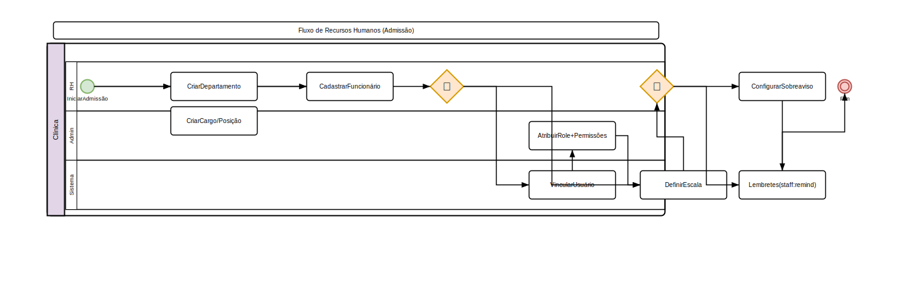

# Manual Técnico

Documentação para desenvolvedores e administradores do sistema.

---

## Arquitetura

### Stack
| Camada | Tecnologia |
|--------|-----------|
| Backend | Laravel 13, PHP 8.4 |
| Frontend | AdminLTE 3.2, Tailwind CSS, Alpine.js |
| Componentes | Livewire 3, FullCalendar 6, Chart.js, TomSelect 2.3 |
| Banco | MySQL 8+ |
| Autenticação | Laravel Breeze, Spatie Permissions v7 |
| PDF | Dompdf (barryvdh/laravel-dompdf) |
| QR Code | endroid/qr-code |
| Markdown | league/commonmark |

### Estrutura de Diretórios
```
app/
├─ Console/Commands/     # Comandos Artisan (~15 comandos)
├─ Events/               # Eventos do sistema
├─ Exceptions/           # Exceções customizadas
├─ Http/
│  ├─ Controllers/      # Controladores (~50)
│  │  └─ Portal/        # Portal do tutor (~8 controllers)
│  ├─ Livewire/         # Componentes Livewire (~35)
│  └─ Middleware/       # Middlewares (SetBranchContext, etc.)
├─ Listeners/           # Listeners de eventos
├─ Models/              # Eloquent Models (~60)
├─ Providers/           # Service Providers
└─ Services/            # Classes de serviço
    ├─ Communication/   # WhatsAppProvider, SmsProvider
    ├─ Insurance/       # PortoSeguroProvider
    └─ Nfse/            # NfseProvider, NfseService, WebmaniaProvider
resources/
├─ docs/                # Documentação em Markdown (source)
├─ views/
│  ├─ layouts/          # Layouts (adminlte, sidebar, mobile)
│  ├─ livewire/         # Views dos componentes Livewire
│  ├─ portal/           # Views do portal do tutor
│  └─ ...               # Views por módulo
routes/
├─ web.php              # Rotas principais
├─ portal.php           # Rotas do portal do tutor
├─ api.php              # Rotas de API
└─ console.php          # Rotas de console
storage/
└─ docs/                # Documentação publicada (cópia de resources/docs/)
tests/
├─ Unit/Models/         # Testes unitários de modelos (~290)
├─ Feature/Controllers/ # Testes de controllers (~400)
├─ Feature/Commands/    # Testes de comandos (~25)
├─ Feature/Integrations/# Testes de fluxo (~12)
├─ Feature/Api/         # Testes de API (~18)
├─ Feature/Portal/      # Testes do portal (~20)
├─ Feature/Services/    # Testes de serviços (~12)
└─ Unit/Services/       # Testes unitários de serviços (~18)
```

### Escopo de Dados
- **Tutores e Pets**: Globais (compartilhados entre filiais)
- **Dados Operacionais**: Escopados por filial (branch_id)
- **Usuários**: Possuem branch_id (null = global)
- **Convênios, Fornecedores, Produtos**: Globais
- **Financeiro, Estoque, Agendamentos**: Escopados por filial

### Requisitos de Hardware

#### Demonstração (1–5 usuários)

| Componente | Mínimo | Recomendado |
|---|---|---|
| **CPU** | 1 core | 2 cores |
| **RAM** | 2 GB | 4 GB |
| **Armazenamento** | 10 GB SSD | 20 GB SSD |

**Stack:** PHP 8.2+, Nginx, MySQL 8+ / MariaDB 10.6+, Redis opcional. Consumo ~1 GB RAM.

#### Produção (50–200 usuários)

Arquitetura com **2 servidores** separando aplicação e banco:

| Componente | Aplicação | Banco de Dados |
|---|---|---|
| **CPU** | 4 cores | 4–8 cores |
| **RAM** | 8 GB | 16 GB |
| **Armazenamento** | 50 GB SSD | 100 GB SSD |

**Stack obrigatória:** PHP-FPM (8–16 workers), Nginx, MySQL 8+ dedicado (`innodb_buffer_pool_size` 70–80% da RAM), Redis (filas + cache + sessões), Supervisor (2–4 workers `queue:work`), backups diários, fail2ban, Certbot TLS.

**Consumo (app):** ~2 GB RAM. **Consumo (banco):** ~10 GB RAM.

> Para alta disponibilidade: balanceador + 2+ servidores app + réplica MySQL.

### CRUD Pattern (Phase V — Modal CRUD)
CRUDs de Tier 1 e Tier 2 usam modais Bootstrap + Livewire form components:
- `app/Livewire/{Entity}Form.php` — Livewire component com mount($id), validação, save()
- `resources/views/livewire/{entity}-form.blade.php` — form sem layout
- Delete via SweetAlert2 global interceptador de `form[method=DELETE]`
- ~29 Livewire form components, 27 index views com modal

---

## Módulos

### Fases Implementadas
| Fase | Descrição | Status |
|------|-----------|--------|
| A-G | Infraestrutura (schema, roles, middleware) | ✅ |
| H-K | RH (departamentos, cargos, funcionários, escalas) | ✅ |
| L-N | Clínico (prontuários, prescrições, vacinas, exames) | ✅ |
| O-P | Farmácia (produtos, estoque, lotes, substâncias controladas) | ✅ |
| P   | Features (eutanásia, pré-anestesia, dietas, claims, CVI, triagem) | ✅ |
| Q   | Gaps reais (lote, aprovação, microchip, auto-invoice, comissões, Rx verification, conciliação) | ✅ |
| R   | Enhancement (Livewire triage, CVI PDF, auto-claim, QR Rx) | ✅ |
| S   | Workflow diário (calendário, dashboard, chat, mobile, ordens de compra) | ✅ |
| T   | Cobertura 100% (timeline, dosage calculator, portal tutor, price tiers, emergency protocols, corporate dashboard) | ✅ |
| U   | Manutenção (auto-update, rebranding, docs, white label) | ✅ |
| V   | Modal CRUD + SweetAlert2 (29 Livewire form components) | ✅ |
| W   | NFSe (Nota Fiscal de Serviços Eletrônica) | ✅ |

### Módulos do Sistema (29 módulos no Manual do Usuário)
| # | Módulo | Descrição |
|---|--------|-----------|
| 5  | Prontuários | SOAP, planos de tratamento, aprovação, dietas, consentimento |
| 6  | Prescrições | Receita digital, dosagem, verificação QR code, impressão |
| 7  | Vacinas | Aplicação, protocolos, certificado PDF, lembretes, previsão, recall |
| 8  | Exames | Solicitação, coleta, resultado, laudo |
| 9  | Laboratório | Pedidos, amostras, parâmetros, equipamentos integrados |
| 10 | Imagem | Raio-X, ultrassom, tomografia, laudos |
| 11 | Cirurgias | Agendamento, checklist, anestesia, transoperatório |
| 12 | Internações | Registro, evolução, prescrição diária, alta |
| 13 | Farmácia | Produtos, categorias, fornecedores, calculadora dosagem, lotes |
| 14 | Estoque | Movimentações, pedidos compra, substâncias controladas, scanner |
| 15 | Financeiro | Faturas, recebimentos, NFSe, comissões, conciliação bancária |
| 16 | Agendamento | Calendário visual, agendamento online, recorrente, lembretes |
| 17 | Tutores e Pets | Cadastro, microchip/RG, timeline, óbito, portal |
| 18 | Convênios | Cadastro, tabelas, guias, faturamento, claims, CVI |
| 19 | Usuários e Permissões | 11 funções, 160+ permissões |
| 20 | Multi-filiais | Estrutura, corporate dashboard, transferências |
| 21 | Relatórios | Clínicos, financeiros, estoque, exportação |
| 22 | Auditoria e LGPD | Trilha auditoria, direitos titular, anonimização |
| 23 | Notificações | Canais, preferências tutor, campanhas |
| 24 | Chat | Mensagens tutor ↔ clínica, anexos |
| 25 | Configurações | Sistema, integrações, identidade visual, auto-update |
| 26 | Emergências | Protocolos de emergência por espécie/gravidade |
| 27 | Mobile | Interface responsiva, modo mobile /m |
| 28 | Triagem | Painel Livewire, classificação Manchester, tempo real |
| 29 | Hospedagem | Boarding, check-in/out, tarefas, banho e tosa |
| 30 | Odontologia | Odontograma, procedimentos, periodontia |
| 31 | Zoonoses | Cadastro, notificação compulsória, relatórios |

---

## Permissões

O sistema utiliza **Spatie Laravel Permission v7** com **11 papéis**:

| Papel | Slug | Descrição | Permissões |
|-------|------|-----------|------------|
| Super Admin | super-admin | Acesso total irrestrito | ~160 (todas) |
| Admin | admin | Acesso total ao sistema | ~160 (todas) |
| Branch Admin | branch-admin | Administração por filial | ~160 (escopo filial) |
| Veterinarian | veterinarian | Acesso clínico completo | ~105 |
| Receptionist | receptionist | Agenda e cadastro | ~22 |
| Financial | financial | Módulo financeiro | ~14 |
| Super Financial | super-financial | Financeiro global | ~19 |
| Stock Manager | stock-manager | Estoque e farmácia | ~25 |
| Human Resources | human-resources | RH | ~10 |
| Tutor | tutor | Portal do tutor | 0 |
| Auditor | auditor | Apenas leitura | ~80+ |

As permissões seguem o padrão `modulo.acao` (ex: `appointments.create`, `products.view`, `nfse.emit`).

### Categorias de Permissão
- **Admin:** admin.view, users.*, roles.*, branches.*
- **Cadastro:** tutors.*, pets.*, convenios.*
- **Clínico:** medical-records.*, prescriptions.*, vaccinations.*, exams.*, surgeries.*, triage.*
- **Farmácia:** products.*, stock.*, suppliers.*, categories.*, controlled-substances.*
- **Financeiro:** invoices.*, payments.*, nfse.*, commissions.*, bank-reconciliation.*
- **Estoque:** purchase-orders.*, stock.transfer
- **Sistema:** configuracoes.view, docs.view, system-update, branding
- **Outros:** chat.*, emergency-protocols.*, diet-plans.*, pre-anesthetic.*, convenio-claims.*

---

## Integrações

### Comunicação

#### WhatsApp (Z-API)
| Chave | Variável .env | Padrão | Descrição |
|-------|---------------|--------|-----------|
| `communication.whatsapp.url` | `WHATSAPP_API_URL` | `https://api.z-api.io/v1` | URL base da API Z-API |
| `communication.whatsapp.token` | `WHATSAPP_API_TOKEN` | — | Token de autenticação Bearer |
| `communication.whatsapp.instance` | `WHATSAPP_INSTANCE` | — | ID da instância Z-API |

**Provider**: `App\Services\Communication\WhatsAppProvider`
**Uso**: Comando `ProcessCommunicationQueue` envia mensagens para canal `whatsapp`

#### SMS
| Chave | Variável .env | Padrão | Descrição |
|-------|---------------|--------|-----------|
| `communication.sms.url` | `SMS_API_URL` | `https://api.smsprovider.com/v1/send` | URL base da API de SMS |
| `communication.sms.key` | `SMS_API_KEY` | — | Chave de API (Bearer token) |

**Provider**: `App\Services\Communication\SmsProvider`
**Uso**: Comando `ProcessCommunicationQueue` envia mensagens para canal `sms`

#### E-mail API
| Chave | Variável .env | Padrão | Descrição |
|-------|---------------|--------|-----------|
| `email-api.url` | `EMAIL_API_URL` | `https://api.example.com/send` | URL base da API de e-mail |
| `email-api.token` | `EMAIL_API_TOKEN` | — | Token de autenticação |
| `email-api.timeout` | `EMAIL_API_TIMEOUT` | `15` | Timeout em segundos |

**Service**: `App\Services\EmailApiService`
**Uso**: Comando `ProcessCommunicationQueue` envia mensagens para canal `email`

#### SMTP (Laravel Mail)
Variáveis padrão do Laravel: `MAIL_MAILER`, `MAIL_HOST`, `MAIL_PORT`, `MAIL_USERNAME`, `MAIL_PASSWORD`, `MAIL_ENCRYPTION`, `MAIL_FROM_ADDRESS`, `MAIL_FROM_NAME`.
Suporte a Mailgun, SES, Postmark via `config/services.php`.

### NFSe (Webmania®)

**Provider**: `App\Services\Nfse\WebmaniaProvider` (implementa `NfseProvider` interface)
**Adapter**: `App\Services\Nfse\NfseService` — orquestra configuração → payload → emissão → persistência
**Endpoints**: `POST /v1/nfse/emitir`, `GET /v1/nfse/{id}`, `POST /v1/nfse/{id}/cancelar`
**Autenticação**: Headers `X-App-Id`, `X-App-Secret`, `X-Consumer-Key`, `X-Consumer-Secret`
**Arquitetura**: Adapter Pattern — permite trocar Webmania® por outro provedor sem alterar regras de negócio

### Pagamentos

#### PIX
| Chave | Variável .env | Padrão | Descrição |
|-------|---------------|--------|-----------|
| `pix.pix_key` | `PIX_KEY` | `admin@vetessence.com` | Chave PIX (CPF, CNPJ, e-mail, telefone ou aleatória) |
| `pix.gi` | `PIX_GI` | `br.gov.bcb.pix` | GUI (identificador do arranjo de pagamentos) |
| `pix.merchant_name` | `PIX_MERCHANT_NAME` | `VETESSENCE CLINICA VETERINARIA` | Nome do recebedor (ate 25 caracteres) |
| `pix.city` | `PIX_CITY` | `SAO PAULO` | Cidade do recebedor |
| `pix.url` | `PIX_URL` | — | URL opcional para payload dinâmico |

**Service**: `App\Services\PixService` — gera payload EMV + QR Code
**Testes**: `tests/Unit/Services/PixServiceTest.php` (9 testes)

#### Gateway de Pagamento
Gerenciado via banco de dados na tabela `payment_gateways`. Acesse o painel admin para configurar:

| Campo | Descrição |
|-------|-----------|
| `provider` | Nome do provedor (mercadopago, pagseguro, stripe, pix) |
| `public_key` | Chave pública/API |
| `secret_key` | Chave secreta (não serializada) |
| `webhook_secret` | Segredo para validar callbacks |
| `webhook_url` | URL de callback |
| `is_sandbox` | Modo de teste |

> **Nota**: O CRUD de gateways está implementado, mas a chamada real à SDK do provedor (`PaymentService@charge`) ainda é um stub.

### APIs Externas

#### GitHub (Auto-Update)
Configurado via painel admin em **Configurações > Atualizar Sistema**:

| Chave (settings table) | Descrição |
|------------------------|-----------|
| `github_token` | Token de acesso pessoal GitHub |
| `github_repo` | Repositório (ex: `hectordufau/vetessence`) |
| `github_branch` | Branch (ex: `main`) |

**Controller**: `App\Http\Controllers\SystemUpdateController`
**Fluxo**: `php artisan down` → `git pull https://token@github.com/...` → `php artisan migrate` → limpa cache → `php artisan up`

#### Porto Seguro (Insurance Claims)
| Chave | Variável .env | Padrão | Descrição |
|-------|---------------|--------|-----------|
| `insurance.porto_seguro.url` | `PORTO_SEGURO_API_URL` | `https://api.portoseguro.com.br/v1/claims` | URL base da API |
| `insurance.porto_seguro.key` | `PORTO_SEGURO_API_KEY` | — | Chave de API |
| `insurance.porto_seguro.timeout` | `PORTO_SEGURO_TIMEOUT` | `30` | Timeout em segundos |

**Provider**: `App\Services\Insurance\PortoSeguroProvider`
**Comando**: `claims:auto-file` — envia claims pendentes automaticamente
**Webhook**: `POST /api/insurance/webhook` (público, rate-limited: 60/min)

#### Equipamentos de Laboratório
Gerenciado via banco de dados na tabela `lab_equipment_integrations`. Acesse o painel admin:

| Campo | Descrição |
|-------|-----------|
| `equipment_type` | Tipo de equipamento |
| `protocol` | Protocolo (rest, hl7, fhir, custom) |
| `endpoint_url` | URL HTTP para envio/recepção |
| `api_key` | Chave de API |
| `ip_address` | Endereço IP (para HL7 direto) |
| `port` | Porta TCP |

**Endpoints públicos**: `POST /api/v1/lab-equipment/{id}/receive` e `GET /api/v1/lab-equipment/{id}/status`

#### Jitsi Meet (Teleconsulta)
Gera salas automaticamente no formato `https://meet.jit.si/{app-name}-{token}`. Nenhuma configuração adicional necessária.

#### NFSe Webhook
**Endpoint**: `POST /api/webhooks/nfse/{branch_id}` (público, rate-limited: 60/min)
**Uso**: Recebe callbacks da Webmania® com atualização de status de NFSe (opcional, processamento síncrono alternativo)

---

## Webhooks

| Endpoint | Público | Rate Limit | Descrição |
|----------|---------|------------|-----------|
| `POST /r/{hash}` | Sim | 10 req/min | Verificação pública de prescrição |
| `POST /api/insurance/webhook` | Sim | 60/min | Callback de status de claims |
| `POST /api/webhooks/nfse/{branch_id}` | Sim | 60/min | Callback de atualização NFSe |
| `POST /api/v1/lab-equipment/{id}/receive` | Sim | — | Recebimento de resultados lab |
| `GET /api/v1/lab-equipment/{id}/status` | Sim | — | Status de equipamento lab |

---

## Testes

### Suite Completa

| Suite | Count | Descrição |
|-------|-------|-----------|
| Unit/Models | ~290 | Todos os modelos |
| Feature/Controllers | ~400 | Todos os controllers |
| Feature/Commands | ~25 | Comandos Artisan |
| Feature/Integrations | ~12 | Fluxos completos |
| Feature/Api | ~18 | Endpoints de API |
| Feature/Portal | ~20 | Portal do tutor |
| Feature/Services | ~12 | Serviços (NFSe providers, etc.) |
| Unit/Services | ~18 | Serviços (Pix, EmailApi, BranchContext) |
| **Total** | **~887** | **238 files, 865 methods, 1520 assertions** |

### Como Rodar

```bash
# Todos os testes
php artisan test

# Unit tests
php artisan test --testsuite=Unit

# Feature tests
php artisan test --testsuite=Feature

# Filter por controller
php artisan test --filter="DepartmentController|NfseController"

# Verboso
php artisan test --filter="PetControllerTest::test_index" --verbose
```

### Database
- Driver: `mysql_testing` (configurado em `config/database.php`)
- Host: `127.0.0.1:3307`, Database: `vetessence_testing`
- Todas as migrations aplicadas
- `DatabaseTransactions` (não `RefreshDatabase`)

---

## Variáveis de Ambiente

| Variável | Descrição |
|----------|-----------|
| `APP_NAME` | Nome do sistema |
| `DB_HOST` | Host do banco |
| `DB_PORT` | Porta do banco |
| `DB_DATABASE` | Nome do banco |
| `DB_USERNAME` | Usuário do banco |
| `DB_PASSWORD` | Senha do banco |
| `WHATSAPP_API_URL` | URL da API WhatsApp (Z-API) |
| `WHATSAPP_API_TOKEN` | Token da API WhatsApp |
| `WHATSAPP_INSTANCE` | Instância Z-API |
| `SMS_API_URL` | URL da API de SMS |
| `SMS_API_KEY` | Chave da API de SMS |
| `EMAIL_API_URL` | URL da API de e-mail |
| `EMAIL_API_TOKEN` | Token da API de e-mail |
| `PORTO_SEGURO_API_URL` | URL da API Porto Seguro |
| `PORTO_SEGURO_API_KEY` | Chave da API Porto Seguro |
| `GITHUB_TOKEN` | Token para auto-update |
| `PIX_KEY` | Chave PIX |
| `PIX_MERCHANT_NAME` | Nome do recebedor PIX |
| `PIX_CITY` | Cidade do recebedor PIX |
| `WEBMANIA_APP_ID` | App ID Webmania NFSe |
| `WEBMANIA_APP_SECRET` | App Secret Webmania NFSe |
| `WEBMANIA_CONSUMER_KEY` | Consumer Key Webmania NFSe |
| `WEBMANIA_CONSUMER_SECRET` | Consumer Secret Webmania NFSe |
| `SESSION_DRIVER` | Driver de sessão (file, database, redis) |
| `QUEUE_CONNECTION` | Driver de fila (sync, database, redis) |

---

## Deploy

### 1. Preparação do Servidor (comum a demo e produção)

```bash
# Atualizar SO
apt update && apt upgrade -y

# Instalar dependências do sistema
apt install -y nginx mysql-server-8.0 redis-server supervisor \
  git curl wget unzip gnupg2 fail2ban ufw

# PHP 8.4 (Ondrej PPA)
add-apt-repository -y ppa:ondrej/php
apt update
apt install -y php8.4-fpm php8.4-cli php8.4-common \
  php8.4-bcmath php8.4-gd php8.4-intl php8.4-mbstring \
  php8.4-mysql php8.4-xml php8.4-zip php8.4-curl php8.4-redis

# Composer
php -r "copy('https://getcomposer.org/installer', 'composer-setup.php');"
php composer-setup.php --install-dir=/usr/local/bin --filename=composer
php -r "unlink('composer-setup.php');"

# Node.js 20+
curl -fsSL https://deb.nodesource.com/setup_20.x | bash -
apt install -y nodejs

# Firewall
ufw allow 22/tcp
ufw allow 80/tcp
ufw allow 443/tcp
ufw --force enable
```

---

### 2. Instalação de Demonstração (servidor único)

Aplicável quando app e banco rodam na mesma máquina (mínimo 2 GB RAM, 1 core).

```bash
# 2.1. Configurar MySQL
mysql -u root -p <<SQL
CREATE DATABASE vetessence CHARACTER SET utf8mb4 COLLATE utf8mb4_unicode_ci;
CREATE USER 'vetessence'@'localhost' IDENTIFIED BY 'SUA_SENHA_AQUI';
GRANT ALL PRIVILEGES ON vetessence.* TO 'vetessence'@'localhost';
FLUSH PRIVILEGES;
SQL

# 2.2. Clonar e instalar
cd /var/www
git clone https://github.com/hectordufau/vetessence.git
cd vetessence
cp .env.example .env

# 2.3. Ajustar .env (editar manualmente ou via sed)
sed -i "s/DB_DATABASE=.*/DB_DATABASE=vetessence/" .env
sed -i "s/DB_USERNAME=.*/DB_USERNAME=vetessence/" .env
sed -i "s/DB_PASSWORD=.*/DB_PASSWORD=SUA_SENHA_AQUI/" .env

# 2.4. Instalar dependências e buildar
composer install --no-dev --optimize-autoloader
npm install && npm run build

# 2.5. Configurar Laravel
php artisan key:generate
php artisan livewire:publish
php artisan vendor:publish --tag=livewire:assets --force
php artisan migrate --seed
php artisan storage:link
php artisan docs:publish

# 2.6. Permissões
chown -R www-data:www-data storage bootstrap/cache
chmod -R 775 storage bootstrap/cache

# 2.7. Configurar Nginx (ver exemplo abaixo)
# 2.8. Configurar PHP-FPM para ambiente demo
sed -i 's/pm.max_children =.*/pm.max_children = 6/' /etc/php/8.4/fpm/pool.d/www.conf
sed -i 's/pm.start_servers =.*/pm.start_servers = 2/' /etc/php/8.4/fpm/pool.d/www.conf
sed -i 's/pm.min_spare_servers =.*/pm.min_spare_servers = 1/' /etc/php/8.4/fpm/pool.d/www.conf
sed -i 's/pm.max_spare_servers =.*/pm.max_spare_servers = 3/' /etc/php/8.4/fpm/pool.d/www.conf
systemctl restart php8.4-fpm

# 2.9. HTTPS (se houver domínio)
certbot --nginx -d seu-dominio.com
```

---

### 3. Instalação de Produção (2 servidores)

#### 3.1. Servidor de Banco de Dados

```bash
# Instalar MySQL
apt install -y mysql-server-8.0

# Editar /etc/mysql/mysql.conf.d/mysqld.cnf
cat >> /etc/mysql/mysql.conf.d/mysqld.cnf <<'EOF'
[mysqld]
bind-address = 0.0.0.0
max_connections = 500
innodb_buffer_pool_size = 12G        # 70-80% da RAM (16 GB)
innodb_log_file_size = 1G
innodb_flush_log_at_trx_commit = 2
innodb_flush_method = O_DIRECT
innodb_file_per_table = 1
query_cache_type = 0
tmp_table_size = 256M
max_heap_table_size = 256M
EOF

systemctl restart mysql

# Criar banco e usuário com acesso do servidor app
mysql -u root <<SQL
CREATE DATABASE vetessence CHARACTER SET utf8mb4 COLLATE utf8mb4_unicode_ci;
CREATE USER 'vetessence'@'IP_DO_SERVIDOR_APP' IDENTIFIED BY 'SENHA_FORTE';
GRANT ALL PRIVILEGES ON vetessence.* TO 'vetessence'@'IP_DO_SERVIDOR_APP';
FLUSH PRIVILEGES;
SQL

# Firewall: liberar apenas app server
ufw allow from IP_DO_SERVIDOR_APP to any port 3306
```

#### 3.2. Servidor de Aplicação

```bash
# 3.2.1. Clonar e instalar (mesmo que demo)
cd /var/www
git clone https://github.com/hectordufau/vetessence.git
cd vetessence
cp .env.example .env

# 3.2.2. .env para produção
sed -i "s/DB_HOST=.*/DB_HOST=IP_DO_SERVIDOR_BANCO/" .env
sed -i "s/DB_DATABASE=.*/DB_DATABASE=vetessence/" .env
sed -i "s/DB_USERNAME=.*/DB_USERNAME=vetessence/" .env
sed -i "s/DB_PASSWORD=.*/DB_PASSWORD=SENHA_FORTE/" .env
sed -i "s/QUEUE_CONNECTION=.*/QUEUE_CONNECTION=redis/" .env
sed -i "s/CACHE_DRIVER=.*/CACHE_DRIVER=redis/" .env
sed -i "s/SESSION_DRIVER=.*/SESSION_DRIVER=redis/" .env
sed -i "s/REDIS_HOST=.*/REDIS_HOST=127.0.0.1/" .env
sed -i "s/APP_ENV=.*/APP_ENV=production/" .env
sed -i "s/APP_DEBUG=.*/APP_DEBUG=false/" .env

# 3.2.3. Dependências
composer install --no-dev --optimize-autoloader
npm install && npm run build
php artisan key:generate
php artisan livewire:publish
php artisan vendor:publish --tag=livewire:assets --force
php artisan migrate --seed
php artisan storage:link
php artisan docs:publish

# 3.2.4. Permissões
chown -R www-data:www-data storage bootstrap/cache
chmod -R 775 storage bootstrap/cache

# 3.2.5. Otimização Laravel
php artisan config:cache
php artisan route:cache
php artisan view:cache
php artisan event:cache
```

#### 3.3. Nginx — Virtual Host

**Passo 1 — Configuração inicial (porta 80 apenas):**

```nginx
# /etc/nginx/sites-available/vetessence
server {
    listen 80;
    server_name seu-dominio.com;
    root /var/www/vetessence/public;

    index index.php;

    charset utf-8;
    client_max_body_size 50M;

    # Gzip
    gzip on;
    gzip_types text/plain text/css application/json application/javascript image/svg+xml;
    gzip_min_length 256;

    location / {
        try_files $uri $uri/ /index.php?$query_string;
    }

    location ~ \.php$ {
        fastcgi_pass unix:/run/php/php8.4-fpm.sock;
        fastcgi_index index.php;
        fastcgi_param SCRIPT_FILENAME $realpath_root$fastcgi_script_name;
        include fastcgi_params;
    }

    location ~ /\.(?!well-known).* {
        deny all;
    }

    location ~ \.env$ {
        deny all;
    }

    # Cache de assets estáticos
    location ~* \.(jpg|jpeg|png|gif|ico|css|js|svg|woff2?)$ {
        expires 365d;
        add_header Cache-Control "public, immutable";
    }

    # Logs
    access_log /var/log/nginx/vetessence_access.log;
    error_log  /var/log/nginx/vetessence_error.log;
}
```

Ativar e reiniciar:
```bash
ln -s /etc/nginx/sites-available/vetessence /etc/nginx/sites-enabled/
rm /etc/nginx/sites-enabled/default
nginx -t && systemctl restart nginx
```

**Passo 2 — Após executar `certbot --nginx`:**

O Certbot altera automaticamente o virtual host para incluir SSL e redirecionamento HTTP → HTTPS. O resultado final será equivalente a:

```nginx
# /etc/nginx/sites-available/vetessence

# Redirecionamento HTTP → HTTPS
server {
    listen 80;
    server_name seu-dominio.com;
    return 301 https://$server_name$request_uri;
}

server {
    listen 443 ssl http2;
    server_name seu-dominio.com;
    root /var/www/vetessence/public;

    index index.php;

    charset utf-8;
    client_max_body_size 50M;

    # SSL (gerado pelo Certbot)
    ssl_certificate     /etc/letsencrypt/live/seu-dominio.com/fullchain.pem;
    ssl_certificate_key /etc/letsencrypt/live/seu-dominio.com/privkey.pem;
    include /etc/letsencrypt/options-ssl-nginx.conf;
    ssl_dhparam /etc/letsencrypt/ssl-dhparams.pem;

    # Segurança
    add_header Strict-Transport-Security "max-age=31536000; includeSubDomains" always;
    add_header X-Frame-Options "SAMEORIGIN" always;
    add_header X-Content-Type-Options "nosniff" always;

    # Gzip
    gzip on;
    gzip_types text/plain text/css application/json application/javascript image/svg+xml;
    gzip_min_length 256;

    location / {
        try_files $uri $uri/ /index.php?$query_string;
    }

    location ~ \.php$ {
        fastcgi_pass unix:/run/php/php8.4-fpm.sock;
        fastcgi_index index.php;
        fastcgi_param SCRIPT_FILENAME $realpath_root$fastcgi_script_name;
        include fastcgi_params;
    }

    location ~ /\.(?!well-known).* {
        deny all;
    }

    location ~ \.env$ {
        deny all;
    }

    location ~* \.(jpg|jpeg|png|gif|ico|css|js|svg|woff2?)$ {
        expires 365d;
        add_header Cache-Control "public, immutable";
    }

    access_log /var/log/nginx/vetessence_access.log;
    error_log  /var/log/nginx/vetessence_error.log;
}
```

> **Nota:** O Certbot cria os arquivos `options-ssl-nginx.conf` e `ssl-dhparams.pem` em `/etc/letsencrypt/`. A renovação automática via snap mantém esses arquivos atualizados. Não edite manualmente os caminhos dos certificados — o Certbot os gerencia.

#### 3.4. PHP-FPM (Produção)

```bash
# Editar /etc/php/8.4/fpm/pool.d/www.conf
# Para servidor com 8 GB RAM e 4 cores:
#   pm = dynamic
#   pm.max_children = 16
#   pm.start_servers = 4
#   pm.min_spare_servers = 2
#   pm.max_spare_servers = 8
#   pm.max_requests = 500

sed -i 's/pm.max_children =.*/pm.max_children = 16/' /etc/php/8.4/fpm/pool.d/www.conf
sed -i 's/pm.start_servers =.*/pm.start_servers = 4/' /etc/php/8.4/fpm/pool.d/www.conf
sed -i 's/pm.min_spare_servers =.*/pm.min_spare_servers = 2/' /etc/php/8.4/fpm/pool.d/www.conf
sed -i 's/pm.max_spare_servers =.*/pm.max_spare_servers = 8/' /etc/php/8.4/fpm/pool.d/www.conf

systemctl restart php8.4-fpm
```

#### 3.5. Redis

```bash
# /etc/redis/redis.conf
sed -i 's/# maxmemory <bytes>/maxmemory 1gb/' /etc/redis/redis.conf
sed -i 's/# maxmemory-policy noeviction/maxmemory-policy allkeys-lru/' /etc/redis/redis.conf
systemctl restart redis-server
```

#### 3.6. Supervisor — Workers de Fila

```ini
# /etc/supervisor/conf.d/vetessence-worker.conf
[program:vetessence-queue]
process_name=%(program_name)s_%(process_num)02d
command=php /var/www/vetessence/artisan queue:work redis --sleep=3 --tries=3 --max-time=3600
autostart=true
autorestart=true
stopasgroup=true
killasgroup=true
user=www-data
numprocs=4
redirect_stderr=true
stdout_logfile=/var/log/vetessence/queue-worker.log
stopwaitsecs=3600
```

```bash
mkdir -p /var/log/vetessence
supervisorctl reread
supervisorctl update
supervisorctl start all
```

#### 3.7. SSL com Let's Encrypt

No **Ubuntu 22.04+**, instale o Certbot via **snap** (recomendado pela Let's Encrypt):

```bash
# Remover versão antiga via apt (se existir)
apt remove -y certbot python3-certbot-nginx 2>/dev/null

# Instalar via snap
snap install certbot --classic

# Garantir que o comando certbot está no PATH
ln -sf /snap/bin/certbot /usr/bin/certbot
```

> **Alternativa via apt:** Caso prefira não usar snap, ative o repositório `universe` e instale `apt install -y certbot python3-certbot-nginx`. A versão via apt pode ser mais antiga, mas é funcional.

Emitir certificado e configurar Nginx automaticamente:

```bash
certbot --nginx -d seu-dominio.com --non-interactive --agree-tos -m admin@seu-dominio.com
```

Verificar renovação automática (o snap já configura o timer):

```bash
certbot renew --dry-run
```

#### 3.8. Segurança

```bash
# fail2ban para Nginx
cat > /etc/fail2ban/jail.local <<'EOF'
[nginx-http-auth]
enabled  = true
port     = http,https
filter   = nginx-http-auth
logpath  = /var/log/nginx/*error.log
maxretry = 5
findtime = 600
bantime  = 3600
EOF
systemctl restart fail2ban

# Desabilitar root SSH
sed -i 's/PermitRootLogin yes/PermitRootLogin no/' /etc/ssh/sshd_config
systemctl restart sshd

# Permissões restritas
chmod 640 /var/www/vetessence/.env
```

#### 3.9. Backup

```bash
# Script de backup diário (/usr/local/bin/backup-vetessence.sh)
#!/bin/bash
BACKUP_DIR="/backups/vetessence"
DATE=$(date +%Y%m%d_%H%M%S)
mkdir -p "$BACKUP_DIR"

# Banco
mysqldump --single-transaction --routines --events \
  -u vetessence -p'SENHA' vetessence | gzip > "$BACKUP_DIR/db_$DATE.sql.gz"

# Storage (arquivos enviados)
rsync -a /var/www/vetessence/storage/app "$BACKUP_DIR/storage_$DATE/"

# Reter 30 dias
find "$BACKUP_DIR" -name "db_*.sql.gz" -mtime +30 -delete
find "$BACKUP_DIR" -name "storage_*" -mtime +30 -exec rm -rf {} \;
```

```bash
chmod +x /usr/local/bin/backup-vetessence.sh
echo "0 3 * * * root /usr/local/bin/backup-vetessence.sh" > /etc/cron.d/vetessence-backup
```

#### 3.10. Monitoramento (opcional)

```bash
# Verificar workers
supervisorctl status

# Logs da aplicação
tail -f /var/www/vetessence/storage/logs/laravel.log

# Health check
curl https://seu-dominio.com/up
```

> **Nota:** O endpoint `/up` retorna HTTP 200 se o servidor estiver operacional, sem exigir autenticação. Útil para health checks de balanceadores.

---

### 4. Manutenção

Após atualizar o Livewire via `composer update`, republicar os assets:

```bash
php artisan livewire:publish
php artisan vendor:publish --tag=livewire:assets --force
php artisan optimize:clear
```

Manutenção geral:

```bash
php artisan down              # Modo manutenção
php artisan up                # Reativar
php artisan optimize:clear    # Limpar cache após alterações
php artisan docs:publish      # Republicar documentação
php artisan livewire:publish  # Republicar config/assets Livewire
php artisan vendor:publish --tag=livewire:assets --force
```

### 5. Auto-Update

Admin pode atualizar via painel em **Configurações > Atualizar Sistema**.
Requer token GitHub configurado e `exec()` habilitado no servidor.

Fluxo executado pelo sistema:
```bash
php artisan down
git pull https://token@github.com/hectordufau/vetessence.git
php artisan migrate --force
php artisan livewire:publish
php artisan vendor:publish --tag=livewire:assets --force
php artisan optimize:clear
php artisan up
```

### 6. .env — Variáveis Essenciais

As variáveis abaixo **devem** ser configuradas antes de iniciar:

| Variável | Obrigatório | Descrição |
|----------|-------------|-----------|
| `APP_URL` | Sim | URL completa do sistema (ex: `https://vetessence.com.br`) |
| `DB_HOST` | Sim | Host do MySQL (local ou remoto) |
| `DB_DATABASE` | Sim | Nome do banco |
| `DB_USERNAME` | Sim | Usuário do banco |
| `DB_PASSWORD` | Sim | Senha do banco |
| `QUEUE_CONNECTION` | Sim* | `sync` (demo) ou `redis` (produção) |
| `SESSION_DRIVER` | Sim* | `file` (demo) ou `redis` (produção) |
| `REDIS_HOST` | Produção | Host do Redis (usualmente `127.0.0.1`) |

Para variáveis de integração (WhatsApp, NFSe, PIX, etc.), veja a seção [Integrações](#integrações).

---

## Documentação do Sistema

- **Source**: `resources/docs/` (arquivos .md)
- **Published**: `storage/docs/` (via comando `docs:publish`)
- **Admin route**: `/docs` (requer permissão `docs.view`)
- **Tutor route**: `/portal/docs` (autenticado como tutor)
- **Controllers**: `DocController` + `Portal\DocController`
- **Conteúdo**:
  - Manual do Usuário: 29 módulos (05 a 31)
  - Manual Técnico: Este documento
  - Changelog
  - Manual do Tutor: 13 tópicos

---

## Diagrama do Processo


*Clique na imagem para ampliar. Diagrama BPMN 2.0 — setas contínuas = fluxo sequencial, tracejadas = fluxo de mensagem, losangos = decisão.*

---

## Diagrama do Processo


*Clique na imagem para ampliar. Diagrama BPMN 2.0 — setas contínuas = fluxo sequencial, tracejadas = fluxo de mensagem, losangos = decisão.*
