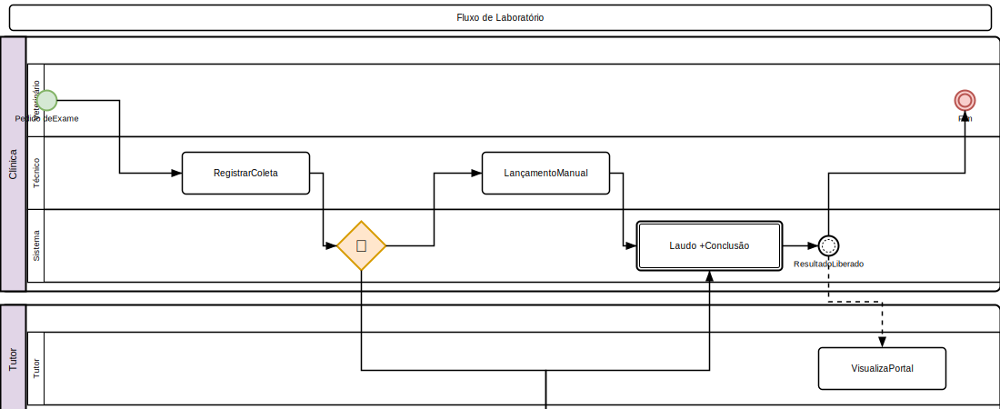

# Exames

## Solicitar Exame
1. Acesse **Clínico > Exames**
2. Clique em **Novo**
3. Selecione o **pet** e o **veterinário** solicitante
4. Escolha o **tipo de exame**:
   - **Laboratório**: Hemograma, bioquímico, urinálise, parasitológico
   - **Imagem**: Raio-X, ultrassom, tomografia, ressonância
5. Preencha as **instruções** (jejum, preparo)
6. Clique em **Salvar**

## Coleta (Laboratório)
1. Acesse o exame solicitado
2. Registre a **coleta**:
   - **Data e hora**
   - **Profissional** que coletou
   - **Amostra**: Sangue, urina, fezes, swab
3. Encaminhe ao laboratório

## Lançamento de Resultados
1. Acesse o exame
2. Clique em **Lançar Resultado**
3. Preencha os parâmetros conforme o tipo de exame
4. Adicione **laudo** e **conclusão**
5. O resultado fica disponível no prontuário e no portal do tutor

## Laudos de Imagem
1. Acesse o exame de imagem
2. Faça upload das **imagens** (DICOM, JPEG, PNG)
3. Redija o **laudo** com:
   - Descrição dos achados
   - Conclusão diagnóstica
   - Recomendações
4. Associe ao prontuário do pet

## Laboratório

### Pedidos de Laboratório
1. Acesse **Clínico > Laboratório**
2. Fluxo: **Solicitação → Coleta → Processamento → Resultado**
3. Acompanhe o status de cada pedido:
   - **Solicitado**: Exame pedido, aguardando coleta
   - **Coletado**: Amostra coletada, em processamento
   - **Processando**: Amostra em análise
   - **Resultado**: Laudo disponível
   - **Liberado**: Resultado liberado para o tutor

### Registrar Coleta
1. Acesse o pedido de laboratório
2. Registre a coleta:
   - **Data e hora**
   - **Profissional** que coletou
   - **Tipo de amostra**: Sangue, Urina, Fezes, Swab, Líquido, Tecido
   - **Acondicionamento**: Temperatura ambiente, Refrigerado, Congelado
   - **Identificação da amostra** (código de barras)

### Lançar Resultado
1. Acesse o pedido com amostra coletada
2. Preencha os parâmetros conforme tipo de exame:
   - **Hemograma**: Série vermelha, série branca, plaquetas
   - **Bioquímico**: ALT, AST, Creatinina, Uréia, Glicose, etc.
   - **Urinálise**: Aspecto, densidade, pH, sedimento
   - **Parasitológico**: Resultado qualitativo/quantitativo
3. Adicione **laudo** e **conclusão**
4. Clique em **Liberar**
5. Resultado disponível no prontuário e portal do tutor

### Equipamentos Integrados
- Cadastre equipamentos de laboratório em **Configurações > Equipamentos de Laboratório**
- Protocolos suportados: REST, HL7, FHIR
- Recebimento automático de resultados via **webhook** (`POST /api/v1/lab-equipment/{id}/receive`)
- Consulta de status do equipamento via API

## Imagem

### Solicitar Exame de Imagem
1. Acesse **Clínico > Imagem**
2. Tipos: Raio-X, Ultrassom, Tomografia, Ressonância
3. Selecione o **pet** e **região anatômica**
4. Registre **instruções** (preparo, sedação necessária)

### Laudo de Imagem
1. Faça upload das imagens (DICOM, JPEG, PNG)
2. Redija o laudo com:
   - **Descrição dos achados**
   - **Conclusão diagnóstica**
   - **Recomendações**
3. Associe ao prontuário do pet
4. Assine digitalmente

## Regras de Negócio
- Resultados de exames são visíveis ao tutor via portal
- Exames de imagem exigem laudo veterinário
- O prazo para liberação de resultado é configurável por tipo
- Equipamentos de laboratório integrados importam resultados automaticamente
- Laudos de imagem exigem assinatura digital do veterinário

---

## Diagrama do Processo

*Clique na imagem para ampliar. Diagrama de Atividades UML com raias — retângulos = atividades, losangos = decisão, setas = fluxo entre atividades, raias = atores.*

---

## Diagrama do Processo

*Clique na imagem para ampliar. Diagrama de Atividades UML com raias — retângulos = atividades, losangos = decisão, setas = fluxo entre atividades, raias = atores.*

---

## Diagrama do Processo

*Clique na imagem para ampliar. Diagrama de Atividades UML com raias — retângulos = atividades, losangos = decisão, setas = fluxo entre atividades, raias = atores.*
