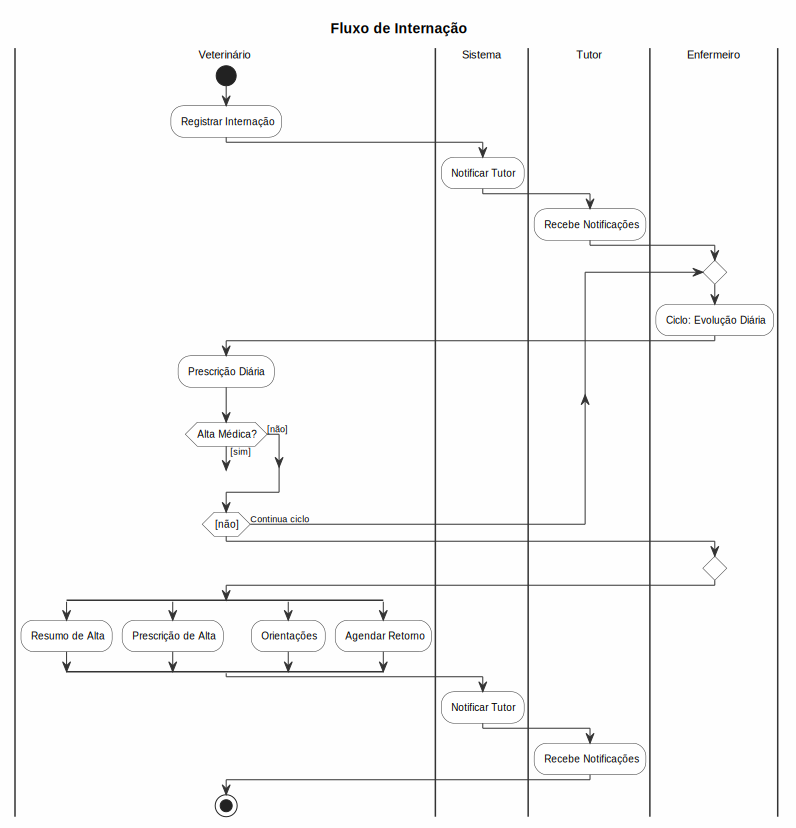

# Internações

## Registrar Internação
1. Acesse **Clínico > Internações**
2. Clique em **Nova Internação**
3. Selecione o **pet** e o **veterinário** responsável
4. Informe:
   - **Motivo da internação**
   - **Data e hora de entrada**
   - **Tipo** (enfermaria, UTI, isolamento)
   - **Observações iniciais**
5. Clique em **Internar**

## Evolução Clínica
- Registre evoluções diárias:
  - **Sinais vitais**: temperatura, FC, FR, pressão
  - **Estado geral**: bom, regular, grave, crítico
  - **Dieta e hidratação**
  - **Medicações administradas**
  - **Exames realizados**
  - **Intercorrências**

## Prescrição Diária
- Prescreva medicamentos para cada dia de internação
- O sistema registra horário de administração
- Controle de gotejo para fluidoterapia

## Resumo de Alta
1. Acesse a internação
2. Clique em **Finalizar**
3. Preencha:
   - **Data e hora da alta**
   - **Condições de alta**: curado, melhorado, à pedido, óbito
   - **Prescrição de alta**
   - **Orientações pós-alta**
   - **Retorno agendado**
4. Clique em **Finalizar Internação**

## Regras de Negócio
- Uma internação não pode ser reaberta após alta
- Óbito durante internação gera registro de causa mortis
- Apenas veterinários podem prescrever durante internação
- Evoluções são registradas na timeline do paciente

## Mapa de Execução

O **Mapa de Execução** é um cronograma visual de tarefas (medicações, procedimentos, cuidados, exames) vinculado a cada dia de internação.

### Acesso
- **Menu lateral:** Clínico > **Mapa de Execução** — lista todas as internações com filtros por status e busca por pet/tutor. Internações ativas aparecem primeiro.
- **Aba na internação:** Na tela de detalhes da internação, a aba **"Execução"** exibe o board do dia.

### Fluxo
1. **Veterinário** lança prescrições na aba "Prescrições" com medicação, dosagem, frequência (ex.: 8/8h, 12/12h, SID, BID), via e período
2. Na aba **"Execução"**, clique em **"Gerar de Prescrições"** para criar automaticamente as tarefas do dia baseadas nas prescrições ativas
3. **Técnicos** e **Veterinários** podem adicionar tarefas manuais para procedimentos não medicamentosos (curativo, sonda, coleta, etc.)
4. Marque cada tarefa como **Completo**, **Parcial** ou **Pulado** com observações
5. Tarefas pendentes além do horário programado são destacadas em vermelho
6. As tarefas são agrupadas por período: Manhã (06–12), Tarde (12–18), Noite (18–06)

### Perfis
| Perfil | Pode ver | Pode executar | Pode gerar/prescrever |
|--------|----------|---------------|----------------------|
| Admin / Super Admin | ✅ | ✅ | ✅ |
| Veterinário | ✅ | ✅ | ✅ |
| Técnico | ✅ | ✅ | ❌ (só executa) |
| Auditor | ✅ (view) | ❌ | ❌ |
| Demais perfis | ❌ | ❌ | ❌ |

---

## Diagrama do Processo

*Clique na imagem para ampliar. Diagrama de Atividades UML com raias — retângulos = atividades, losangos = decisão, setas = fluxo entre atividades, raias = atores.*
