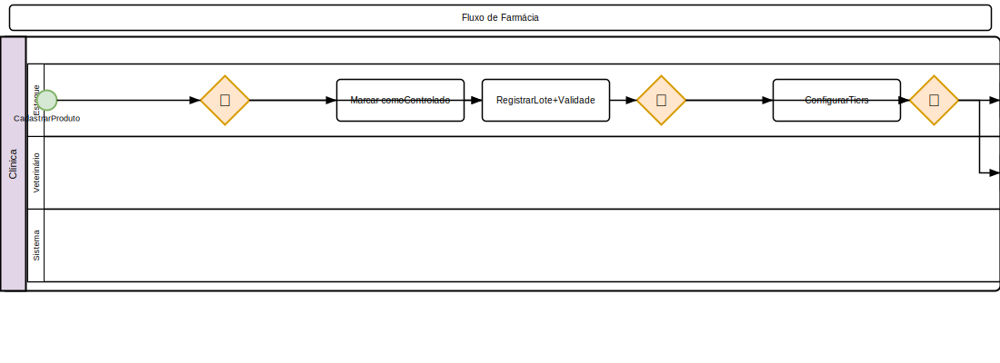

# Farmácia

## Produtos

### Cadastro de Produto
1. Acesse **Estoque > Produtos**
2. Clique em **Novo**
3. Preencha:
   - **Nome** (obrigatório)
   - **SKU** (código interno)
   - **Código de barras**
   - **Categoria**
   - **Fabricante** / fornecedor padrão
   - **Preço de custo**
   - **Preço de venda**
   - **Unidade** (comprimido, ml, g, frasco)
   - **Estoque mínimo** (alerta)
   - **Controlado?** (substância controlada ANVISA)
4. Clique em **Salvar**

### Lotes e Validade
- Informe **lote** e **data de validade** ao receber produtos
- O sistema alerta produtos próximos ao vencimento
- Produtos vencidos são bloqueados para venda/uso

### Preços por Espécie
- Produtos podem ter preços diferenciados por espécie/porte
- Configure em **Estoque > Produtos > Editar > Preços por Espécie**

## Fornecedores

### Cadastro
1. Acesse **Estoque > Fornecedores**
2. Clique em **Novo Fornecedor**
3. Preencha:
   - **Nome / Razão Social** (obrigatório)
   - **CNPJ / CPF**
   - **Inscrição Estadual**
   - **Endereço**: CEP (auto-preenchimento via ViaCEP), logradouro, número, complemento, bairro, **cidade e estado com cascading select**
   - **Telefone** e **E-mail**
   - **Contato** (pessoa de referência)
   - **Observações**
4. Clique em **Salvar**

- Associe produtos ao fornecedor padrão
- Histórico de pedidos por fornecedor

## Categorias
- Classifique produtos por categoria (Medicamentos, Insumos, Rações, etc.)
- Categorias são configuradas em **Configurações > Categorias**

## Calculadora de Dosagem (Livewire)

1. Acesse **Clínico > Calculadora de Dosagem**
2. Selecione:
   - **Fármaco** (do formulário)
   - **Espécie**: Cão, Gato, Equino, etc.
   - **Peso do animal** (kg)
3. O sistema calcula:
   - **Dose em mg** por administração
   - **Frequência** recomendada
   - **Dose máxima** para a espécie
   - **Volume** (se solução injetável)
4. Clique em **Copiar para Prescrição** para usar na receita

### Formulário de Fármacos (Drug Formulary)

- Cadastre fármacos por **espécie** e **faixa de peso**
- Configure: dosagem (mg/kg), dose máxima, via de administração, observações
- Interface de busca rápida por nome do fármaco
- Atualize doses conforme literatura

## Lotes e Validade

### Registrar Lote
1. Ao receber produtos, informe:
   - **Número do lote**
   - **Data de fabricação**
   - **Data de validade**
2. O sistema bloqueia **produtos vencidos** para venda/uso
3. Alerta de **produtos próximos ao vencimento** (configurável: 30, 60, 90 dias)

### Alerta de Vencimento
- Comando `products:alert-expiry` verifica lotes próximos ao vencimento
- Notificação no dashboard
- Destaque visual (badge amarelo/vermelho) nos produtos

## Pedidos de Compra (Farmacia)
- Consulte o módulo específico **Estoque > Pedidos de Compra**
- Crie pedidos para reposição de estoque
- Aprovação, recebimento e conciliação

## Regras de Negócio
- Produtos controlados exigem receituário ANVISA
- Preço de venda não pode ser menor que o de custo (alerta)
- Estoque mínimo gera notificação
- Lotes vencidos não podem ser utilizados
- Calculadora de dosagem é apenas referencial — não substitui julgamento clínico

---

## Diagrama do Processo

*Clique na imagem para ampliar. Diagrama de Atividades UML com raias — retângulos = atividades, losangos = decisão, setas = fluxo entre atividades, raias = atores.*
