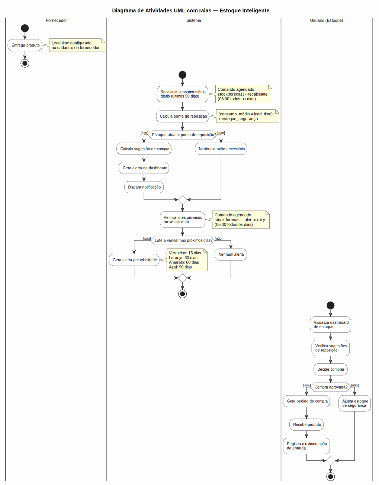
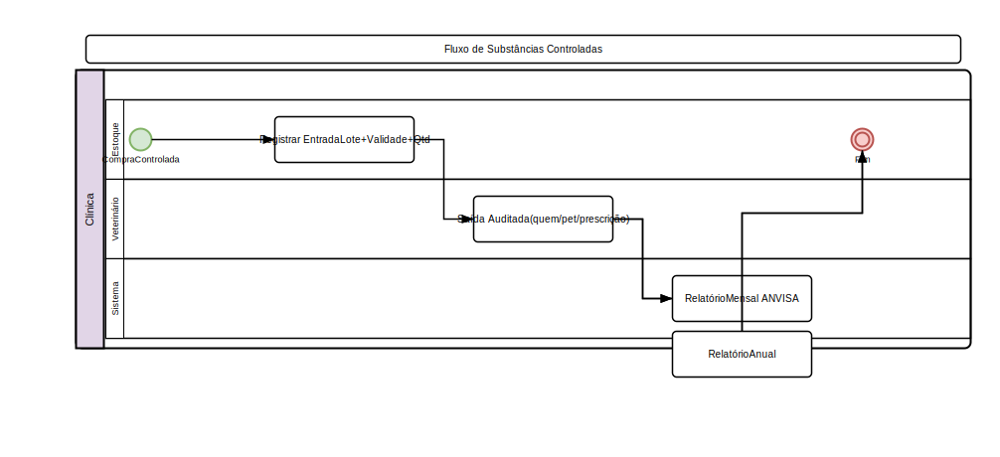

# Estoque

## Movimentações
- **Entrada**: Compra, devolução, ajuste positivo
- **Saída**: Venda, uso em procedimento, perda, ajuste negativo
- **Transferência**: Entre filiais

### Registrar Entrada
1. Acesse **Estoque > Movimentações**
2. Clique em **Nova Movimentação**
3. Selecione **tipo: Entrada**
4. Escolha o **produto**, informe **quantidade**, **lote**, **validade**
5. Selecione a **filial** de destino
6. Clique em **Salvar**

### Transferência entre Filiais
1. Acesse **Estoque > Transferir**
2. Selecione:
   - **Produto**
   - **Quantidade** (não pode exceder o estoque disponível na origem)
   - **Filial de origem**
   - **Filial de destino**
3. Clique em **Transferir**
4. O sistema:
   - Cria duas movimentações: saída na origem + entrada no destino
   - Calcula automaticamente o saldo posterior (`balance_after`) em cada movimentação
   - Registra a data/hora exata da transferência (timestamps habilitados em `StockMovement`)

### Ajuste de Estoque
- Utilize para correção de inventário
- Informe o **motivo** do ajuste
- O sistema registra o usuário responsável

## Lotes e Validade
- Produtos podem ter **lote** e **data de validade** associados
- Ao dar entrada, informe lote e validade por lote
- **Alerta de vencimento**: produtos próximos ao vencimento (30/60/90 dias)
- Comando `products:alert-expiry` notifica sobre lotes próximos ao vencimento
- Lotes vencidos são bloqueados para movimentação de saída

## Campos Fiscais para Venda de Produtos

Para emitir **NF-e** (Nota Fiscal Eletrônica de Produtos), cada produto precisa de dados fiscais obrigatórios:

| Campo | Descrição | Obrigatório |
|-------|-----------|:-----------:|
| **NCM** | Código NCM de 8 dígitos (ex: `3004.90.99`) | Sim |
| **CFOP** | Código CFOP de 4 dígitos (ex: `5.102` — venda) | Sim |
| **CST** | Tributação ICMS (ex: `000` — tributada integralmente) | Sim |
| **CSOSN** | Tributação ICMS para Simples Nacional (ex: `400` — não tributada) | Se CRT=1 |
| **Alíquota ICMS** | Percentual de ICMS (%) | Sim |
| **CST IPI** | Código IPI (ex: `50` — saída tributada) | Se aplicável |
| **Alíquota IPI** | Percentual de IPI (%) | Se aplicável |
| **CST PIS** | Código PIS (ex: `01` — operação tributável) | Sim |
| **CST COFINS** | Código COFINS (ex: `01` — operação tributável) | Sim |
| **Alíquota PIS** | Percentual de PIS (%) | Sim |
| **Alíquota COFINS** | Percentual de COFINS (%) | Sim |
| **CEST** | Código CEST de 7 dígitos (se aplicável) | Não |
| **IBPT (%)** | Percentual IBPT | Não |
| **Peso (kg)** | Peso do produto para frete | Não |

> **Nota**: Se o produto for usado em uma fatura sem NCM/CFOP preenchidos, a NF-e não poderá ser emitida.

### Como Preencher

1. Acesse **Estoque > Produtos**
2. Abra o produto desejado
3. Na aba **Fiscal**, preencha os campos conforme a classificação tributária do produto
4. Consulte o contador da clínica para valores corretos de CST, CFOP e alíquotas

### Venda de Produtos na Fatura

Ao criar ou editar uma fatura, é possível adicionar itens do tipo **produto**:

1. Acesse **Financeiro > Contas a Receber > Nova Fatura**
2. Na seção de itens, selecione a aba **Produto**
3. Busque o produto pelo nome ou código de barras
4. Informe **quantidade** e o sistema preenche o **preço de venda** automaticamente
5. O item aparece na fatura com tipo `produto`

**Ao pagar a fatura:**
- O estoque do produto é **deduzido automaticamente** (cria movimentação de saída)
- Uma **NF-e** é emitida automaticamente (se o provedor estiver configurado)
- O item aparece no relatório de comissões (se houver taxa configurada para produtos)

## Alerta de Estoque Baixo
- Produtos com quantidade abaixo do mínimo configurado são destacados
- Notificação no dashboard
- Alerta de vencimento para lotes próximos do fim

## Pedidos de Compra

### Fluxo Completo
1. **Rascunho**: Crie o pedido sem impacto no estoque
2. **Pedido**: Confirme o pedido ao fornecedor
3. **Aprovação**: Pedidos acima do limite exigem aprovação
4. **Recebimento**: Dê entrada dos produtos no estoque
5. **Conciliação**: Confira valores e quantidades

### Criar Pedido
1. Acesse **Estoque > Pedidos de Compra**
2. Clique em **Novo**
3. Selecione **fornecedor** e **filial**
4. Adicione itens (produto + quantidade + preço unitário)
5. O total é calculado automaticamente
6. O sistema gera um número de pedido sequencial automático
7. Clique em **Salvar**

### Status do Pedido
| Status | Descrição |
|--------|-----------|
| **Draft** | Rascunho, sem impacto no estoque |
| **Ordered** | Confirmado ao fornecedor |
| **Partial** | Recebimento parcial |
| **Received** | Totalmente recebido |
| **Cancelled** | Cancelado |

### Aprovação
- Pedidos acima do limite configurado exigem aprovação
- Admin ou branch-admin pode aprovar
- Pedido aprovado pode ser enviado ao fornecedor
- Pedido rejeitado volta para rascunho com justificativa

### Recebimento
1. Acesse o pedido com status **Ordered** ou **Partial**
2. Clique em **Receber**
3. Informe **quantidades recebidas** por item (pode ser parcial)
4. O sistema dá entrada no estoque automaticamente
5. Divergências de quantidade/preço são registradas para conciliação
6. Lotes e validades são informados no recebimento

### Conciliação
- Compare valores pedidos vs recebidos
- Registre ajustes (diferença de preço, desconto, frete)
- Conciliação concluída = pedido finalizado

## Scanner de Código de Barras
1. Acesse **Estoque > Scanner**
2. Aponte a câmera para o código de barras (via html5-qrcode)
3. O sistema busca o produto automaticamente
4. Exibe informações: nome, estoque, preço, lote
5. Útil para conferência de inventário e recebimento de pedidos

## Substâncias Controladas (ANVISA)

### Registro Obrigatório
- Produtos marcados como **"Controlado"** têm movimentação auditada
- Registro de **entrada** (compra, devolução, ajuste)
- Registro de **saída** (venda, uso clínico, perda)
- Rastreamento **lote-a-lote** obrigatório

### Relatórios ANVISA
1. Acesse **Estoque > Substâncias Controladas**
2. Relatórios:
   - **Movimentação mensal**: Entradas e saídas do mês
   - **Balanço anual**: Saldo por produto por ano
   - **Exportação CSV**: Formato ANVISA padronizado
3. Relatório inclui: lote, validade, quantidade, data, responsável

### Regras Específicas
- Produtos controlados só podem ser movimentados por usuários autorizados
- Prescrições de substâncias controladas seguem Portaria 344/98
- Receituário ANVISA azul (A1, A2, A3) ou amarelo (B1, B2)
- Relatórios mensais e anuais para envio à ANVISA

## Transferência entre Filiais

1. Acesse **Estoque > Transferir**
2. Selecione:
   - **Produto**
   - **Quantidade**
   - **Filial de origem**
   - **Filial de destino**
3. Clique em **Transferir**
4. O sistema cria duas movimentações: saída na origem + entrada no destino
5. Permissão específica: `stock.transfer`
6. Transferências têm registro de auditoria completo

## Estoque Inteligente (Dashboard)

Dashboard com visão geral do estoque em **Estoque > Dashboard** (permissão `stock.forecast`):

### Widgets
- **Produtos no estoque**: total de produtos cadastrados
- **Abaixo do ponto de reposição**: quantos produtos precisam ser comprados
- **Valor total em estoque**: soma do custo médio × saldo
- **Produtos a vencer**: nos próximos 30 dias
- **Comandas de assinaturas ativas**: total de assinaturas petshop ativas
- **Valor economizado com pacotes**: soma da economia de todos os consumos registrados

### Ações Rápidas
- **Nova movimentação**: atalho para registrar entrada/saída
- **Sugestões de reposição**: baseadas em consumo médio
- **Produtos a vencer**: filtro por período
- **Ajustar estoque**: registrar ajuste manual ou transferência

## Sugestão de Reposição

Acesse **Estoque > Reposição** (permissão `stock.reorder`) para visualizar produtos abaixo do ponto de reposição.

Funciona com base em:
- **Consumo médio diário**: calculado automaticamente (consumo total dos últimos 90 dias ÷ 90)
- **Lead time do fornecedor**: dias entre pedido e recebimento
- **Estoque de segurança**: margem adicional configurada
- **Ponto de reposição**: `(consumo_médio × lead_time) + estoque_segurança`

### Colunas da Tabela
| Coluna | Descrição |
|--------|-----------|
| Produto | Nome + estoque atual |
| Consumo médio/dia | Média dos últimos 90 dias |
| Lead time | Dias do fornecedor |
| Est. segurança | Margem configurada |
| Ponto de reposição | Limite calculado |
| Sugestão de compra | Quantidade recomendada |
| Fornecedor | Fornecedor principal |

> A sugestão de compra é calculada como: `(consumo_médio × lead_time + estoque_segurança) − estoque_atual`, arredondado para cima.

### Recálculo Automático
- Comando `stock:forecast --recalculate` roda diariamente às **03:00** (agendado no Kernel)
- Recalcula consumo médio com base nos últimos 90 dias de movimentações de saída

## Produtos a Vencer

Acesse **Estoque > Vencimentos** (permissão `stock.view`) para listar produtos próximos ao vencimento.

### Filtros
- **15 dias**: vermelho (crítico)
- **30 dias**: laranja (atenção)
- **60 dias**: amarelo (monitoramento)
- **90 dias**: azul (planejamento)

### Alerta Automático
- Comando `stock:forecast --alert-expiry` roda diariamente às **06:00** (Kernel)
- Envia notificação para usuários com acesso a estoque sobre lotes próximos ao vencimento

## Ajuste Manual com Transferência

O formulário de ajuste de estoque em **Estoque > Ajustar** unifica entrada, saída, perda, devolução e transferência:

### Tipos de Movimentação
| Tipo | Efeito no estoque |
|------|-------------------|
| **Entrada** | Aumenta saldo |
| **Saída** | Reduz saldo |
| **Ajuste** | Corrige divergência (positivo ou negativo) |
| **Perda** | Reduz saldo (quebra, extravio) |
| **Devolução** | Aumenta saldo (cliente devolveu) |
| **Transferência** | Saída na origem + entrada no destino (simultâneo) |

### Transferência entre Unidades
1. Selecione o tipo **Transferência**
2. Informe produto, quantidade, lote e validade
3. Selecione **filial de origem** e **filial de destino**
4. O sistema cria duas movimentações: `transfer_out` na origem e `transfer_in` no destino
5. Ambas com registro de auditoria completo

### Campo Estoque na Edição de Produtos
- Na criação do produto, o campo **Estoque inicial** está disponível
- Na edição, o campo é **desabilitado** com a mensagem: *"Altere o estoque via Ajustar Estoque ou vendas"*
- Isso garante que toda alteração de saldo seja registrada como movimentação

## Regras de Negócio
- Transferência cria registro de auditoria completo
- Estoque negativo não é permitido
- Apenas admin, estoque e super-financial podem fazer ajustes
- Substâncias controladas têm rastreamento lote-a-lote
- Transferência só pode ser feita entre filiais do mesmo grupo
- Campo `stock` em produto só é editável no cadastro inicial; alterações posteriores exclusivamente por movimentações ou vendas

---

## Diagrama do Processo

*Clique na imagem para ampliar. Diagrama de Atividades UML com raias — retângulos = atividades, losangos = decisão, setas = fluxo entre atividades, raias = atores.*

---

## Diagrama do Processo

*Clique na imagem para ampliar. Diagrama de Atividades UML com raias — retângulos = atividades, losangos = decisão, setas = fluxo entre atividades, raias = atores.*

---

## Diagrama do Processo

*Clique na imagem para ampliar. Diagrama de Atividades UML com raias — retângulos = atividades, losangos = decisão, setas = fluxo entre atividades, raias = atores.*
