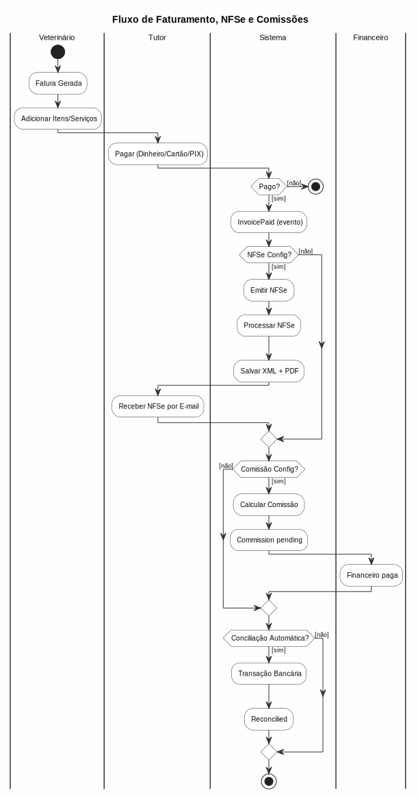
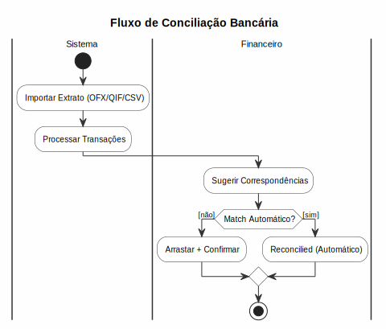

# Financeiro

## Contas a Receber

### Lançar Recebimento
1. Acesse **Financeiro > Contas a Receber**
2. Clique em **Novo**
3. Preencha:
   - **Cliente** (tutor do pet)
   - **Descrição** (ex: consulta, cirurgia, exame)
   - **Valor**
   - **Data de vencimento**
   - **Forma de pagamento**: Dinheiro, Cartão, PIX, Boleto, Convênio
   - **Plano de contas**
   - **Filial**
4. Clique em **Salvar**

### Baixar Recebimento
1. Acesse o lançamento
2. Clique em **Baixar**
3. Informe **data do pagamento** e **valor recebido**
4. Selecione **conta bancária**
5. Clique em **Confirmar**

### Contas Parceladas
- Gere parcelas automaticamente ao lançar
- Configure número de parcelas e intervalo
- Cada parcela é um lançamento individual

### Cancelar Fatura
1. Acesse a fatura na listagem ou na tela de detalhes
2. Clique em **Cancelar** (ícone <i class="fas fa-ban"></i>)
3. Confirme a operação — o status da fatura muda para **Cancelado**
4. Faturas pagas **não** podem ser canceladas (apenas estorno manual)
5. Faturas canceladas saem da lista de "a receber" mas permanecem no histórico

## Contas a Pagar
- Fluxo: Lançamento → Vencimento → Baixa
- Categorias: Fornecedores, Aluguel, Salários, Impostos, etc.
- Aprovação necessária para valores acima do limite

## Fluxo de Caixa
- Acesse **Financeiro > Fluxo de Caixa**
- **DRE** Resumido: Receitas - Despesas = Saldo Operacional
- Filtros por período, filial, plano de contas
- Gráficos de receitas e despesas mensais

## Conciliação Bancária
- Importe extratos bancários (CSV/OFX)
- O sistema sugere correspondência com lançamentos
- Concilie manualmente lançamentos pendentes

## Planos de Contas
- Estrutura hierárquica (categoria → subcategoria)
- Contas padrão: Receitas, Despesas, Custos
- Configure pela tela **Configurações > Planos de Contas**

## Relatórios Financeiros
- **DRE** (Demonstrativo de Resultados)
- **Extrato** por período
- **Contas a Receber** em aberto
- **Contas a Pagar** em aberto
- **Fluxo de Caixa** projetado
- Exportação em Excel e PDF

## Serviços

### Cadastrar Serviço
1. Acesse **Financeiro > Serviços**
2. Clique em **Novo**
3. Preencha:
   - **Nome** (obrigatório, ex: Consulta Clínica, Aplicação de Vacina, Cirurgia)
   - **Categoria**
   - **Preço Base** (valor padrão)
   - **Duração** estimada em minutos
4. Clique em **Salvar**

### Preços por Espécie/Porte
- Após cadastrar o serviço, configure **preços diferenciados** por espécie e porte
- Ex: Consulta felino R$ 120, canino grande R$ 180
- Acesse o serviço → aba **Tabela de Preços**
- Adicione linhas combinando espécie (canino, felino, equino) + porte (PP, P, M, G, GG) + valor

### Mapeamento: Tipo de Atendimento → Serviço

Para que o sistema saiba qual serviço usar ao gerar uma fatura automaticamente, é preciso associar cada **tipo de atendimento** a um **serviço**:

1. Acesse **Financeiro > Serviços**
2. Role até a seção **Mapeamento: Tipo de Atendimento → Serviço**
3. Para cada tipo (consulta, vacina, cirurgia, retorno, exame...), selecione o serviço correspondente
4. Clique no ícone <i class="fas fa-save"></i> para salvar

**Impacto:**
- Ao clicar **Gerar Fatura** no prontuário, o sistema busca o serviço mapeado e cria o item da fatura com o preço configurado
- Se já existir uma fatura **pendente** para o mesmo tutor/pet, o sistema **adiciona** o novo atendimento à fatura existente em vez de criar uma nova
- Se não houver mapeamento, a fatura é criada com R$ 0,00 e um aviso é exibido

## Auto-Faturamento Pós-Consulta

Quando uma consulta é marcada como **concluída**, o sistema gera automaticamente uma fatura com os serviços prestados:

1. **Appointment** é finalizado como `completed`
2. Listener `GenerateInvoiceFromAppointment` é disparado
3. Se já existir uma fatura **pendente** para o mesmo tutor/pet, o sistema **adiciona** este atendimento à fatura existente (acumula serviços e valores)
4. Se não houver fatura pendente, uma nova é criada com os serviços do agendamento
5. Fatura fica em status `pending` para recebimento

- Se o agendamento tiver serviços vinculados, usa os preços deles
- Caso contrário, o sistema busca o **Mapeamento: Tipo → Serviço** configurado como fallback
- Se não houver serviço nem mapeamento, a fatura é gerada com R$ 0,00
- O veterinário pode editar a fatura antes de finalizar o recebimento

### Proteção Contra Duplicidade de Faturamento
- Se o agendamento já possui **fatura paga**, o auto-faturamento é **ignorado** — nenhuma nova fatura é gerada e nenhum erro é exibido
- Da mesma forma, o botão **Gerar Fatura** no prontuário é bloqueado quando já existe fatura paga
- Essa proteção evita que um mesmo atendimento seja faturado mais de uma vez

### Itens da Fatura: Serviço, Produto ou Avulso

Cada item da fatura possui um **tipo** que define o comportamento fiscal e de estoque:

| Tipo | Descrição | Impacto Fiscal | Estoque |
|------|-----------|----------------|---------|
| **Serviço** | Consultas, cirurgias, exames, vacinas | Emite NFSe | Não deduz |
| **Produto** | Medicamentos, rações, insumos | Emite NFC-e (modelo 65) | Deduz automaticamente ao pagar |
| **Avulso** | Taxas, multas, genérico | Nenhum | Não deduz |

- Uma fatura pode conter **itens mistos** (serviço + produto + avulso na mesma fatura)
- Ao **pagar** a fatura, o sistema roteia automaticamente:
  - Itens do tipo **serviço** → emite **NFSe** (nota de serviço)
  - Itens do tipo **produto** → deduz do estoque + emite **NFC-e** (nota fiscal de consumo, modelo 65)
  - Itens do tipo **avulso** → sem documento fiscal

### Agrupamento de Atendimentos na Mesma Fatura

É possível agrupar **múltiplos atendimentos** em uma única fatura para facilitar o pagamento do tutor:

- **Como funciona:** Quando um atendimento é concluído, o sistema procura automaticamente por uma fatura **pendente** do mesmo tutor/pet na mesma filial. Se encontrar, adiciona os serviços à fatura existente em vez de criar uma nova
- **Cenário típico:** Pet vem para consulta, durante o atendimento o vet decide fazer cirurgia + vacinas no mesmo dia. Cada procedimento é um atendimento separado, mas o sistema os agrupa em uma única fatura automaticamente
- **Visualização:** Na tela de detalhes da fatura, todos os atendimentos vinculados são listados com links para cada um
- **Comissões:** Quando a fatura é paga, as comissões são calculadas para **cada veterinário** envolvido nos atendimentos agrupados
- **NFSe:** A NFSe é emitida com o valor total da fatura (apenas itens de serviço)
- **NFC-e:** A NFC-e é emitida com o valor total dos itens de produto

## Nota Fiscal de Serviços (NFSe)

### Provedores Suportados
O sistema suporta provedores de NFSe, configuráveis na tela de Config. NF:

| Provedor | Credenciais |
|----------|-------------|
| **Webmania®** | Consumer Key, Consumer Secret, Access Token, Access Token Secret |
| **NFE.io** | API Key, Company ID |
| **FocusNFe** | API Token (configurado via foco) |
| **Spedy** | API Key (configurado via spedy) |

### Configuração do Provedor

1. Acesse **Financeiro > Config. NF** (ou **Conf. Sistema > Config. NF** pelo menu)
2. Em **NFS-e**, selecione o **provedor** desejado
3. Escolha o **ambiente**: Homologação (testes) ou Produção
4. Preencha as **credenciais** do provedor escolhido
5. Ative a configuração

> **Dados fiscais por filial**: CNPJ, código IBGE do município, regime tributário e série da nota são configurados no **cadastro da filial** (Configurações > Unidades), não na tela de NFSe.

### Emitir NFSe

**Manual:**
1. Acesse **Financeiro > NFSe**
2. Clique em **Emitir NFSe** na fatura desejada
3. O sistema monta o RPS automaticamente com dados da fatura + dados fiscais da filial
4. Confirme a emissão
5. Links para **XML** e **PDF** da nota são gerados

**Automático:**
- Quando uma fatura é **marcada como paga**, a NFSe é emitida automaticamente
- Funciona apenas para filiais com dados fiscais configurados
- Comando `nfse:emit-pending` emite notas pendentes a cada 10 min

### Cancelar NFSe

1. Acesse a NFSe emitida
2. Clique em **Cancelar** (prazo legal: até 24h da emissão)
3. Informe o **motivo do cancelamento**
4. O sistema comunica o cancelamento à prefeitura

### Consultar NFSe

- Listagem com filtros por **período**, **status**, **filial**
- Colunas: número NFSe, RPS, fatura vinculada, data, status, provedor
- Ações: visualizar XML, baixar PDF, cancelar
- Detalhes completos com log da resposta da API

### Exportação Contábil

1. Acesse **Financeiro > NFSe > Exportar**
2. Selecione **período** e **filial**
3. Baixe **ZIP** com todos os XMLs do período
4. Comando `nfse:export` para exportar via terminal

### Permissões NFSe

- `nfse.view` — Visualizar notas emitidas
- `nfse.emit` — Emitir novas NFSe
- `nfse.cancel` — Cancelar NFSe
- `nfse-config.edit` — Configurar provedor de NFSe

### Regras NFSe
- Prazo de cancelamento: até 24h após emissão (Lei 11.945/2009)
- XML deve ser armazenado por no mínimo 5 anos (CTN art. 195)
- Apenas admin, branch-admin e financeiro podem emitir notas
- NFSe emitida em ambiente de produção não pode ser reemitida (apenas cancelada)

## Nota Fiscal de Consumidor (NFC-e) / Nota Fiscal Eletrônica (NF-e)

O sistema trabalha com dois modelos de nota fiscal para produtos:

- **NFC-e (modelo 65)**: Emitida para vendas diretas ao consumidor final (itens produto em faturas de consultas). Gera DANFE simplificado.
- **NF-e (modelo 55)**: Emitida apenas para **transferências de estoque entre unidades**. Gera XML completo com DANFE.

### Provedores Suportados (NFC-e e NF-e)
O sistema suporta provedores de NF-e/NFC-e, configuráveis na tela de Config. NF:

| Provedor | Credenciais |
|----------|-------------|
| **Webmania®** | Consumer Key, Consumer Secret, Access Token, Access Token Secret |
| **NFE.io** | API Key, Company ID |
| **FocusNFe** | API Token (configurado via foco) |

### Configuração do Provedor

1. Acesse **Financeiro > Config. NF** (ou **Conf. Sistema > Config. NF** pelo menu)
2. Em **NF-e**, selecione o **provedor** desejado
3. Preencha as **credenciais** (separadas das de NFS-e)
4. Ative a configuração

> **Dados fiscais para NF-e**: NCM, CFOP, CST/CSOSN, alíquotas de ICMS/IPI/PIS/COFINS e peso são configurados no **cadastro do produto** (Estoque > Produtos). Inscrição Estadual (IE) e CRT são configurados no **cadastro da filial**.

### Produtos com Tributação

Ao cadastrar um produto, os campos fiscais obrigatórios para emissão de NF-e são:

| Campo | Descrição | Obrigatório |
|-------|-----------|:-----------:|
| **NCM** | Código NCM (8 dígitos) | Sim |
| **CFOP** | Código CFOP (4 dígitos) | Sim |
| **CST / CSOSN** | Tributação ICMS | Sim |
| **Alíquota ICMS** | % ICMS | Sim |
| **Alíquota PIS** | % PIS | Sim |
| **Alíquota COFINS** | % COFINS | Sim |
| **Peso (kg)** | Peso do produto | Não |
| **CEST** | Código CEST (7 dígitos) | Não |
| **IPI** | Alíquota IPI (se aplicável) | Não |
| **IBPT** | % Imposto IBPT | Não |

### Dados Fiscais por Filial

Cada filial precisa dos seguintes dados para emitir NF-e:

| Campo | Descrição |
|-------|-----------|
| **Inscrição Estadual (IE)** | Inscrição estadual da filial |
| **IE ST** | IE Substituição Tributária (se houver) |
| **CRT** | Código de Regime Tributário (1=Simples Nacional, 2=SN excesso, 3=Regime Normal) |

### Emitir NFC-e (Vendas ao Consumidor)

**Onde acessar:** Faturas com itens produto → card **NFC-e** na tela de detalhes da fatura.

**Manual:**
1. Acesse a fatura com itens de produto
2. No card **NFC-e**, clique em **Emitir Nota Fiscal**
3. O sistema monta a NFC-e automaticamente com dados dos produtos + dados fiscais da filial
4. Confirme a emissão
5. Links para **XML** e **DANFE** da nota são gerados

**Automático:**
- Quando uma fatura com itens de **produto** é **marcada como paga**, a NFC-e é emitida automaticamente
- Ao mesmo tempo, o estoque dos produtos é **deduzido automaticamente**
- Comando `nfe:emit-pending` emite notas pendentes a cada 10 min

### Emitir NF-e (Transferência entre Unidades)

1. Acesse **Estoque > Transferências**
2. Na tela de transferência, marque a opção **Emitir NF-e**
3. Preencha os dados fiscais necessários
4. Confirme a transferência — a NF-e modelo 55 é emitida

> A NF-e para transferência utiliza o mesmo provedor configurado para NFC-e.

### Roteamento Inteligente: NFSe vs NFC-e / NF-e

Uma mesma fatura pode conter **serviços e produtos**. Ao pagar:

```
Fatura paga
   ├── Itens do tipo "serviço"  →  NFSe (prefeitura)
   ├── Itens do tipo "produto"  →  NFC-e (SEFAZ, modelo 65) + dedução de estoque
   ├── Transferência entre filiais →  NF-e (SEFAZ, modelo 55)
   └── Itens do tipo "avulso"   →  sem documento fiscal
```

Isso permite, por exemplo, faturar uma consulta (serviço) + medicamento (produto) em uma única cobrança, gerando os documentos fiscais corretos para cada tipo.

### Visualizar NFC-e

1. Acesse **Financeiro > NFC-e** (sidebar)
2. Listagem com filtros por **período**, **status**, **filial**
3. Colunas: número NFC-e, chave de acesso (44 dígitos), fatura vinculada, data, status
4. Ações: visualizar XML, baixar DANFE, cancelar

### Cancelar NFC-e / NF-e

1. Acesse a nota emitida (NFC-e ou NF-e)
2. Clique em **Cancelar** (prazo legal: até 24h da emissão)
3. Informe o **motivo do cancelamento**
4. O sistema comunica o cancelamento à SEFAZ

### Exportação Contábil

1. Acesse **Financeiro > NFC-e > Exportar** ou **Financeiro > NF-e > Exportar**
2. Selecione **período** e **filial**
3. Baixe **ZIP** com todos os XMLs do período

### Permissões NFC-e / NF-e

- `nfe.view` — Visualizar notas emitidas (NFC-e e NF-e)
- `nfe.emit` — Emitir novas notas (NFC-e e NF-e)
- `nfe.cancel` — Cancelar notas
- `nfe-config.edit` — Configurar provedor de NF-e/NFC-e

### Regras NFC-e / NF-e
- Prazo de cancelamento: até 24h após emissão
- XML deve ser armazenado por no mínimo 5 anos
- A NFC-e/NF-e só pode ser emitida se a filial tiver IE e CRT configurados
- Produtos precisam de NCM e CFOP para emitir NFC-e/NF-e
- Nota emitida em produção não pode ser reemitida (apenas cancelada)

## Comissões de Veterinários

### Configurar Taxas

1. Acesse **Financeiro > Comissões > Taxas**
2. Clique em **Nova Taxa**
3. Configure:
   - **Veterinário**
   - **Tipo**: Percentual ou Valor fixo
   - **Aplica-se a**: Serviços ou Produtos
   - **Valor**: % ou R$ por item
   - **Ativo?**
4. Salve

### Cálculo Automático

- Quando uma fatura é **paga**, as comissões são calculadas automaticamente
- Comissões ficam em status `pending` (pendente)
- Admin ou financeiro pode marcar como `paid` (paga)

### Relatório de Comissões

1. Acesse **Financeiro > Comissões > Relatório**
2. Filtre por:
   - **Veterinário**
   - **Período**
   - **Status** (todas, pendentes, pagas)
3. Visualize:
   - Total de comissões no período
   - Comissões pendentes de pagamento
   - Detalhamento por serviço/produto
4. Exporte para **PDF** ou **Excel**

### Permissões
- `commissions.view` — Visualizar relatórios
- `commissions.pay` — Marcar comissões como pagas

## Conciliação Bancária

### Configurar Contas

1. Acesse **Financeiro > Conciliação > Contas Bancárias**
2. Clique em **Nova Conta**
3. Preencha:
   - **Banco**
   - **Agência**
   - **Conta** (número + dígito)
   - **Tipo**: Corrente, Poupança
   - **Filial**

### Importar Extrato

1. Acesse **Financeiro > Conciliação**
2. Clique em **Importar Extrato**
3. Selecione o arquivo (formato **OFX**, **QIF**, **CSV**)
4. O sistema processa e exibe as transações importadas
5. Transações com **status: pending**

### Conciliar Lançamentos

1. Na tela de conciliação, visualize:
   - **Transações bancárias** (lado esquerdo)
   - **Lançamentos do sistema** (lado direito)
2. O sistema sugere **correspondências** por valor (±R$0,01)
3. Clique em **Conciliar** para confirmar o par
4. Transação e lançamento ficam como `reconciled`
5. Transações sem correspondência ficam como `unmatched`

### Sugestões Automáticas

- Correspondência por valor exato (tolerância R$0,01)
- Correspondência por data próxima (até 3 dias)
- Sugestões são exibidas com destaque visual

### Relatórios de Conciliação

- **Extrato conciliado** por período
- **Transações não conciliadas** (pendentes de correspondência)
- **Diferenças** entre saldo bancário e saldo contábil

### Permissões
- `bank-reconciliation.view` — Visualizar conciliação
- `bank-reconciliation.reconcile` — Conciliar lançamentos

## Regras de Negócio
- Recebimentos não podem ser editados após baixa (apenas estorno)
- Estorno exige justificativa e autorização de admin
- Convênios têm regras de faturamento específicas
- Apenas admin, financeiro e super-financial podem realizar estornos
- NFSe só pode ser emitida se filial tiver configuração fiscal ativa
- Comissões são calculadas apenas na primeira liquidação da fatura
- Conciliação bancária sugere correspondências, mas requer confirmação manual
- NF-e só pode ser emitida se a filial tiver IE e CRT configurados
- Produtos precisam de NCM e CFOP preenchidos para emitir NF-e
- Ao pagar fatura com itens de produto, o estoque é deduzido automaticamente
- Faturas com itens mistos (serviço + produto) emitem NFSe e NFC-e simultaneamente
- NFC-e é modelo 65 (consumo); NF-e é modelo 55 (apenas transferências entre unidades)

---

## Diagrama do Processo


*Clique na imagem para ampliar. Diagrama de Atividades UML com raias — retângulos = atividades, losangos = decisão, setas = fluxo entre atividades, raias = atores.*

---

## Diagrama do Processo


*Clique na imagem para ampliar. Diagrama de Atividades UML com raias — retângulos = atividades, losangos = decisão, setas = fluxo entre atividades, raias = atores.*
