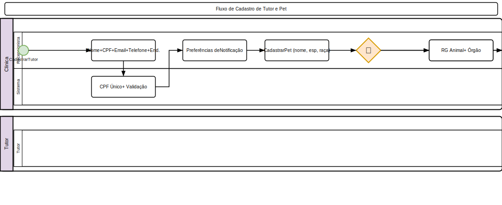

# Tutores e Pets

## Cadastro de Tutor
1. Acesse **Cadastros > Tutores**
2. Clique em **Novo**
3. Preencha os dados:
   - **Nome completo** (obrigatório)
   - **CPF/CNPJ**
   - **RG**
   - **Data de nascimento**
   - **E-mail**
   - **Telefone** (celular obrigatório)
   - **Telefone 2**
   - **Endereço**: CEP, logradouro, número, complemento, bairro, cidade, estado
4. Preferências:
   - **Notificações**: WhatsApp, SMS, E-mail
   - Aceita **comunicação promocional**?
5. Clique em **Salvar**

### Documentos do Tutor
- Upload de documentos (RG, CPF, comprovante de residência)
- Fotos do tutor
- Contrato de prestação de serviços

## Cadastro de Pet
1. Acesse **Cadastros > Pets**
2. Clique em **Novo**
3. Selecione o **tutor** (ou cadastre novo tutor)
4. Preencha:
   - **Nome** (obrigatório)
   - **Espécie**: Cão, Gato, Ave, Roedor, Réptil, Equino, Outros
   - **Raça** (filtrada por espécie)
   - **Sexo**: Macho, Fêmea
   - **Porte**: Pequeno, Médio, Grande, Gigante
   - **Pelagem / Cor**
   - **Data de nascimento** (ou idade aproximada)
    - **Microchip**: Número do microchip
    - **Data do Microchip**: Data de implantação
    - **RG Animal** (Registro Geral Animal)
    - **Órgão Emissor do RG** (CRMV, órgão competente)
    - **Castrado?**
   - **Foto** do pet
5. Informações complementares:
   - **Alergias**
   - **Doenças crônicas**
   - **Medicações contínuas**
   - **Observações**
6. Clique em **Salvar**

### Múltiplos Tutores
- Um pet pode ter mais de um tutor
- Acesse o pet, seção **Tutores**
- Adicione tutores adicionais com vínculo (pai, mãe, responsável)

## Timeline do Paciente

A Timeline do Paciente consolida todo o histórico do pet em uma única tela cronológica:

1. Acesse o pet > **Timeline**
2. Visualize eventos em ordem cronológica reversa:
   - **Consultas** (prontuários)
   - **Vacinas** aplicadas
   - **Exames** solicitados e resultados
   - **Cirurgias** realizadas
   - **Internações** (entrada e alta)
   - **Prescrições** emitidas
   - **Triagens** realizadas
   - **Óbito** (se aplicável)
   - **Pesagem** e evolução de peso
3. Filtre por **tipo de evento** e **período**
4. Pesquise por **diagnóstico** ou **procedimento**
5. Clique em qualquer evento para ver detalhes completos

## Óbito e Cremação (Pet Death Records)

### Registrar Óbito

1. Acesse o pet > **Registrar Óbito**
2. Preencha:
   - **Data e hora** do óbito
   - **Causa** (diagnóstico)
   - **Veterinário responsável** pelo atestado
   - **Autorizado por** (responsável que autorizou)
   - **Documento de autorização** (anexo)
3. Informações de cremação (opcional):
   - **Tipo**: Cremação individual, Cremação coletiva, Sem cremação
   - **Data de retirada das cinzas**
   - **Observações**
4. **Texto de memorial** (homenagem opcional)
5. Clique em **Salvar**

### Efeitos do Registro

- Pet é marcado como falecido (não aparece em buscas ativas)
- Histórico médico é preservado (LGPD: apenas anonimização)
- Óbito registrado na timeline do paciente
- Agendamentos futuros são cancelados automaticamente

### Visualizar Registro

1. Acesse o pet > **Registro de Óbito**
2. Visualize:
   - Causa e data do óbito
   - Documentos de autorização
   - Informações de cremação
   - Memorial

## Histórico do Pet
- Acesse a ficha do pet
- **Timeline do Paciente**: Prontuários, vacinas, exames, cirurgias, internações, triagens, óbito
- Filtre por período e tipo de evento
- Pesquise por diagnóstico ou procedimento

## Portal do Tutor
- O tutor acessa via **Portal do Tutor**
- Funcionalidades disponíveis:
  - Histórico do pet
  - Resultados de exames
  - Prescrições (visualização)
  - Certificados de vacina
  - Agendamento online
  - Chat com a clínica
  - Notificações

## Regras de Negócio
- CPF é único no sistema
- Pets podem ser transferidos entre tutores
- Histórico médico nunca é excluído
- Tutor pode solicitar exclusão de dados (LGPD)

---

## Diagrama do Processo

*Clique na imagem para ampliar. Diagrama BPMN 2.0 — setas contínuas = fluxo sequencial, tracejadas = fluxo de mensagem, losangos = decisão.*
