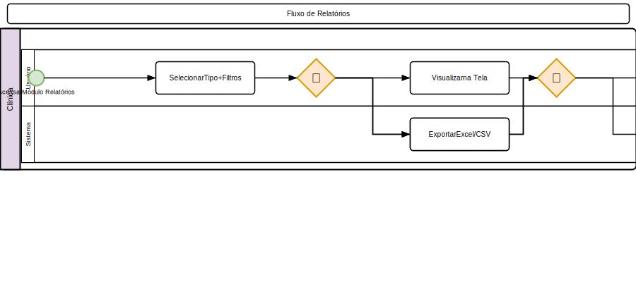

# Relatórios

## Relatórios Clínicos

### Pet
- **Histórico Completo**: Todos os eventos do paciente (PDF)
- **Atestado de Saúde**: Geração automática com dados atuais
- **Carteira de Vacinação**: Resumo de vacinas aplicadas

### Profissional
- **Produtividade**: Consultas, cirurgias, exames por período
- **Ranking**: Procedimentos realizados por veterinário

## Relatórios de Estoque

### Produtos
- **Inventário**: Saldo atual por filial
- **Movimentações**: Entradas e saídas por período
- **Validade**: Produtos próximos ao vencimento
- **Estoque Mínimo**: Produtos abaixo do mínimo
- **Substâncias Controladas**: Relatório ANVISA mensal/anual

### Pedidos
- **Histórico de Pedidos**: Por fornecedor, período, status
- **Itens Mais Pedidos**: Ranking de produtos

## Relatórios Financeiros

### Contas a Receber
- **Em Aberto**: Todas as contas não pagas
- **Vencidas**: Contas com atraso
- **Recebido por Período**: Total recebido no mês

### Contas a Pagar
- **A Pagar**: Contas a vencer
- **Histórico de Pagamentos**
- **Previsão**: Fluxo de saída projetado

### DRE
- **Demonstrativo de Resultados**: Receitas - Despesas
- **Por Filial**: DRE individual por unidade
- **Por Plano de Contas**: Agrupado por categoria

## Relatórios de Agendamento
- **Taxa de Comparecimento**: % de presença
- **Horários de Pico**: Períodos mais movimentados
- **Lista de Espera**: Pacientes aguardando vaga

## Exportação
- Formatos: **PDF**, **Excel (XLSX)**, **CSV**
- Relatórios podem ser impressos ou enviados por e-mail
- Agendamento de relatórios recorrentes

## Regras de Negócio
- Relatórios financeiros e de estoque exigem permissão específica
- Dados de tutores/pets respeitam LGPD
- Relatórios podem ser filtrados por filial

---

## Diagrama do Processo

*Clique na imagem para ampliar. Diagrama BPMN 2.0 — setas contínuas = fluxo sequencial, tracejadas = fluxo de mensagem, losangos = decisão.*
