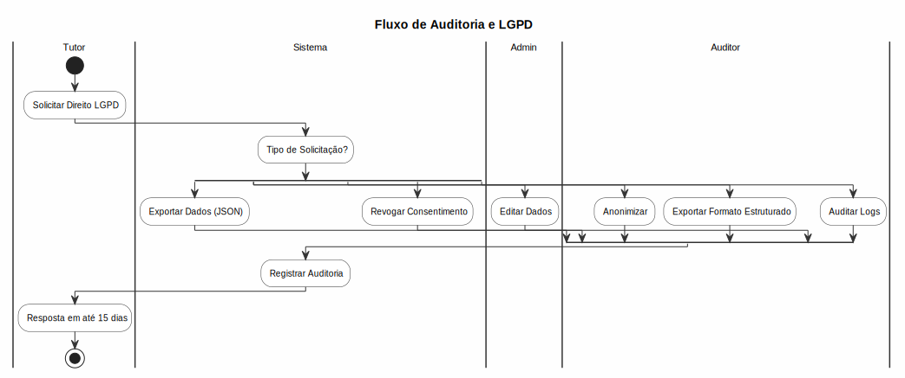

# Auditoria e LGPD

## Trilha de Auditoria

### Log de Atividades
- Todas as ações importantes são registradas:
  - **Criação**, **edição** e **exclusão** de registros
  - **Acessos** ao sistema (login/logout)
  - **Alterações de permissões**
  - **Visualização** de dados sensíveis
  - **Exportações** de relatórios
  - **Movimentações** de estoque

### Consultar Logs
1. Acesse **Configurações > Auditoria**
2. Filtre por:
   - **Usuário**
   - **Ação** (create, update, delete, view, export)
   - **Entidade** (Pet, Tutor, Prescription, etc.)
   - **Período**
   - **Filial**
3. Visualize detalhes:
   - **Usuário** que executou
   - **Endereço IP**
   - **Data/hora**
   - **Valores anteriores e novos** (se editado)
   - **User Agent**

### Retenção
- Logs são mantidos por **5 anos** (conforme LGPD)
- Logs antigos são arquivados automaticamente
- Logs de exclusão são mantidos permanentemente

## LGPD

### Direitos do Titular
- **Acesso**: Tutor pode solicitar todos os dados armazenados
- **Correção**: Dados incorretos podem ser corrigidos
- **Exclusão**: Solicitação de exclusão de dados (direito ao esquecimento)
- **Portabilidade**: Exportação dos dados em formato estruturado
- **Anonimização**: Ocultar dados pessoais mantendo registros clínicos

### Consentimento
- **Termo de Consentimento** assinado na criação do cadastro
- Registro de qual dado foi autorizado para qual finalidade
- Tutor pode revogar consentimento a qualquer momento
- Canais de notificação (WhatsApp, SMS, E-mail) são opt-in

### Privacidade
- Dados sensíveis são mascarados em relatórios
- Acesso a prontuários é restrito a veterinários
- Tutores veem apenas dados de seus próprios pets
- Exportação de dados é registrada em auditoria

### Política de Retenção
- **Dados cadastrais**: Mantidos enquanto o vínculo existir
- **Prontuários**: 20 anos após o último atendimento
- **Prescrições**: 5 anos (ANVISA)
- **Financeiro**: 6 anos (fisco)
- **Logs de acesso**: 6 meses
- Após o prazo, dados são anonimizados ou excluídos

## Regras de Negócio
- Apenas Admin e Compliance podem acessar logs completos
- Exclusão de dados pessoais não afeta registros clínicos (são anonimizados)
- Solicitações LGPD devem ser respondidas em até 15 dias
- Relatório de impacto à proteção de dados (RIPD) disponível

---

## Diagrama do Processo

*Clique na imagem para ampliar. Diagrama BPMN 2.0 — setas contínuas = fluxo sequencial, tracejadas = fluxo de mensagem, losangos = decisão.*
