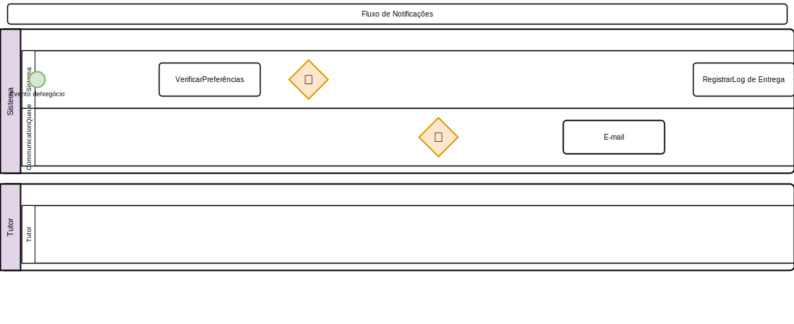

# Notificações

## Canais Disponíveis
- **WhatsApp**: Mensagens via API (recomendado)
- **SMS**: Mensagens de texto
- **E-mail**: Envio de e-mails transacionais

## Preferências do Tutor (T10)

### Configurar Preferências
1. Acesse o cadastro do tutor > **Preferências de Notificação**
2. Opções de canal (escolha um ou mais):
   - [ ] Notificações via **WhatsApp**
   - [ ] Notificações via **SMS**
   - [ ] Notificações via **E-mail**
   - [ ] **Não deseja receber notificações**
3. O tutor também pode configurar pelo **Portal do Tutor**
4. O sistema respeita as preferências ao enviar notificações

### Hierarquia de Canais
1. WhatsApp (prioridade máxima)
2. SMS (fallback se WhatsApp falhar)
3. E-mail (último recurso)
- Limite de 2 SMS/dia por tutor
- Após 3 falhas consecutivas, canal é desativado temporariamente

## Tipos de Notificação

### Lembretes de Agendamento
- **24h antes**: Confirmação de consulta/cirurgia
- **2h antes**: Lembrete de horário
- Tutor pode confirmar ou reagendar pelo link

### Vacinas
- **Próxima dose**: Lembrete na data programada
- **Vacinas anuais**: Alerta 30 dias antes do vencimento

### Retornos
- **Pós-cirúrgico**: Lembrete de retorno
- **Exames**: Resultado disponível
- **Tratamento**: Fim do ciclo de medicação

### Campanhas
- **Promocional**: Ofertas e campanhas (opt-in)
- **Recall**: Vacinação em massa
- **Aniversário do Pet**: Saudação automática

## Configuração

Acesse **Configurações > Notificações** para configurar os provedores de cada canal. As credenciais são salvas no banco de dados e gerenciadas pelo painel admin.

### Painel de Configuração (abas)

**Aba E-mail:**
| Provedor | Campos |
|----------|--------|
| **SMTP** | Servidor, porta, usuário, senha, criptografia, remetente |
| **Mailgun** | Domínio, API Key, endpoint |
| **Amazon SES** | Access Key, Secret Key, região |
| **SendGrid** | API Key |

**Aba SMS:**
| Provedor | Campos |
|----------|--------|
| **Twilio** | Account SID, Auth Token, número remetente |
| **Zenvio** | API Key, número remetente |
| **Amazon SNS** | Access Key, Secret Key, região |

**Aba WhatsApp:**
| Provedor | Campos |
|----------|--------|
| **Z-API** | URL da API, Token, Instância |
| **Weni** | API Key, Project UUID, número remetente |
| **WhatsApp Cloud API (Meta)** | Access Token, Phone Number ID |
| **Twilio WhatsApp** | Account SID, Auth Token, número remetente |

> **Importante**: Os templates de mensagem são configurados em **Configurações > Modelos de Comunicação**, independentemente do provedor escolhido.

## Relatórios
- **Taxa de entrega** por canal
- **Histórico** de notificações enviadas
- **Tentativas falhas** e motivos

## Regras de Negócio
- Lembretes são enviados apenas com consentimento do tutor
- Limite de 2 SMS por dia por tutor
- WhatsApp tem prioridade sobre outros canais
- Falha após 3 tentativas desativa temporariamente o canal

---

## Diagrama do Processo

*Clique na imagem para ampliar. Diagrama BPMN 2.0 — setas contínuas = fluxo sequencial, tracejadas = fluxo de mensagem, losangos = decisão.*
