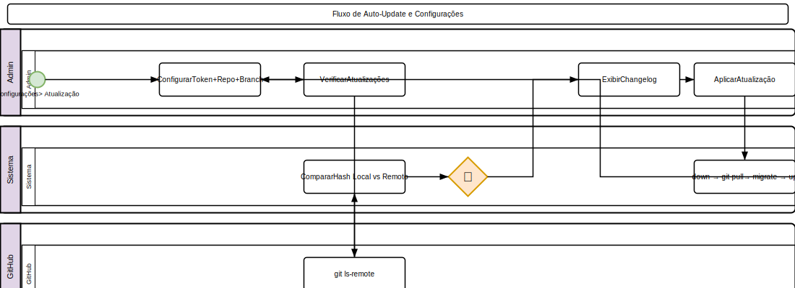

# Configurações

## Sistema

### Gerais
1. Acesse **Configurações > Sistema**
2. Configure:
   - **Nome da clínica** (principal)
   - **CNPJ** da matriz
   - **Logo** (upload)
   - **Fuso horário**
   - **Moeda** (padrão: BRL)
   - **Idioma** (padrão: pt-BR)
   - **Manutenção**: Ativar/desativar modo de manutenção
   - **Token de atualização**: Para auto-update via Git

### Token de Atualização
- Necessário para realizar auto-update do sistema via GitHub
- Configure em **Configurações > Sistema**
- Armazenado com segurança na tabela `settings`
- O token valida requisições de atualização

## Integrações

As integrações são configuradas via **arquivo `.env`** na raiz do sistema (acesso via servidor/SSH) ou via painel admin conforme indicado.

### WhatsApp (Z-API)
| Variável | Descrição | Onde configurar |
|----------|-----------|-----------------|
| `WHATSAPP_API_URL` | URL base da API Z-API | `.env` |
| `WHATSAPP_API_TOKEN` | Token de autenticação Bearer | `.env` |
| `WHATSAPP_INSTANCE` | ID da instância Z-API | `.env` |

**Provider**: Z-API ([https://z-api.io](https://z-api.io))
**Uso**: Lembretes de consulta, vacinas, campanhas, notificações em geral.
**Como obter**: Crie uma conta no Z-API, crie uma instância e copie o token.

### SMS
| Variável | Descrição | Onde configurar |
|----------|-----------|-----------------|
| `SMS_API_URL` | URL base da API de SMS | `.env` |
| `SMS_API_KEY` | Chave de API (Bearer token) | `.env` |

**Provider**: Twilio, Zenvia ou similar
**Uso**: Fallback quando WhatsApp não está disponível.

### E-mail Transacional
| Variável | Descrição | Onde configurar |
|----------|-----------|-----------------|
| `EMAIL_API_URL` | URL base da API de e-mail | `.env` |
| `EMAIL_API_TOKEN` | Token de autenticação | `.env` |
| `EMAIL_API_TIMEOUT` | Timeout em segundos (padrão: 15) | `.env` |

**Uso**: Envio de e-mails transacionais (notificações, campanhas).

### SMTP (E-mail Padrão)
| Variável | Descrição | Onde configurar |
|----------|-----------|-----------------|
| `MAIL_MAILER` | Driver (smtp, mailgun, ses, postmark) | `.env` |
| `MAIL_HOST` | Servidor SMTP | `.env` |
| `MAIL_PORT` | Porta SMTP | `.env` |
| `MAIL_USERNAME` | Usuário SMTP | `.env` |
| `MAIL_PASSWORD` | Senha SMTP | `.env` |

**Uso**: Recuperação de senha, e-mails do sistema.

### PIX
| Variável | Descrição | Onde configurar |
|----------|-----------|-----------------|
| `PIX_KEY` | Chave PIX (CPF, CNPJ, e-mail, telefone) | `.env` |
| `PIX_MERCHANT_NAME` | Nome do recebedor (até 25 caracteres) | `.env` |
| `PIX_CITY` | Cidade do recebedor | `.env` |

**Uso**: Geração de QR Code PIX para pagamento de faturas.
**Nota**: O sistema gera o QR Code localmente — não depende de API externa.

### Gateway de Pagamento (Cartão/Boleto)
1. Acesse **Financeiro > Gateways de Pagamento**
2. Clique em **Novo**
3. Configure:
   - **Provedor**: Mercado Pago, PagSeguro, Stripe, PIX
   - **Chave pública**
   - **Chave secreta**
   - **Webhook secret** (para notificações)
   - **Webhook URL** (URL de callback)
   - **Modo de teste** (sandbox)
4. Clique em **Salvar**

> **Nota**: O cadastro do gateway está implementado. A chamada real para a SDK do provedor está em desenvolvimento (stub).

### NFSe (Webmania®)
1. Acesse **Financeiro > NFSe > Configurações**
2. Configure por filial:
   - **CNPJ do prestador**
   - **Município IBGE** (código da cidade)
   - **Regime tributário**: MEI, Simples Nacional, Lucro Presumido
   - **Série** das notas
   - **Ambiente**: Homologação ou Produção
3. Credenciais Webmania®:
   - `WEBMANIA_APP_ID` — ID do aplicativo
   - `WEBMANIA_APP_SECRET` — Segredo (mascarado na UI)
   - `WEBMANIA_CONSUMER_KEY` — Chave do consumidor
   - `WEBMANIA_CONSUMER_SECRET` — Segredo do consumidor (mascarado)
4. Cada filial tem sua própria configuração (1 por filial)
5. Ative a configuração para começar a emitir notas

**Provider**: Webmania® ([https://webmania.com.br](https://webmania.com.br))
**Uso**: Emissão de NFSe a partir de faturas de serviço.
**Arquitetura**: Adapter Pattern — pode ser trocado sem alterar regras de negócio.

### Convênios (Porto Seguro)
| Variável | Descrição | Onde configurar |
|----------|-----------|-----------------|
| `PORTO_SEGURO_API_URL` | URL base da API Porto Seguro | `.env` |
| `PORTO_SEGURO_API_KEY` | Chave de API | `.env` |

**Uso**: Envio automático de claims de convênio (`claims:auto-file`).

### Equipamentos de Laboratório
1. Acesse **Configurações > Equipamentos de Laboratório**
2. Clique em **Novo**
3. Configure:
   - **Tipo de equipamento**
   - **Protocolo** (REST, HL7, FHIR, Custom)
   - **URL de conexão** (endpoint)
   - **Chave de API**
   - **IP e porta** (para conexão direta HL7)
4. Clique em **Salvar**

**Uso**: Recebimento automático de resultados de exames via webhook `POST /api/v1/lab-equipment/{id}/receive`.
**Status**: Consulta via `GET /api/v1/lab-equipment/{id}/status`.

## Personalização

### Identidade Visual
1. Acesse **Configurações > Personalização** (Super Admin apenas)
2. Configure:

   **Geral:**
   - **Nome da clínica** — exibido no título, sidebar, navbar e documentos
   - **Logotipo** — upload PNG, JPG ou SVG (salvo em `storage/app/public/branding/`)
   - **Favicon** — ícone da aba do navegador

   **Exibição do Nome:**
   - **Exibir nome** — ativar/desativar exibição do nome ao lado do logo
   - **Posição** — escolher entre: acima, abaixo, esquerda ou direita do logo
   - A posição se aplica à sidebar, navbar AdminLTE e tela de login

   **Cores:**
   - **Cor primária** — usada na sidebar, botões e elementos principais
   - **Fundo do login** — cor de fundo da tela de login (AdminLTE e Portal)

   **Ajustes:**
   - **Largura do logo no sidebar** — em pixels (20–200)

3. A personalização afeta:
   - Sidebar (cor de fundo, logo + nome com posição configurável)
   - Navbar AdminLTE (brand link)
   - Tela de login AdminLTE (logo, nome, fundo)
   - Tela de login do Portal do Tutor (logo, nome, fundo, cor primária)
   - Cabeçalhos de documentos (PDF)
4. Permissão necessária: `configuracoes.branding` (Super Admin apenas)

### Impressão
- **Header**: Texto exibido no topo dos documentos
- **Footer**: Texto exibido no rodapé
- **Logo**: Logo nos documentos

## Auditoria
- Visualize logs de acesso e alterações
- Configure período de retenção
- Exporte logs

## Atualização do Sistema (Auto-Update U1)

### Como Funciona
1. Acesse **Configurações > Atualização do Sistema**
2. Configure:
   - **Token de atualização** (token de acesso pessoal do GitHub)
   - **Repositório** (ex: `hectordufau/vetessence`)
   - **Branch** (ex: `main`)
3. Clique em **Verificar Atualizações** para checar GitHub
4. Se disponível, clique em **Aplicar Atualização**

### Fluxo de Atualização
1. Sistema entra em modo de manutenção (`php artisan down`)
2. Executa `git pull` usando o token de acesso
3. Roda migrações pendentes (`php artisan migrate`)
4. Limpa cache (config, route, view)
5. Reativa o sistema (`php artisan up`)
6. Histórico de atualizações é registrado (data, versão, status)

### Segurança
- Permissão `system-update` (super-admin apenas)
- Token armazenado na tabela `settings`
- Sistema faz backup antes de atualizar (recomendado backup manual)
- Merge conflicts podem interromper o processo

### Requisitos
- Servidor com `exec()` habilitado
- Git instalado no servidor
- Permissão de escrita na pasta do projeto
- Token GitHub com permissão de leitura do repositório

---

## Diagrama do Processo

*Clique na imagem para ampliar. Diagrama BPMN 2.0 — setas contínuas = fluxo sequencial, tracejadas = fluxo de mensagem, losangos = decisão.*
