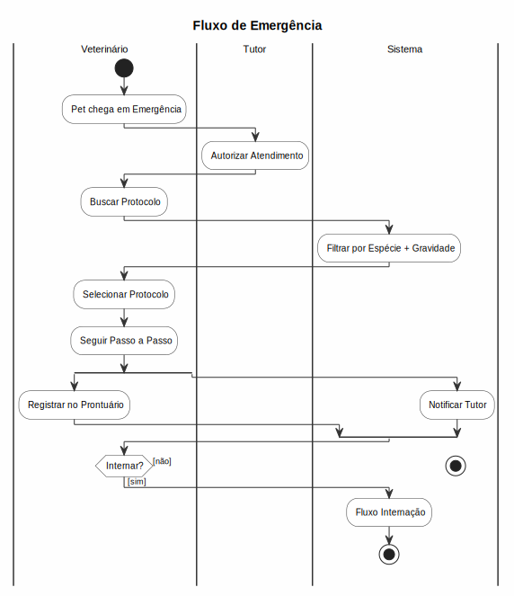

# Emergências

## Protocolos de Emergência

### Acessar Protocolos
1. Acesse **Clínico > Protocolos de Emergência**
2. Navegue pelos protocolos em grade visual
3. Filtre por:
   - **Espécie**: Cão, Gato, Equino, Outros
   - **Categoria**: Trauma, Toxicose, Parada, Convulsão, etc.
   - **Gravidade**: Crítico, Urgente, Estável

### Visualizar Protocolo
- Clique em um cartão para ver detalhes
- Cada protocolo contém:
  - **Título e descrição**
  - **Procedimentos** passo a passo
  - **Medicações** com dose por espécie
  - **Materiais** necessários
  - **Referências** bibliográficas

### Criar Protocolo
1. Acesse **Clínico > Protocolos de Emergência**
2. Clique em **Novo Protocolo**
3. Preencha:
   - **Título** (obrigatório)
   - **Slug** (gerado automaticamente)
   - **Espécie**
   - **Categoria**
   - **Gravidade**
   - **Descrição**
   - **Procedimentos** em detalhes
   - **Referências**
4. Clique em **Salvar**

## Emergências na Prática
- Ao registrar uma emergência, o protocolo relevante pode ser sugerido
- O sistema sugere baseado na espécie e condição
- Acesso rápido durante o registro de prontuário

## Regras de Negócio
- Protocolos são apenas referenciais, não substituem julgamento clínico
- Apenas veterinários podem criar/editar protocolos
- Protocolos podem ter versões (histórico de alterações)

---

## Diagrama do Processo

*Clique na imagem para ampliar. Diagrama de Atividades UML com raias — retângulos = atividades, losangos = decisão, setas = fluxo entre atividades, raias = atores.*
