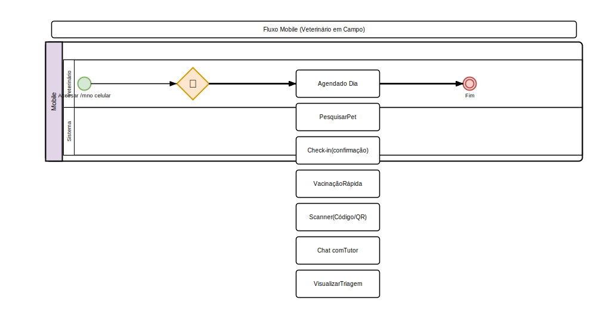

# Acessibilidade e Dispositivos Móveis

## Interface Responsiva
- O sistema é totalmente responsivo (desktop, tablet, celular)
- Sidebar recolhível em dispositivos móveis
- Layout adaptável para telas pequenas

## Modo Mobile
1. Acesse pelo celular em `/m`
2. Interface otimizada para toque:
   - Botões maiores
   - Menus simplificados
   - Foco em ações rápidas

### Funcionalidades Mobile
- **Agenda do dia**: Visualização rápida dos compromissos
- **Pesquisa de pet**: Busca rápida por nome ou tutor
- **Check-in**: Confirme chegada do tutor
- **Vacinação rápida**: Registro simplificado
- **Scanner**: Código de barras e QR code pela câmera
- **Chat**: Comunicação com tutores

## Atalhos de Teclado
- `Ctrl + K` / `Cmd + K`: Busca global
- `Ctrl + N`: Novo registro (contextual)
- `Ctrl + S`: Salvar formulário
- `Esc`: Fechar modal / cancelar

## Acessibilidade
- Contraste adequado para leitura
- Suporte a leitores de tela (atributos ARIA)
- Navegação por teclado em todos os componentes
- Textos alternativos em imagens
- Foco visível em elementos interativos

## Compatibilidade
- Navegadores: Chrome, Firefox, Edge, Safari (2 últimas versões)
- Aplicação web progressiva (PWA): Instalável no celular
- Notificações push no navegador

---

## Diagrama do Processo

*Clique na imagem para ampliar. Diagrama de Atividades UML com raias — retângulos = atividades, losangos = decisão, setas = fluxo entre atividades, raias = atores.*
