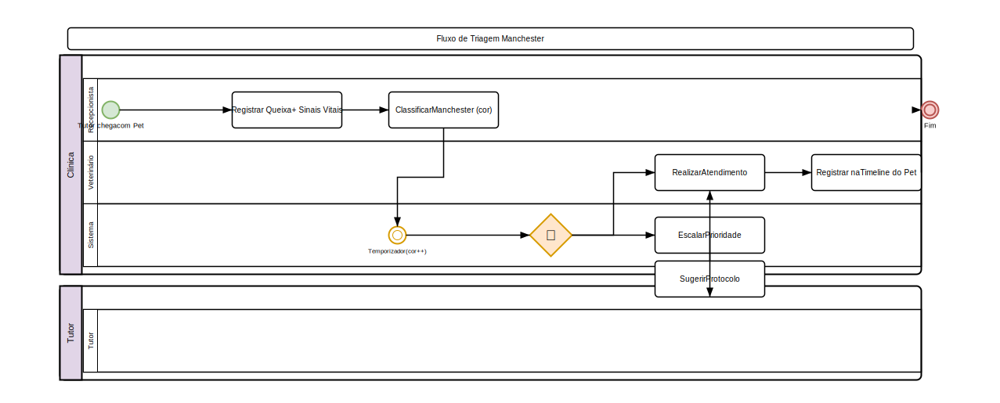

# Triagem

## Painel de Triagem (Livewire)

O painel de triagem é uma interface em tempo real para classificação de risco de pacientes emergenciais.

1. Acesse **Clínico > Triagem**
2. Visualize a fila de pacientes em tempo real:
   - **Cartões coloridos** por gravidade
   - **Ordem de chegada** dentro de cada cor
   - **Badge** com tempo de espera

### Classificação de Risco (Manchester)

| Cor | Prioridade | Atendimento | Descrição |
|-----|------------|-------------|-----------|
| **Vermelho** | Imediato | Emergência | Risco de vida iminente |
| **Laranja** | 10 min | Muito urgente | Condição grave, estável |
| **Amarelo** | 30 min | Urgente | Sem risco imediato |
| **Verde** | 60 min | Pouco urgente | Condição simples |
| **Azul** | 120 min | Não urgente | Consulta eletiva |

### Registrar Triagem

1. Clique em **Nova Triagem**
2. Preencha:
   - **Pet** (busca por nome/tutor)
   - **Queixa principal**
   - **Sinais vitais**: temperatura, FC, FR, pressão, SpO2
   - **Classificação de risco** (cor)
   - **Alergias** registradas
3. Clique em **Salvar**

### Fluxo de Atendimento

1. **Aguardando**: Paciente na fila
2. **Em Atendimento**: Veterinário iniciou
3. **Aguardando Exames**: Coleta/análise pendente
4. **Aguardando Internação**: Leito solicitado
5. **Finalizado**: Atendimento concluído
6. **Alta**: Paciente liberado

### Funcionalidades

- **Alerta sonoro** para novos pacientes vermelhos
- **Botão "Abrir Protocolo"** — abre protocolo de emergência relevante
- **Tempo de espera** visível para cada classificação
- **Atualização automática** a cada 5 segundos
- **Filtro** por cor e veterinário responsável

### Pre-Anesthetic Evaluation

1. Acesse **Clínico > Avaliação Pré-Anestésica**
2. Preencha:
   - **Peso**, **idade**, **escore corporal**
   - **Doenças pré-existentes**
   - **Medicações em uso**
   - **Exames complementares** (hemograma, bioquímico)
   - **Classificação ASA** (I a V)
   - **Jejum confirmado**
   - **Hidratação**
3. Clique em **Salvar**

### Checklist Pré-Anestésico

- [ ] Exames pré-operatórios realizados
- [ ] Avaliação cardíaca
- [ ] Avaliação pulmonar
- [ ] Exames laboratoriais
- [ ] Jejum confirmado
- [ ] Acesso venoso
- [ ] Termo de consentimento assinado
- [ ] Protocolo antibiótico profilático

## Regras de Negócio

- Apenas veterinários podem alterar classificação de risco
- Paciente vermelho não pode ficar sem atendimento por mais de 15 min (alerta)
- Triagem pode ser feita por recepcionista treinada (permissão `triage.create`)
- Histórico completo de triagens fica na timeline do paciente

---

## Diagrama do Processo

*Clique na imagem para ampliar. Diagrama de Atividades UML com raias — retângulos = atividades, losangos = decisão, setas = fluxo entre atividades, raias = atores.*
