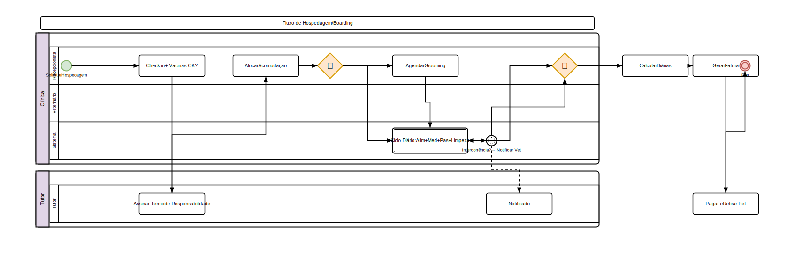

# Hospedagem (Boarding)

## Visão Geral

O módulo de hospedagem gerencia check-in, check-out, tarefas diárias, banho e tosa para animais hospedados na clínica.

## Check-in

1. Acesse **Hotel > Hospedagem**
2. Clique em **Novo Check-in**
3. Preencha:
   - **Pet** (selecionar)
   - **Tutor** (preenchido automaticamente)
   - **Data prevista de saída**
   - **Tipo de acomodação**: Canil, Gatil, VIP, Enfermaria
   - **Alimentação**: Ração do tutor, ração da clínica, dieta especial
   - **Medicações**: Lista de medicamentos e horários
   - **Observações**: Comportamento, alergias, cuidados especiais
4. Clique em **Check-in**

### Itens Obrigatórios

- Vacinas em dia (verificação automática)
- Termo de responsabilidade assinado
- Contato de emergência
- Autorização para atendimento veterinário

## Tarefas Diárias

### Registrar Tarefa

1. Acesse a hospedagem ativa
2. Na aba **Tarefas**, clique em **Nova**
3. Preencha:
   - **Tipo**: Alimentação, Medicação, Passeio, Limpeza, Socialização
   - **Descrição**
   - **Responsável**
   - **Horário agendado**
4. Marque como **Concluída** após execução
5. Registre **observações** (ex: "comeu bem", "fezes normais")

### Checklist Diário

- [ ] Alimentação matinal
- [ ] Medicação (se houver)
- [ ] Passeio / recreação
- [ ] Limpeza do recinto
- [ ] Alimentação vespertina
- [ ] Medicação noturna
- [ ] Registro de intercorrências

## Banho e Tosa (Grooming)

1. Acesse **Hotel > Banho e Tosa**
2. Clique em **Novo**
3. Preencha:
   - **Pet** e **tutor**
   - **Tipo**: Banho, Tosa, Banho + Tosa, Hidratação
   - **Observações**: Pelagem, alergias, produtos específicos
   - **Agendamento**: Data e horário
4. Clique em **Salvar**

### Templates de Serviço

- Configure templates em **Configurações > Templates de Banho e Tosa**
- Defina serviços, preços e produtos padrão por porte/espécie
- Ao agendar, selecione o template para preenchimento automático

## Check-out

1. Acesse a hospedagem ativa
2. Clique em **Finalizar Hospedagem**
3. Preencha:
   - **Data e hora efetiva da saída**
   - **Condições do animal** ao sair
   - **Observações finais**
   - **Fatura** gerada automaticamente com diárias + serviços
4. Clique em **Finalizar**

### Cálculo de Diárias

- Diária completa até 12h do dia da saída
- Meia diária após 12h
- Descontos configuráveis para longas estadias

## Relatórios

- **Ocupação**: Taxa de ocupação por período
- **Faturamento**: Receita de hospedagem por mês
- **Check-ins/Check-outs**: Movimento diário

## Regras de Negócio

- Pet precisa estar com vacinas em dia para check-in (verificação automática)
- Medicação só pode ser administrada por profissional habilitado
- Qualquer intercorrência veterinária gera notificação ao tutor
- Tutor pode visitar o pet durante o horário comercial
- Check-out fora do horário combinado pode gerar taxa adicional

---

## Diagrama do Processo

*Clique na imagem para ampliar. Diagrama BPMN 2.0 — setas contínuas = fluxo sequencial, tracejadas = fluxo de mensagem, losangos = decisão.*
