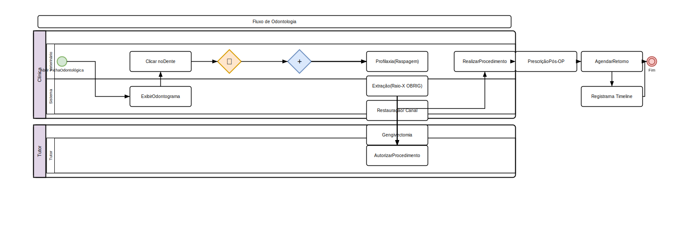

# Odontologia

## Ficha Odontológica

1. Acesse **Clínico > Odontologia**
2. Selecione o **pet**
3. A ficha exibe o **odontograma** (dentição do animal)

### Odontograma

O odontograma é uma representação gráfica dos dentes do animal:

- **Círculo colorido** por dente:
  - **Verde**: Sadio
  - **Amarelo**: Placa/tártaro leve
  - **Laranja**: Tártaro moderado, gengivite
  - **Vermelho**: Doença periodontal avançada
  - **Preto**: Ausente ou extraído
  - **Azul**: Tratamento realizado
- **Clique** em cada dente para registrar:
  - **Condição**: Sadio, tártaro, fratura, mobilidade, ausente
  - **Tratamento**: Limpeza, extração, restauração, canal
  - **Observações**

## Procedimentos Odontológicos

### Registrar Procedimento

1. Acesse **Clínico > Odontologia**
2. Clique em **Novo Procedimento**
3. Preencha:
   - **Dente(s)** afetado(s)
   - **Tipo**: Limpeza (profilaxia), Extração, Restauração, Canal, Gengivectomia
   - **Descrição** detalhada
   - **Técnica** utilizada
   - **Medicações**: Anestésico, antibiótico, analgésico
4. Clique em **Salvar**

### Classificação Periodontal

| Estágio | Descrição | Tratamento |
|---------|-----------|------------|
| Estágio 1 | Gengivite leve | Profilaxia + escovação |
| Estágio 2 | Periodontite inicial | Profilaxia + raspagem |
| Estágio 3 | Periodontite moderada | Raspagem + extrações parciais |
| Estágio 4 | Periodontite avançada | Extrações múltiplas |

## Exames de Imagem Odontológica

- Raio-X odontológico intraoral
- Associe imagens ao odontograma
- Laudo radiológico odontológico

## Prescrição Pós-Procedimento

- Analgésicos e anti-inflamatórios
- Antibióticos (se indicado)
- Recomendações de higiene oral
- Retorno agendado para reavaliação

## Relatórios

- **Procedimentos realizados** por período
- **Dentes extraídos** (mais comuns)
- **Doenças periodontais** por espécie/raça

## Regras de Negócio

- Apenas veterinários com especialização odontológica podem realizar extrações
- Raio-X odontológico é obrigatório antes de extrações
- Histórico odontológico faz parte da timeline do paciente
- Procedimentos são registrados com data e profissional responsável

---

## Diagrama do Processo

*Clique na imagem para ampliar. Diagrama BPMN 2.0 — setas contínuas = fluxo sequencial, tracejadas = fluxo de mensagem, losangos = decisão.*
