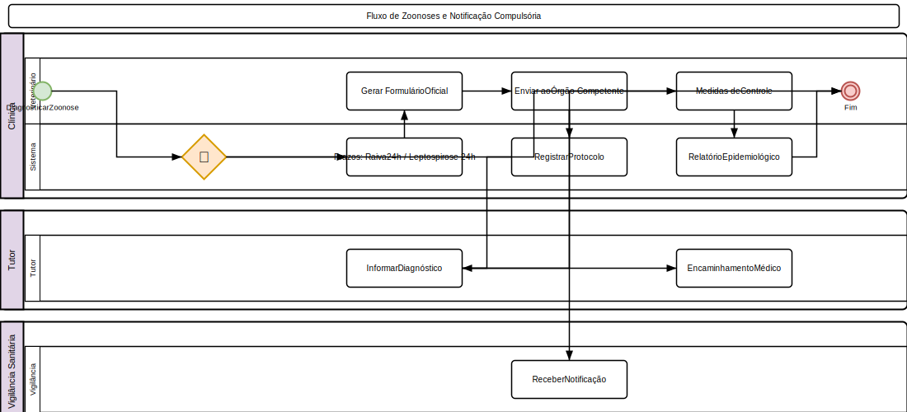

# Zoonoses

## Cadastro de Zoonose

1. Acesse **Clínico > Zoonoses**
2. Clique em **Nova Zoonose**
3. Preencha:
   - **Pet** infectado
   - **Tutor** responsável
   - **Tipo**: Raiva, Leptospirose, Leishmaniose, Toxoplasmose, Brucelose, Dermatofitose, Esquistossomose, Outras
   - **Data do diagnóstico**
   - **Confirmação**: Clínico, Sorologia, PCR, Cultura
   - **Notificação ao órgão competente?** (Sim/Não)
   - **Observações**: Fonte provável, medidas tomadas
4. Clique em **Salvar**

### Notificação Compulsória

Doenças de notificação obrigatória:

| Doença | Órgão | Prazo |
|--------|-------|-------|
| Raiva | SVO / Vigilância Sanitária | Imediata (24h) |
| Leptospirose | SVO | 24h |
| Leishmaniose | SVO / MS | Semanal |
| Brucelose | SVO | Semanal |

- O sistema registra data e protocolo da notificação
- Gera formulário oficial para envio ao órgão competente

## Relatórios

### Epidemiológicos

- **Casos confirmados** por período e tipo
- **Mapa de incidência** por região/filial
- **Série histórica** (comparativo mensal/anual)
- **Taxa de letalidade** por tipo de zoonose

### Notificações

- **Pendentes**: Casos não notificados ao órgão competente
- **Realizadas**: Notificações enviadas com protocolo
- **Relatório consolidado** para Vigilância Sanitária

## Medidas de Controle

- Isolamento do animal infectado (quando aplicável)
- Vacinação de contactantes
- Orientação ao tutor sobre riscos e prevenção
- Encaminhamento de tutores expostos para atendimento médico

## Regras de Negócio

- Caso suspeito de raiva exige notificação imediata (alerta no sistema)
- Apenas veterinários podem registrar zoonoses
- Histórico de zoonoses do pet fica na timeline
- Relatórios epidemiológicos podem ser solicitados pela vigilância
- Dados de zoonoses são anonimizados para relatórios públicos (LGPD)

---

## Diagrama do Processo

*Clique na imagem para ampliar. Diagrama de Atividades UML com raias — retângulos = atividades, losangos = decisão, setas = fluxo entre atividades, raias = atores.*
