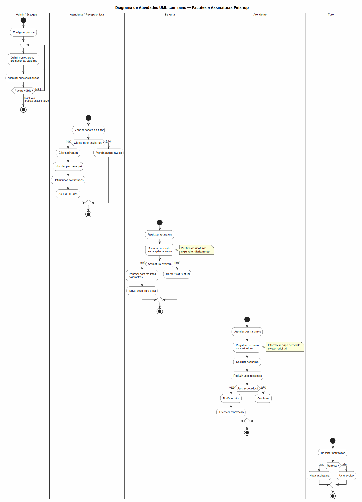

# Pacotes Petshop

Módulo para gestão de pacotes de banho & tosa, hotel e outros serviços petshop com preço promocional, assinaturas e controle de consumo.

## Pacotes

Cadastre pacotes com serviços agrupados por um preço especial.

### Cadastrar Pacote
1. Acesse **Estoque > Pacotes Petshop**
2. Clique em **Novo Pacote**
3. Preencha:
   - **Nome** do pacote (ex: "Pacote Banho + Tosa Pequeno")
   - **Descrição** com detalhes do que inclui
   - **Preço promocional** — valor do pacote
   - **Validade** (opcional) — data limite para uso
   - **Serviços inclusos** — selecione os serviços (banho, tosa, hidratação, etc.)
4. Clique em **Salvar**

### Listagem
- Tabela com nome, preço, validade, valor economizado estimado
- Ações: editar, excluir

### Regras
- Preço promocional deve ser menor que a soma dos serviços avulsos
- Pacote vencido não pode ser vendido como novo, mas assinaturas ativas continuam válidas
- Exclusão apenas se não houver assinaturas ou consumos vinculados

## Assinaturas

Assinaturas vinculam um pacote a um pet com usos pré-pagos.

### Criar Assinatura
1. Acesse **Estoque > Assinaturas**
2. Clique em **Nova Assinatura**
3. Preencha:
   - **Pacote** — selecione o pacote base
   - **Pet** e **Tutor** — vinculados à assinatura
   - **Data de início** — quando a assinatura começa a valer
   - **Data de expiração** — opcional, para assinaturas com prazo
   - **Usos contratados** — total de usos inclusos (ex: 10 banhos)
4. Clique em **Salvar**

### Status da Assinatura
| Status | Descrição |
|--------|-----------|
| **Ativa** | Dentro do prazo e com usos disponíveis |
| **Expirada** | Data de expiração passou ou usos esgotados |
| **Cancelada** | Cancelada manualmente |
| **Renovada** | Renovada automaticamente pelo comando `subscriptions:renew` |

### Detalhes da Assinatura
Na página de detalhes da assinatura:
- **Info-boxes**: usos restantes, usos totais, economia total, status
- **Histórico de consumo**: tabela com data, serviço, valor economizado
- **Formulário de consumo**: registrar uso da assinatura

### Registrar Consumo
1. Acesse a assinatura desejada
2. No formulário de consumo, informe:
   - **Serviço** prestado (banho, tosa, etc.)
   - **Valor original** do serviço (preço avulso)
3. Clique em **Consumir**
4. O sistema calcula a economia: `valor_original − preço_por_uso_do_pacote`
5. Reduz os usos restantes da assinatura

### Economia
- Exibida na listagem e no detalhe da assinatura
- Acumulada por consumo
- Total geral no widget do dashboard de estoque

### Renovação Automática
- Comando `subscriptions:renew` verifica assinaturas expiradas
- Cria nova assinatura com mesmos parâmetros e nova data de início
- Pode ser agendado no cron ou executado manualmente:
  ```bash
  php artisan subscriptions:renew
  ```

### Cancelamento
- Acesse a assinatura e clique em **Cancelar**
- Assinatura cancelada mantém o histórico de consumo
- Não pode ser reativada

## Permissões
- `pet-shop-packages.view/create/edit/delete` — Pacotes
- `pet-shop-subscriptions.view/create/edit/delete` — Assinaturas

## Regras de Negócio
- Assinatura só pode ser consumida se estiver **Ativa**
- Usos restantes nunca podem ser negativos
- Preço promocional do pacote é fixo; alterações não afetam assinaturas já criadas
- Renovação automática respeita o preço vigente do pacote no momento da renovação
- Consumo registra qual serviço foi prestado e o valor economizado
- Exclusão de pacote bloqueada se houver assinaturas ou consumos vinculados

---

## Diagrama do Processo


*Clique na imagem para ampliar. Diagrama de Atividades UML com raias — retângulos = atividades, losangos = decisão, setas = fluxo entre atividades, raias = atores.*
