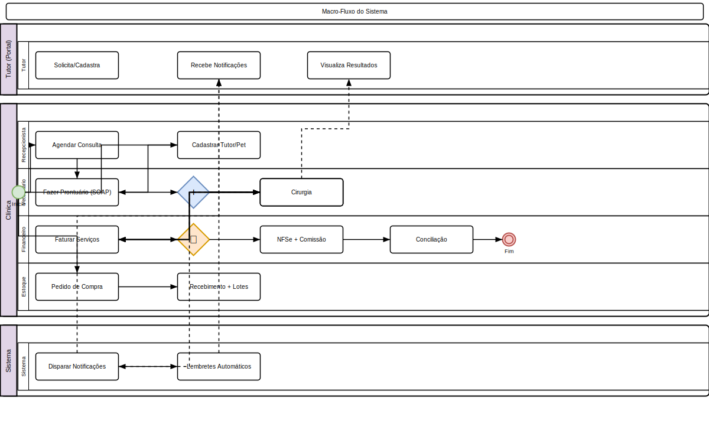
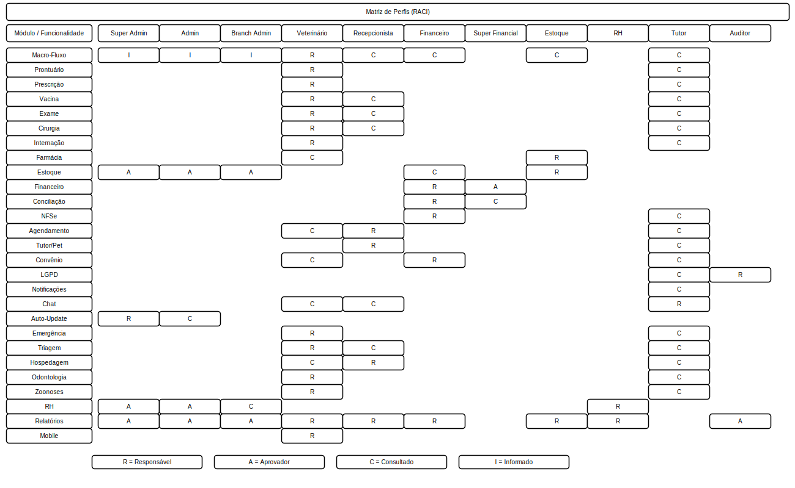

# Manual do Usuário

Guia prático para utilização do VetEssence no dia a dia da clínica.

## Índice de Módulos

| # | Módulo | Descrição |
|---|--------|-----------|
| 01 | [Prontuários](01-prontuarios) | SOAP, planos de tratamento, aprovação de orçamento, dietas, consentimento, anexos |
| 02 | [Prescrições](02-prescricoes) | Receitas digitais, dosagem, verificação QR code, impressão PDF |
| 03 | [Vacinas](03-vacinas) | Aplicação, protocolos, certificado CFMV, lembretes, previsão vencimento, recall |
| 04 | [Exames](04-exames) | Solicitação, coleta, resultado, laudo |
| 05 | [Cirurgias](05-cirurgias) | Checklist, avaliação pré-anestésica, trans e pós-operatório |
| 06 | [Internações](06-internacoes) | Evolução clínica, prescrição diária, resumo de alta, mapa de execução |
| 07 | [Farmácia](07-farmacia) | Produtos, lotes, fornecedores, calculadora de dosagem, alerta vencimento |
| 08 | [Estoque](08-estoque) | Movimentações, pedidos de compra, substâncias controladas, scanner, transferências |
| 09 | [Financeiro](09-financeiro) | Faturas, NFSe, NF-e, comissões, conciliação bancária, auto-faturamento, fluxo de caixa, DRE |
| 10 | [Agendamento](10-agendamento) | Calendário visual (FullCalendar), agendamento online, escala de veterinários e plantões, lembretes, cancelamento automático |
| 11 | [Tutores e Pets](11-tutores-pets) | Cadastro, microchip/RG, timeline, óbito/cremação, múltiplos tutores, portal |
| 12 | [Convênios](12-convenios) | Planos, tabela procedimentos, guias, claims, CVI, glosas |
| 13 | [Usuários e Permissões](13-usuarios-e-permissoes) | 11 funções, 170+ permissões, controle de acesso |
| 14 | [Multi-Filiais](14-multi-filiais) | Estrutura, corporate dashboard, transferências, isolamento de dados |
| 15 | [Relatórios](15-relatorios) | Clínicos, estoque, financeiros, comissões, exportação PDF/Excel |
| 16 | [Auditoria e LGPD](16-auditoria-lgpd) | Logs, direitos do titular, consentimento, política de retenção |
| 17 | [Notificações](17-notificacoes) | WhatsApp, SMS, e-mail, preferências do tutor, campanhas |
| 18 | [Chat](18-chat) | Comunicação tutor-clínica, mensagens, anexos, notificações |
| 19 | [Configurações](19-configuracoes) | Sistema, notificações, integrações (NFSe, Gateway, Lab), rebranding, auto-update |
| 20 | [Emergências](20-emergencias) | Protocolos de emergência, busca por espécie/categoria/gravidade |
| 21 | [Mobile e Acessibilidade](21-mobile-acessibilidade) | Interface responsiva, modo mobile /m, atalhos, acessibilidade |
| 22 | [Triagem](22-triagem) | Painel Livewire, classificação Manchester, avaliação pré-anestésica |
| 23 | [Hospedagem](23-hospedagem) | Boarding, check-in/out, tarefas diárias, banho e tosa, diárias |
| 24 | [Odontologia](24-odontologia) | Odontograma, procedimentos, classificação periodontal |
| 25 | [Zoonoses](25-zoonoses) | Cadastro, notificação compulsória, relatórios epidemiológicos |

---

## Acesso Rápido

- **Prontuários**: Clínico > Prontuários
- **Vacinas**: Clínico > Vacinas  
- **Exames**: Clínico > Exames
- **Agenda**: Agenda > Calendário
- **Estoque**: Estoque > Produtos
- **Financeiro**: Financeiro > Contas a Receber
- **NFSe**: Financeiro > NFSe
- **Portal do Tutor**: `/portal`

---

## Diagrama do Processo

*Clique na imagem para ampliar. Diagrama de Atividades UML com raias — retângulos = atividades, losangos = decisão, setas = fluxo entre atividades, raias = atores.*

---

## Diagrama do Processo

*Clique na imagem para ampliar. Diagrama de Atividades UML com raias — retângulos = atividades, losangos = decisão, setas = fluxo entre atividades, raias = atores.*
